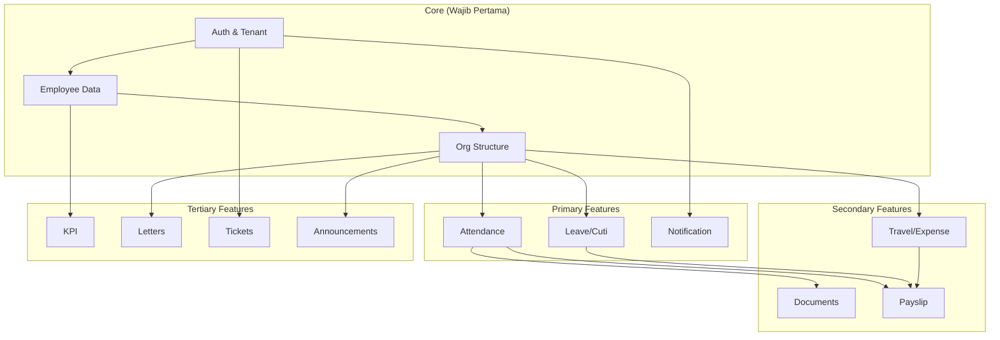

# Konsep PeopleHub by Kreatifindo

> **Versi:** 2.0 | **Tanggal Update:** 22 Januari 2026 | **Status:** Final

## Ringkasan
PeopleHub adalah platform web untuk memusatkan pengelolaan data dan aktivitas karyawan: kehadiran, cuti, kinerja, dokumen, hingga administrasi HR. Sistem dirancang modular, fleksibel untuk multi-cabang dan berbagai status karyawan, dengan alur persetujuan yang dapat disesuaikan.

Tagline: PeopleHub by Kreatifindo — One platform to manage people, performance, and productivity.

## Perusahaan Pengguna (Multi-Tenant)
- PT. KREATIFINDO ABADI SEJAHTERA
- PT. VIOLET GLOBAL INDONESIA
- PT. CYBER MULTI ARTHA
- PT. CYBER MULTI MANDIRI
- Catatan multi-tenant: isolasi data per perusahaan/cabang, admin per tenant, opsi branding/logo per perusahaan; akses lintas tenant hanya untuk Super Admin/Tenant Admin.

## Prinsip Desain UI
- Clean, profesional, rasa enterprise: tipografi rapi, ruang lega, hirarki visual jelas.
- Warna terkontrol: palet netral + 1-2 aksen; hindari saturasi berlebih.
- Konsistensi komponen: tabel, kartu ringkas, filter pencarian cepat, status badge yang mudah dibaca.
- Responsif: prioritas mobile untuk absen/cuti; dashboard tetap jelas di desktop.
- Aksesibilitas: kontras cukup, states fokus/hover jelas, icon + label teks.

### Rekomendasi Identitas Visual
- Tipografi: gunakan keluarga grotesk atau humanist (mis. `Inter`/`Manrope`/`Neue Haas`), 3 tier ukuran (heading, body, meta); weight 500–600 untuk judul, 400 untuk isi.
- Palet: dasar netral (`#0F172A` teks utama, `#475569` teks sekunder, `#E2E8F0` stroke, `#F8FAFC` latar); aksen tunggal (mis. biru `#2563EB` atau teal `#0EA5E9`); warna status: sukses `#16A34A`, warning `#F59E0B`, error `#DC2626`, info `#0EA5E9`.
- Spasi: grid 8px; padding komponen 12–20px; kartu dengan radius 8px, shadow ringan.
- Ikonografi: set konsisten (mis. Heroicons/Feather); hindari ikon dekoratif tanpa fungsi.

### Pola Layar Kunci
- Dashboard HRD: kartu ringkas (headcount, hadir/terlambat/absen hari ini), tren absensi (7/30 hari), tabel pengajuan terbaru (cuti, reimburse, perjalanan dinas), widget KPI cepat.
- Dashboard Karyawan: ringkasan saldo cuti, tombol cepat absen (WFO/WFH), status pengajuan terakhir, jadwal shift hari ini, KPI aktif, slip gaji terbaru.
- Daftar data (tabel): bar pencarian + filter (cabang, departemen, status), kolom yang bisa di-sort, badge status berwarna, pagination jelas.
- Form: layout satu kolom di mobile, dua kolom di desktop; grouping bidang (Data Akun, Organisasi, Identitas); aksi utama berwarna aksen, aksi sekunder outlined.
- Notifikasi: panel in-app dengan tab (Semua, Tugas, Peringatan); status dibaca/tidak; tautan langsung ke detail.

### Mikrointeraksi
- Hover/fokus: border/outline jelas pada input dan tombol; transisi 150–200ms.
- Loading: skeleton untuk tabel/kartu; spinner hanya untuk aksi singkat.
- Feedback: toast untuk aksi berhasil/gagal; modal konfirmasi untuk aksi kritikal (approve/reject, publish slip).

## Tujuan Produk
- Menyediakan sumber data tunggal (single source of truth) untuk seluruh informasi karyawan.
- Mengotomasi proses kehadiran, cuti, dan penilaian kinerja untuk mengurangi pekerjaan manual.
- Menjamin transparansi dan jejak audit pada seluruh aktivitas HR.
- Mempercepat proses administrasi lintas cabang dan tim.
- Memberi insight real time bagi manajemen terkait produktivitas dan kepatuhan.

## Persona dan Peran
- HR Admin: mengelola data karyawan, kebijakan, jadwal, dan memonitor kepatuhan.
- People Manager/Lead: menyetujui cuti, memantau kehadiran, melakukan review kinerja.
- Karyawan: clock in/out, ajukan cuti/izin, akses slip/kontrak, mengikuti review.
- Finance/Payroll: menarik data absensi dan cuti untuk proses payroll.
- IT/Ops: mengatur akses, SSO, audit, integrasi.
- C-Level: melihat ringkasan eksekutif terkait headcount, absensi, dan performa.

## Ruang Lingkup Rilis Awal
- Data master karyawan dan organisasi (cabang, departemen, jabatan).
- Absensi dengan variasi jadwal (normal, shift, fleksibel) dan lokasi.
- Pengajuan cuti/izin dengan multi-level approval.
- Dashboard ringkas untuk HR dan manager.
- Dokumen karyawan (kontrak, surat peringatan, NDA) dengan kontrol akses.
- Integrasi dasar ekspor CSV untuk payroll.

## Value Proposition Utama
- Terpusat: satu platform untuk data, kehadiran, cuti, kinerja, dan dokumen.
- Efisien: otomatisasi alur dan pengingat, minim input manual.
- Transparan: status pengajuan, jejak audit, dan histori tercatat.
- Fleksibel: dukung tipe karyawan (tetap, kontrak, freelance), jadwal fleksibel/shift.
- Scalable: modul modular; bisa ditambah OKR, asset management, dan API integrasi.

## Modul Utama (v1 dan roadmap)
1) Data Karyawan
   - Profil lengkap, status kerja, kontrak, riwayat jabatan.
   - Struktur organisasi: cabang, departemen, tim, atasan langsung.
   - Dokumen personal dengan kontrol akses.
2) Absensi dan Jam Kerja
   - Clock in/out via web atau geofenced (opsional), pencatatan lokasi/device.
   - Jadwal kerja: normal, shift, fleksibel; kalender cabang.
   - Lembur, koreksi absensi, dan pengingat keterlambatan.
3) Cuti/Izin
   - Jenis cuti (tahunan, sakit, khusus) dengan kuota dan masa berlaku.
   - Multi-step approval (atasan, HR) dan delegasi approval.
   - Sinkronisasi ke kalender tim dan penyesuaian timesheet.
4) Pengelolaan Dokumen
   - Penyimpanan kontrak, surat tugas, peringatan, NDA dengan versi.
   - Templat dokumen dan tanda tangan digital (opsional).
5) Kinerja (Roadmap cepat)
   - Periode penilaian, target/goal individu atau OKR ringan.
   - Form review 360/manager, feedback publik/privat.
   - Rekap performa untuk promosi atau perpanjangan kontrak.
6) Onboarding/Offboarding (Roadmap)
   - Checklist tugas, akses aplikasi, penyerahan aset.
   - Form exit interview dan penutupan akses.
7) Reporting dan Insight
   - Dashboard kehadiran, keterlambatan, lembur, pemakaian cuti.
   - Headcount, turnover, dan status kontrak kedaluwarsa.
   - Ekspor CSV/Excel dan API (roadmap) untuk payroll/BI.
8) Admin dan Konfigurasi
   - RBAC: role sistem (admin HR, manager, karyawan, finance).
   - Kebijakan cuti, jadwal, hari libur, shift, lokasi kantor.
   - Pengaturan approval flow per jenis permintaan.

## Alur Kunci
- Login/SSO: dukung email+password; opsi SSO (Google/Microsoft) di roadmap.
- Clock in/out: karyawan melakukan tap; sistem mencatat waktu, lokasi, dan device; keterlambatan menghasilkan notifikasi.
- Pengajuan cuti: karyawan pilih jenis cuti, tanggal, alasan; sistem memvalidasi kuota; permintaan masuk ke atasan lalu HR; status dan histori tampil real time.
- Koreksi absensi: karyawan ajukan koreksi dengan bukti; disetujui oleh atasan/HR.
- Review kinerja (roadmap): HR set periode; manager mengisi form; hasil tersimpan sebagai histori karyawan.
- Onboarding (roadmap): HR buat checklist, assign ke PIC; progres dapat dipantau.

## Data dan Model Tingkat Tinggi
- Entity utama: User, Employee, Branch, Department, Position, Schedule, Attendance, LeaveRequest, Overtime, PerformanceCycle, Goal/OKR, Review, Document, ApprovalFlow, Role/Permission.
- Relasi penting: Employee terhubung ke Branch/Department/Position dan Manager; Attendance terkait Schedule; LeaveRequest terkait ApprovalFlow; Document terkait Employee dan tipe dokumen.
- Jejak audit: setiap perubahan data kunci mencatat siapa, kapan, dan nilai sebelum/sesudah.

## Kebijakan Approval dan Audit
- Flow bisa disusun per jenis permintaan (cuti, lembur, koreksi absensi, dokumen).
- Dukungan multi-level, parallel (opsional), dan delegasi sementara.
- Semua status, komentar, dan jejak waktu tercatat; notifikasi otomatis (email/in-app).

## Keamanan dan Kepatuhan
- RBAC granular, pembatasan akses dokumen sensitif.
- Enkripsi data in transit (HTTPS) dan at-rest (opsional tergantung infrastruktur).
- Pembatasan perangkat/lokasi untuk absensi (opsional geofence).
- Retensi data: kebijakan arsip untuk dokumen dan log; rotasi/retensi log terstruktur; backup terjadwal dan uji restore; masking/pseudonimisasi data sensitif saat ekspor atau di sandbox.

## Integrasi
- Ekspor CSV/Excel untuk payroll; API outbound (roadmap) ke payroll/BI; siapkan format multi-payroll provider (placeholder).
- Webhook untuk event (absensi tercatat, cuti disetujui).
- SSO Google/Microsoft (roadmap); integrasi Slack/Email/SMS untuk notifikasi.

## Non-Fungsional
- Target SLA internal: 99.5% untuk jam kerja.
- Performa: respon halaman dashboard utama < 3 detik pada 500 user aktif; aksi absen di mobile < 1.5 detik (P95).
- Skalabilitas: arsitektur modular (service-oriented) siap dipisah menjadi microservice jika beban meningkat.
- Observabilitas: logging terstruktur, audit trail, dan health checks.

## Pengalaman Pengguna
- Web responsive (mobile-first untuk absensi/cuti).
- Bahasa: Indonesia (default), extensible ke EN.
- Aksesibilitas dasar: kontrast cukup, navigasi keyboard.

## Roadmap Tahap Awal
- Fase 1 (MVP): data karyawan, absensi, cuti, dashboard ringkas, ekspor CSV.
- Fase 2: dokumen dengan versi dan kontrol akses, lembur, koreksi absensi.
- Fase 3: modul kinerja dasar (goal + review), onboarding/offboarding, webhook/API.
- Fase 4: SSO, notifikasi Slack/Teams, analitik lanjutan, tanda tangan digital.

## Metrik Keberhasilan
- Adopsi: >90% karyawan clock in/out melalui sistem dalam 1 bulan.
- Efisiensi: waktu pemrosesan cuti turun 50%.
- Kepatuhan: pengurangan keterlambatan input absensi manual >70%.
- Transparansi: 0 permintaan cuti tanpa jejak approval.

## Risiko dan Mitigasi
- Variasi kebijakan tiap cabang: buat konfigurasi per cabang/tipe karyawan.
- Resistensi pengguna: sediakan UX sederhana, mobile-friendly, dan onboarding cepat.
- Integrasi payroll beragam: mulai dengan ekspor CSV generik lalu adaptor khusus.
- Keamanan data: terapkan RBAC, audit log, dan enkripsi; lakukan backup terjadwal.

## Kriteria Sukses Rilis
- Semua alur utama (absensi, cuti) dapat dijalankan end-to-end dengan jejak audit.
- Dashboard HR menampilkan data real time dasar (kehadiran, cuti, lembur).
- Ekspor data dapat digunakan finance untuk payroll tanpa koreksi manual besar.
- Dokumentasi kebijakan dan konfigurasi dapat dikelola HR tanpa bantuan teknis.

---

## Analisis Kompetitif

### Perbandingan dengan Solusi Sejenis

| Fitur | PeopleHub | Talenta | Gadjian | LinovHR | Mekari |
|-------|-----------|---------|---------|---------|--------|
| **Multi-tenant** | Ya (4 perusahaan) | Ya (SaaS) | Ya (SaaS) | Ya | Ya |
| **Absensi Selfie** | Ya + Geofence | Ya | Ya | Ya | Ya |
| **Cuti/Izin** | Multi-level approval | Ya | Ya | Ya | Ya |
| **Slip Gaji PDF** | Ya | Ya | Ya | Ya | Ya |
| **KPI/Performance** | Ya (numerik) | Terbatas | Tidak | Ya | Ya |
| **Customizable** | Tinggi (self-hosted) | Rendah | Rendah | Sedang | Sedang |
| **Harga** | Self-hosted | Per user/bulan | Per user/bulan | Per user/bulan | Per user/bulan |
| **Data Ownership** | 100% internal | Cloud vendor | Cloud vendor | Cloud vendor | Cloud vendor |
| **Integrasi Payroll** | CSV + custom | Built-in | Built-in | Terbatas | Built-in |

### Keunggulan Kompetitif PeopleHub

1. **Full Data Ownership** - Data tersimpan di infrastruktur sendiri, tidak bergantung vendor
2. **Customizable** - Dapat disesuaikan dengan kebutuhan spesifik perusahaan
3. **No Per-User Fee** - Tidak ada biaya per karyawan yang terus bertambah
4. **Multi-Tenant Internal** - Satu sistem untuk 4 perusahaan dalam grup
5. **Kebijakan Fleksibel** - Aturan berbeda per cabang/tipe karyawan

### Kelemahan yang Perlu Dimitigasi

1. **Development Effort** - Perlu investasi waktu untuk pengembangan awal
2. **Maintenance** - Tim internal perlu maintain sistem
3. **Feature Parity** - Beberapa fitur advanced perlu waktu untuk dikembangkan

---

## Prioritisasi Fitur (MoSCoW)

### MUST HAVE (MVP - Fase 1)
Fitur yang wajib ada untuk sistem dapat digunakan.

| Fitur | Justifikasi |
|-------|-------------|
| Registrasi & Login | Dasar akses sistem |
| Approval registrasi oleh HRD | Kontrol akses karyawan |
| Absensi selfie (WFO/WFH) | Core feature, menggantikan manual |
| Pengajuan cuti dengan saldo | Core feature, paling sering dipakai |
| Dashboard karyawan | Self-service dasar |
| Dashboard HRD | Monitoring dasar |
| Notifikasi in-app & email | Komunikasi approval |
| Ekspor CSV absensi | Kebutuhan payroll |
| Audit log aksi sensitif | Compliance |
| Multi-tenant isolation | Keamanan data |

### SHOULD HAVE (Fase 2)
Fitur penting yang meningkatkan nilai sistem.

| Fitur | Justifikasi |
|-------|-------------|
| Koreksi absensi dengan approval | Mengurangi error manual |
| Tukar/cover shift | Fleksibilitas jadwal |
| Dokumen karyawan (kontrak, NDA) | Digitalisasi arsip |
| Perjalanan dinas & reimburse | Menggantikan form manual |
| Slip gaji PDF | Transparansi gaji |
| Denda keterlambatan otomatis | Enforcement kebijakan |
| Lembur request & approval | Tracking jam kerja lebih |

### COULD HAVE (Fase 3)
Fitur yang menambah nilai jika ada waktu dan resource.

| Fitur | Justifikasi |
|-------|-------------|
| KPI numerik dengan tracking | Performance management |
| Bulk actions (import, approval massal) | Efisiensi admin |
| Delegasi approver | Business continuity |
| Surat pengajuan dengan template | Digitalisasi surat |
| Pengumuman per cabang/role | Komunikasi internal |
| Tiket bantuan HR/IT | Support internal |
| Aset pinjaman tracking | Asset management ringan |

### WON'T HAVE (Roadmap Lanjutan)
Fitur yang tidak dalam scope saat ini, mungkin di masa depan.

| Fitur | Alasan Ditunda |
|-------|----------------|
| SSO Google/Microsoft | Kompleksitas integrasi |
| Tanda tangan digital | Perlu integrasi pihak ketiga |
| Mobile app native | PWA sudah mencukupi |
| 360 review/feedback | Kompleksitas tinggi |
| OKR full-featured | Perlu analisis lebih lanjut |
| Integrasi BPJS/Pajak | Perlu API pemerintah |
| Recruitment module | Out of scope HR ops |
| Payroll calculation | Fokus pada data, bukan hitung gaji |

---

## Dependency Matrix

### Modul Dependencies

### Development Order (Recommended)

| Order | Module | Dependencies | Sprint |
|-------|--------|--------------|--------|
| 1 | Auth & Tenant | - | Sprint 1 |
| 2 | Employee & Org | Auth | Sprint 1-2 |
| 3 | Attendance | Employee, Org | Sprint 2-3 |
| 4 | Leave | Employee, Org | Sprint 3-4 |
| 5 | Notification | Auth | Sprint 4 |
| 6 | Dashboard | All above | Sprint 4 |
| 7 | Documents | Employee | Sprint 5 |
| 8 | Travel/Expense | Employee, Org | Sprint 6 |
| 9 | Payslip | Attendance, Leave | Sprint 7 |
| 10 | KPI | Employee | Sprint 8 |
| 11 | Letters | Employee, Org | Sprint 9 |
| 12 | Tickets/Assets | Auth | Sprint 10 |

---

## Dokumen Terkait

| Dokumen | Deskripsi |
|---------|-----------|
| [roles-permissions.md](../02-requirements/roles-permissions.md) | Detail role dan permission |
| [kak.md](kak.md) | Kerangka Acuan Kerja formal |
| [user-stories.md](../02-requirements/user-stories.md) | User stories dengan acceptance criteria |
| [hld.md](../03-architecture/hld.md) | High-level architecture |
| [erd.md](../03-architecture/erd.md) | Database schema |
| [glossary.md](glossary.md) | Daftar istilah |
