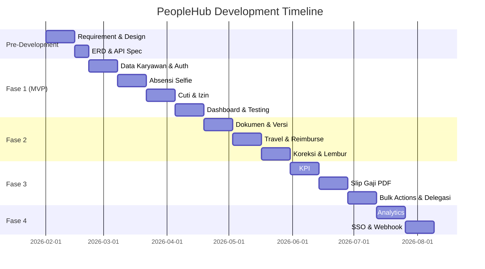

# Kerangka Acuan Kerja (KAK) PeopleHub by Kreatifindo

> **Versi:** 2.0 | **Tanggal Update:** 22 Januari 2026 | **Status:** Final

## 1. Latar Belakang

PeopleHub adalah sistem manajemen kekaryawanan berbasis web untuk memusatkan data dan aktivitas karyawan (absensi, cuti, kinerja, dokumen, payroll) dengan dukungan multi-tenant untuk empat perusahaan:

| No | Perusahaan |
|----|------------|
| 1 | PT. KREATIFINDO ABADI SEJAHTERA |
| 2 | PT. VIOLET GLOBAL INDONESIA |
| 3 | PT. CYBER MULTI ARTHA |
| 4 | PT. CYBER MULTI MANDIRI |

---

## 2. Tujuan

- Menyediakan sumber data tunggal (single source of truth) untuk data karyawan dan proses HR.
- Mengotomasi alur absensi, cuti, perjalanan dinas/reimburse, slip gaji, dan KPI.
- Menjamin transparansi melalui approval berjejak audit dan notifikasi real time.
- Mendukung skala multi-cabang/perusahaan dengan kebijakan yang fleksibel.

---

## 3. Ruang Lingkup

### 3.1 Fitur per Role

| Role | Fitur |
|------|-------|
| **Karyawan** | Registrasi dengan approval HRD, absen (WFO/WFH) dengan selfie, cuti, koreksi absensi, tukar shift, perjalanan dinas/reimburse, surat pengajuan, KPI pribadi, slip gaji PDF, dokumen/self-service, tiket bantuan, aset pinjaman |
| **Atasan/Manager** | Approval cuti/koreksi/shift/perjalanan, pantau absensi/KPI tim, pengumuman tim |
| **HRD** | Data master karyawan, kebijakan cuti/shift/denda, slip gaji, surat, monitoring kepatuhan, bulk actions, audit, analytics, delegasi approver |
| **Finance/Payroll** | Payroll run, slip batch, COA biaya, approval biaya/perjalanan, ekspor multi-format |
| **IT/Ops** | Akun/SSO, role/permission, audit log, kebijakan keamanan (IP/geofence/device), integrasi |
| **Super Admin** | Konfigurasi tenant, branding, domain, admin per perusahaan, batas cabang |

### 3.2 Integrasi
- Ekspor payroll CSV/Excel/multi-format
- Webhook event (absensi, cuti approved, reimburse)
- Notifikasi email/in-app (SMS roadmap)
- SSO Google/Microsoft (roadmap)

### 3.3 Non-Functional Requirements
- RBAC granular dengan isolasi tenant
- Audit trail untuk aksi sensitif
- Enkripsi in transit (TLS)
- Backup reguler dengan uji restore
- Dashboard < 3 detik @ 500 active users
- Absensi mobile P95 < 1.5 detik
- SLA 99.5% jam kerja

---

## 4. Deliverables

| # | Deliverable | Fase |
|---|------------|------|
| 1 | Dokumen kebutuhan fungsional per role/module dengan alur approval | Pre-MVP |
| 2 | Desain UI (wireframe, prototype) | Pre-MVP |
| 3 | Skema database (ERD) dan API specification | Pre-MVP |
| 4 | Implementasi MVP: data karyawan, absensi selfie, cuti, dashboard | Fase 1 |
| 5 | Implementasi: dokumen, lembur, koreksi absensi, travel/reimburse | Fase 2 |
| 6 | Implementasi: KPI, slip gaji PDF, bulk actions, delegasi | Fase 3 |
| 7 | Implementasi: analytics, SSO, webhook, automation | Fase 4 |
| 8 | UAT dan uji performa | Setiap Fase |
| 9 | Dokumentasi operasional dan panduan pengguna | Final |

---

## 5. Peran & Tanggung Jawab

| Role | Tanggung Jawab |
|------|----------------|
| **Sponsor/Stakeholder** | Menyetujui prioritas dan KPI keberhasilan |
| **Product Owner/BA** | Memfinalkan requirement, mengelola backlog/scope |
| **Tech Lead/Arsitek** | Desain teknis, keamanan, integrasi, NFR |
| **UI/UX Designer** | Desain UI enterprise, flow utama |
| **Frontend Engineer** | Implementasi Next.js, komponen UI |
| **Backend Engineer** | API Routes, database, integrasi |
| **QA Engineer** | Test plan, UAT, performance testing |
| **HRD/Finance (Client)** | Validasi kebijakan, UAT, template slip/surat |
| **IT/Ops (Client)** | SSO, keamanan, backup/restore |

---

## 6. Fase & Jadwal

### 6.1 Timeline Overview

### 6.2 Detail per Fase

| Fase | Scope | Durasi | Estimasi Mulai | Estimasi Selesai |
|------|-------|--------|----------------|------------------|
| **Pre-Dev** | Requirement, design, ERD, API spec | 3 minggu | Minggu 1 | Minggu 3 |
| **Fase 1 (MVP)** | Data karyawan, auth, absensi selfie, cuti, dashboard | 8 minggu | Minggu 4 | Minggu 11 |
| **Fase 2** | Dokumen versi, lembur/koreksi, travel/reimburse, denda | 6 minggu | Minggu 12 | Minggu 17 |
| **Fase 3** | KPI numerik, slip gaji PDF, bulk actions, delegasi, pengumuman ack | 6 minggu | Minggu 18 | Minggu 23 |
| **Fase 4** | Analytics (heatmap, turnover), webhook/API, SSO, automation, audit export | 4 minggu | Minggu 24 | Minggu 27 |

**Total Estimasi: ~27 minggu (~7 bulan)**

### 6.3 Milestone Kunci

| Milestone | Target Minggu | Kriteria Sukses |
|-----------|---------------|-----------------|
| **M1: Design Complete** | Minggu 3 | ERD, API spec, wireframe disetujui |
| **M2: MVP Launch** | Minggu 11 | Absensi selfie, cuti berjalan, 10 pilot users |
| **M3: Fase 2 Complete** | Minggu 17 | Travel/reimburse, dokumen, koreksi absensi live |
| **M4: Fase 3 Complete** | Minggu 23 | KPI, slip gaji PDF, bulk actions live |
| **M5: Full Launch** | Minggu 27 | Semua fitur live, SSO enabled |

### 6.4 Sprint Breakdown (Fase 1 MVP Detail)

| Sprint | Durasi | Deliverables |
|--------|--------|--------------|
| Sprint 1 | 2 minggu | Setup project, auth (register, login, reset), tenant config |
| Sprint 2 | 2 minggu | Data karyawan, struktur org (cabang/dept/jabatan), approval registrasi |
| Sprint 3 | 2 minggu | Absensi selfie (clock in/out, upload foto, late calculation) |
| Sprint 4 | 2 minggu | Cuti (request, balance, approval), dashboard HRD/karyawan, ekspor CSV |

---

## 7. Kriteria Keberhasilan

| Metric | Target | Measurement |
|--------|--------|-------------|
| **Adopsi Absensi** | >90% karyawan aktif absen via sistem | 1 bulan setelah MVP launch |
| **Efisiensi Cuti** | Waktu proses turun ≥50% | Compare pre vs post implementation |
| **Audit Compliance** | 100% approval/penolakan tercatat audit | Audit log review |
| **Data Isolation** | 0 akses lintas tenant tidak sah | Security testing |
| **Slip Gaji** | Finance publish batch tanpa koreksi manual besar | Post-payroll review |
| **Performa** | Dashboard <3s, absen <1.5s P95 | Performance testing |

---

## 8. Asumsi & Batasan

### Asumsi
- Setiap perusahaan memiliki admin HRD/Finance sendiri
- Super Admin hanya untuk pengaturan tenant
- Karyawan memiliki smartphone dengan kamera dan akses internet
- HRD/Finance sudah familiar dengan proses HR manual sebelumnya

### Batasan
- SSO dan tanda tangan digital berada di roadmap (bukan MVP)
- Geofence/device check absensi opsional sesuai kebijakan perusahaan
- Reimburse dibayar terpisah dari payroll (tidak auto-offset)
- Maksimal 4 tenant pada fase awal

---

## 9. Risiko & Mitigasi

| Risiko | Dampak | Probabilitas | Mitigasi |
|--------|--------|--------------|----------|
| Variasi kebijakan per cabang/perusahaan | Tinggi | Tinggi | Konfigurasi per cabang/tenant yang fleksibel |
| Resistensi pengguna terhadap sistem baru | Sedang | Sedang | UX sederhana, mobile-first, training, pengumuman in-app |
| Beban approval menumpuk di manager | Sedang | Sedang | Bulk approval, delegasi approver, pengingat SLA |
| Integrasi payroll beragam per perusahaan | Sedang | Tinggi | Mulai dengan format CSV/Excel generik, adaptor khusus per provider |
| Kebocoran data antar tenant | Tinggi | Rendah | RBAC ketat, audit log, testing isolasi tenant, code review |
| Kegagalan upload foto selfie | Sedang | Sedang | Retry mechanism, offline queue (PWA), compression |

---

## 10. Budget Estimate (Opsional)

> [!NOTE]
> Budget estimate bersifat indikatif dan perlu disesuaikan berdasarkan tim dan vendor yang dipilih.

| Item | Estimasi |
|------|----------|
| Development (7 bulan, 3-4 engineer) | Sesuai rate internal/vendor |
| UI/UX Design | 1-2 bulan dedicated |
| Infrastructure (VPS, DB, Storage) | ~Rp 2-5 juta/bulan |
| Domain & SSL | ~Rp 500 ribu/tahun |
| Email Service (SMTP) | ~Rp 500 ribu-1 juta/bulan |
| Contingency (20%) | - |

---

## 11. Dokumen Referensi

| Dokumen | Deskripsi |
|---------|-----------|
| [concept.md](concept.md) | Konsep produk lengkap |
| [roles-permissions.md](../02-requirements/roles-permissions.md) | Detail role dan permission |
| [user-stories.md](../02-requirements/user-stories.md) | User stories dengan acceptance criteria |
| [hld.md](../03-architecture/hld.md) | High-level architecture design |
| [lld.md](../03-architecture/lld.md) | Low-level design dan entitas |
| [erd.md](../03-architecture/erd.md) | ERD lengkap |
| [specification.md](../04-api/specification.md) | API specification MVP |
| [env-config.md](../06-database/env-config.md) | Environment variables |
