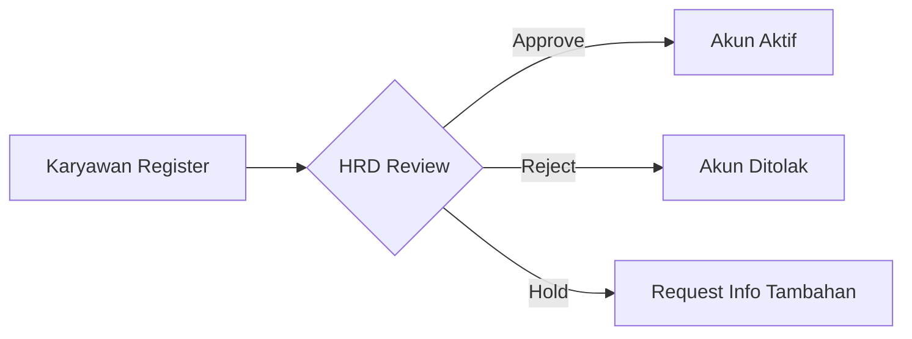
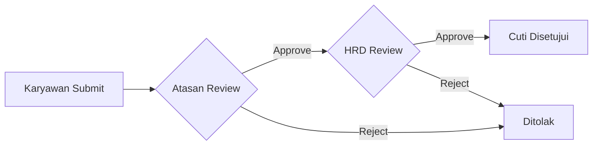
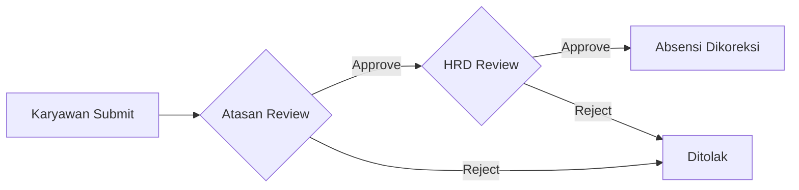
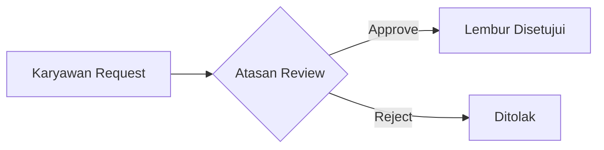
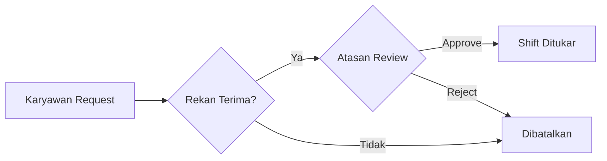
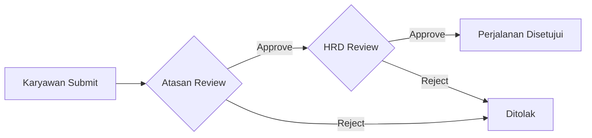
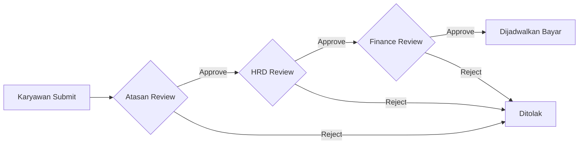
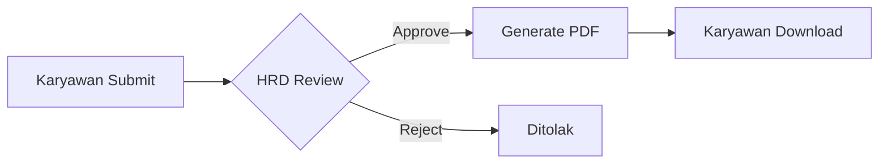
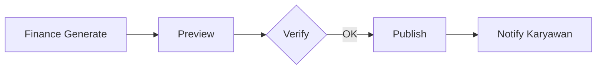

# Approval Matrix - PeopleHub

> **Versi:** 1.0 | **Tanggal:** 22 Januari 2026 | **Status:** Final

---

## Ringkasan

Dokumen ini mendefinisikan **matriks persetujuan** untuk setiap jenis pengajuan di sistem PeopleHub. Matriks ini menentukan:
- Siapa yang berwenang menyetujui
- Level approval yang diperlukan
- SLA untuk setiap tahapan
- Eskalasi jika tidak ada respons

---

## Approval Levels

| Level | Role | Deskripsi |
|-------|------|-----------|
| L1 | Atasan Langsung (Manager) | Approval pertama dari supervisor langsung |
| L2 | HRD Admin | Approval dari departemen HR |
| L3 | Finance | Approval dari departemen Finance |
| L4 | Super Admin / Direktur | Approval tertinggi untuk kasus khusus |

---

## 1. Registrasi Akun Baru

| Aspect | Detail |
|--------|--------|
| **Initiator** | Calon Karyawan |
| **Approvers** | HRD Admin |
| **Level** | Single-level (L2) |
| **SLA** | ≤ 2 hari kerja |
| **Eskalasi** | Jika tidak direspons 3 hari → Super Admin |

### Data yang Harus Diisi HRD saat Approve

| Field | Required | Notes |
|-------|----------|-------|
| Cabang | ✅ | Wajib pilih |
| Departemen | ✅ | Wajib pilih |
| Jabatan | ✅ | Wajib pilih |
| Atasan Langsung | ✅ | Wajib pilih |
| Nomor Karyawan | ✅ | Auto-generate atau manual |
| Employment Type | ✅ | Tetap/Kontrak/Freelance |
| Work Mode | ✅ | WFO/WFH/Hybrid |
| Tanggal Mulai | ✅ | Default: hari ini |

---

## 2. Pengajuan Cuti

| Jenis Cuti | Approvers | Level | SLA per Level |
|------------|-----------|-------|---------------|
| **Tahunan (≤ 3 hari)** | Atasan → HRD | L1 → L2 | 1 hari + 1 hari |
| **Tahunan (> 3 hari)** | Atasan → HRD | L1 → L2 | 1 hari + 2 hari |
| **Sakit (1 hari)** | Auto-approve | - | Immediate |
| **Sakit (> 1 hari)** | HRD (dengan surat dokter) | L2 | 1 hari |
| **Cuti Khusus** | Atasan → HRD | L1 → L2 | 1 hari + 1 hari |
| **Cuti Besar (> 5 hari)** | Atasan → HRD → Direktur | L1 → L2 → L4 | 1 + 2 + 2 hari |

### Validasi Otomatis

| Kondisi | Aksi |
|---------|------|
| Saldo tidak cukup | ❌ Submit diblokir |
| Overlap dengan cuti existing | ❌ Submit diblokir |
| Cuti sakit > 1 hari tanpa surat dokter | ⚠️ Warning, require upload |
| Cuti di tanggal libur | ⚠️ Warning, hari tidak dihitung |

### Override Rules

| Kondisi | Override oleh |
|---------|---------------|
| Atasan tidak available | Delegasi approver aktif |
| Urgent / Darurat | HRD direct approve (dengan catatan) |
| Koreksi saldo | HRD dengan audit log |

---

## 3. Koreksi Absensi

| Aspect | Detail |
|--------|--------|
| **Initiator** | Karyawan |
| **Approvers** | Atasan → HRD |
| **Level** | Multi-level (L1 → L2) |
| **SLA** | 1 hari + 1 hari |
| **Max Days Back** | 7 hari kalender |
| **Evidence Required** | Recommended (screenshot, foto, dll) |

---

## 4. Pengajuan Lembur

| Aspect | Detail |
|--------|--------|
| **Initiator** | Karyawan |
| **Approvers** | Atasan Langsung |
| **Level** | Single-level (L1) |
| **SLA** | ≤ 24 jam sebelum lembur |
| **Max Hours** | 4 jam/hari, 14 jam/minggu |

### Post-Approval

Setelah lembur selesai, HRD memverifikasi realisasi:
- Jam mulai & selesai aktual
- Kalkulasi upah lembur

---

## 5. Tukar/Cover Shift

| Aspect | Detail |
|--------|--------|
| **Initiator** | Karyawan |
| **Stage 1** | Konfirmasi dari rekan (partner) |
| **Stage 2** | Approval atasan |
| **Level** | Peer → L1 |
| **SLA** | 24 jam + 24 jam |

---

## 6. Perjalanan Dinas

| Aspect | Detail |
|--------|--------|
| **Initiator** | Karyawan |
| **Approvers** | Atasan → HRD |
| **Level** | Multi-level (L1 → L2) |
| **SLA** | 2 hari + 2 hari |
| **Min Lead Time** | 3 hari kerja sebelum keberangkatan |

---

## 7. Reimburse / Penggantian Biaya

| Aspect | Detail |
|--------|--------|
| **Initiator** | Karyawan |
| **Approvers** | Atasan → HRD → Finance |
| **Level** | Multi-level (L1 → L2 → L3) |
| **SLA** | 1 hari + 1 hari + 2 hari |
| **Evidence** | Wajib (struk/invoice) |
| **Max Days** | 30 hari dari tanggal transaksi |

### Validasi Plafon

| Kategori | Plafon per Hari | Notes |
|----------|-----------------|-------|
| Tiket | Sesuai aktual | Ekonomi/bisnis sesuai jabatan |
| Hotel | Rp 700.000 | Per malam |
| Transport lokal | Rp 150.000 | Per hari |
| Makan | Rp 100.000 | Per hari |
| Uang saku | Rp 50.000 | Per hari |

---

## 8. Pengajuan Surat

| Jenis Surat | Approvers | SLA |
|-------------|-----------|-----|
| Keterangan Kerja | HRD | 2 hari |
| Referensi | HRD → Direktur | 3 hari |
| Tugas / SPPD | HRD | 1 hari |
| Pinjaman | HRD → Finance | 3 hari |

---

## 9. Publish Slip Gaji

| Aspect | Detail |
|--------|--------|
| **Initiator** | Finance |
| **Approvers** | Self (Finance) |
| **Audit Log** | Wajib tercatat |
| **Notification** | Email + In-App |

---

## Delegasi Approval

Jika approver tidak tersedia, delegasi dapat diaktifkan:

| Kondisi | Delegasi ke |
|---------|-------------|
| Atasan cuti | Atasan dari atasan (skip level) |
| HRD cuti | HRD lain atau Super Admin |
| Finance cuti | Finance lain atau Super Admin |

### Setup Delegasi

1. Approver set delegasi sebelum cuti
2. Delegasi aktif selama periode tertentu
3. Semua approval oleh delegate tercatat di audit

---

## Eskalasi Matrix

Jika tidak ada respons dalam SLA:

| Level | Eskalasi ke | Waktu |
|-------|-------------|-------|
| L1 (Atasan) | HRD | +1 hari |
| L2 (HRD) | Super Admin | +2 hari |
| L3 (Finance) | CFO / Direktur | +2 hari |

### Notifikasi Pengingat

| Waktu | Aksi |
|-------|------|
| 50% SLA | Reminder ke approver |
| 80% SLA | Reminder + CC atasan approver |
| 100% SLA | Auto-eskalasi |

---

## Audit Trail

Setiap approval action WAJIB mencatat:

| Field | Description |
|-------|-------------|
| `action` | approve / reject / hold |
| `actor_id` | User ID yang melakukan aksi |
| `actor_role` | Role saat melakukan aksi |
| `comment` | Komentar (wajib jika reject) |
| `timestamp` | Waktu aksi |
| `ip_address` | IP address |
| `is_delegated` | Apakah ini delegasi |
| `delegated_from` | Jika delegasi, dari siapa |

---

## Dokumen Terkait

| Dokumen | Link |
|---------|------|
| Roles & Permissions | [roles-permissions.md](roles-permissions.md) |
| User Stories | [user-stories.md](user-stories.md) |
| API Specification | [../04-api/specification.md](../04-api/specification.md) |
| Flow Leave | [../04-api/flow-leave.md](../04-api/flow-leave.md) |
