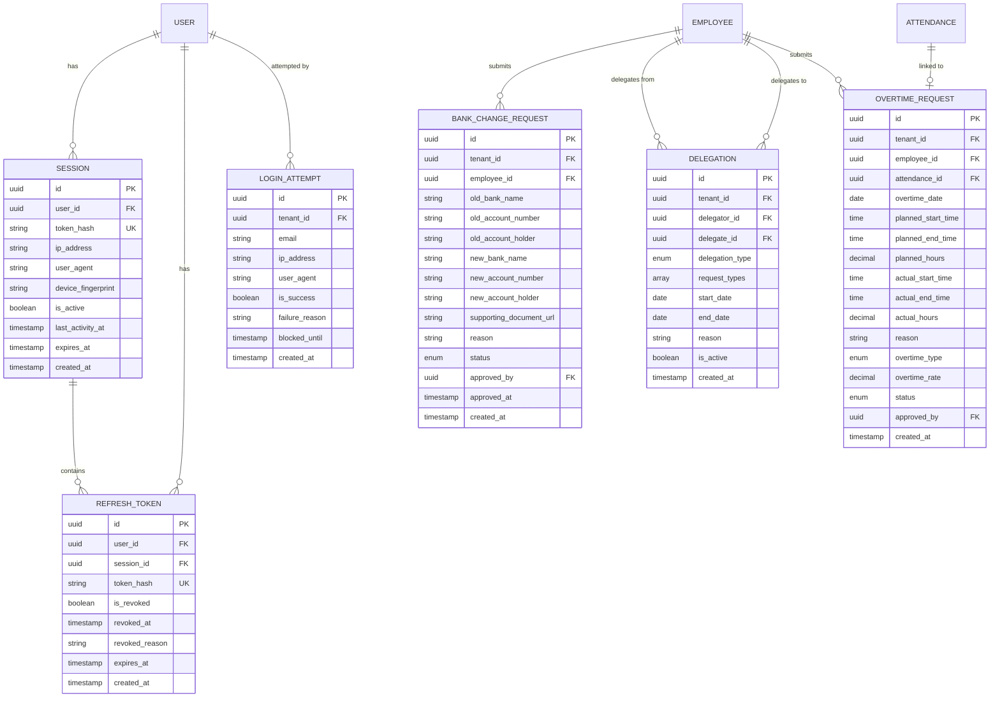

# Skema Database & ERD PeopleHub

> **Versi:** 2.0 | **Tanggal Update:** 22 Januari 2026 | **Status:** Final

## Ringkasan

Dokumen ini berisi Entity Relationship Diagram (ERD) lengkap untuk sistem PeopleHub, mencakup semua entitas utama, relasi, dan definisi kolom.

---

## ERD Overview

```mermaid
erDiagram
    %% Core Entities
    TENANT ||--o{ USER : has
    TENANT ||--o{ BRANCH : has
    TENANT ||--o{ DEPARTMENT : has
    TENANT ||--o{ POSITION : has
    
    USER ||--o| EMPLOYEE : "is linked to"
    EMPLOYEE ||--o{ ATTENDANCE : records
    EMPLOYEE ||--o{ LEAVE_REQUEST : submits
    EMPLOYEE ||--o{ LEAVE_BALANCE : has
    EMPLOYEE ||--o{ TRAVEL_REQUEST : submits
    EMPLOYEE ||--o{ EXPENSE : submits
    EMPLOYEE ||--o{ PAYSLIP : receives
    EMPLOYEE ||--o{ KPI_GOAL : has
    EMPLOYEE ||--o{ DOCUMENT : owns
    EMPLOYEE ||--o{ LETTER_REQUEST : submits
    EMPLOYEE ||--o{ TICKET : creates
    EMPLOYEE ||--o{ ASSET_LOAN : borrows
    EMPLOYEE ||--o{ VIOLATION_NOTICE : receives
    
    BRANCH ||--o{ EMPLOYEE : employs
    DEPARTMENT ||--o{ EMPLOYEE : contains
    POSITION ||--o{ EMPLOYEE : holds
    EMPLOYEE ||--o{ EMPLOYEE : "reports to (manager)"
    
    SCHEDULE ||--o{ ATTENDANCE : defines
    SHIFT ||--o{ SCHEDULE : uses
    
    KPI_CYCLE ||--o{ KPI_GOAL : contains
    ANNOUNCEMENT ||--o{ ANNOUNCEMENT_READ : "tracked by"
    
    APPROVAL_FLOW ||--o{ APPROVAL_STEP : has

    %% Entity Definitions
    TENANT {
        uuid id PK
        string name
        string domain
        json branding
        boolean is_active
        timestamp created_at
        timestamp updated_at
    }
    
    USER {
        uuid id PK
        uuid tenant_id FK
        string email UK
        string phone
        string password_hash
        enum status "pending|approved|rejected|suspended"
        enum role "employee|manager|hrd|finance|it_ops|super_admin"
        timestamp email_verified_at
        timestamp last_login_at
        timestamp created_at
        timestamp updated_at
    }
    
    EMPLOYEE {
        uuid id PK
        uuid tenant_id FK
        uuid user_id FK
        uuid branch_id FK
        uuid department_id FK
        uuid position_id FK
        uuid manager_id FK
        string employee_number UK
        string full_name
        string nik
        string npwp
        string bpjs_kesehatan
        string bpjs_ketenagakerjaan
        enum employment_type "permanent|contract|freelance"
        enum work_mode "wfo|wfh|hybrid"
        date start_date
        date end_date
        string phone
        string address
        string emergency_contact_name
        string emergency_contact_phone
        string bank_name
        string bank_account_number
        string bank_account_holder
        string bank_branch
        enum status "active|inactive|terminated"
        timestamp created_at
        timestamp updated_at
    }
    
    BRANCH {
        uuid id PK
        uuid tenant_id FK
        string code UK
        string name
        string address
        string city
        string timezone
        decimal latitude
        decimal longitude
        integer geofence_radius_meters
        boolean is_active
        timestamp created_at
    }
    
    DEPARTMENT {
        uuid id PK
        uuid tenant_id FK
        uuid branch_id FK
        string code UK
        string name
        boolean is_active
        timestamp created_at
    }
    
    POSITION {
        uuid id PK
        uuid tenant_id FK
        string code UK
        string name
        integer level
        boolean is_active
        timestamp created_at
    }
    
    SHIFT {
        uuid id PK
        uuid tenant_id FK
        string name
        time start_time
        time end_time
        integer break_minutes
        boolean is_flexible
        boolean is_active
        timestamp created_at
    }
    
    SCHEDULE {
        uuid id PK
        uuid tenant_id FK
        uuid employee_id FK
        uuid shift_id FK
        date schedule_date
        enum work_mode "wfo|wfh"
        boolean is_holiday
        timestamp created_at
    }
    
    ATTENDANCE {
        uuid id PK
        uuid tenant_id FK
        uuid employee_id FK
        uuid schedule_id FK
        date attendance_date
        timestamp clock_in
        timestamp clock_out
        enum work_mode "wfo|wfh"
        string clock_in_photo_url
        string clock_out_photo_url
        decimal clock_in_latitude
        decimal clock_in_longitude
        decimal clock_out_latitude
        decimal clock_out_longitude
        string device_info
        integer late_minutes
        integer early_leave_minutes
        integer overtime_minutes
        decimal late_deduction_amount
        enum status "present|late|absent|leave|holiday"
        boolean is_corrected
        timestamp created_at
        timestamp updated_at
    }
    
    ATTENDANCE_CORRECTION {
        uuid id PK
        uuid tenant_id FK
        uuid employee_id FK
        uuid attendance_id FK
        date correction_date
        timestamp requested_clock_in
        timestamp requested_clock_out
        string reason
        string evidence_url
        enum status "pending|approved|rejected"
        uuid approved_by_manager FK
        uuid approved_by_hrd FK
        timestamp manager_approved_at
        timestamp hrd_approved_at
        string rejection_reason
        timestamp created_at
        timestamp updated_at
    }
    
    SHIFT_SWAP {
        uuid id PK
        uuid tenant_id FK
        uuid requester_id FK
        uuid partner_id FK
        date requester_shift_date
        date partner_shift_date
        string reason
        enum status "pending_partner|pending_manager|approved|rejected|cancelled"
        boolean partner_approved
        uuid approved_by FK
        timestamp approved_at
        timestamp created_at
        timestamp updated_at
    }
    
    LEAVE_TYPE {
        uuid id PK
        uuid tenant_id FK
        string code UK
        string name
        integer default_balance
        boolean is_paid
        boolean requires_attachment
        boolean is_active
        timestamp created_at
    }
    
    LEAVE_BALANCE {
        uuid id PK
        uuid tenant_id FK
        uuid employee_id FK
        uuid leave_type_id FK
        integer year
        integer initial_balance
        integer used_balance
        integer remaining_balance
        date expiry_date
        timestamp created_at
        timestamp updated_at
    }
    
    LEAVE_REQUEST {
        uuid id PK
        uuid tenant_id FK
        uuid employee_id FK
        uuid leave_type_id FK
        date start_date
        date end_date
        integer total_days
        string reason
        string attachment_url
        uuid delegate_to FK
        enum status "pending|approved_manager|approved|rejected|cancelled"
        uuid approved_by_manager FK
        uuid approved_by_hrd FK
        timestamp manager_approved_at
        timestamp hrd_approved_at
        string rejection_reason
        timestamp created_at
        timestamp updated_at
    }
    
    TRAVEL_REQUEST {
        uuid id PK
        uuid tenant_id FK
        uuid employee_id FK
        string destination
        date start_date
        date end_date
        string purpose
        decimal estimated_budget
        string currency
        enum status "pending|approved_manager|approved_hrd|approved|rejected|cancelled"
        uuid approved_by_manager FK
        uuid approved_by_hrd FK
        uuid approved_by_finance FK
        timestamp created_at
        timestamp updated_at
    }
    
    EXPENSE {
        uuid id PK
        uuid tenant_id FK
        uuid employee_id FK
        uuid travel_request_id FK
        string category
        string description
        decimal amount
        string currency
        date expense_date
        string receipt_url
        enum status "pending|approved_manager|approved_hrd|approved|rejected|paid"
        uuid approved_by_manager FK
        uuid approved_by_hrd FK
        uuid approved_by_finance FK
        date paid_date
        timestamp created_at
        timestamp updated_at
    }
    
    EXPENSE_CATEGORY {
        uuid id PK
        uuid tenant_id FK
        string code
        string name
        decimal max_amount
        string coa_code
        boolean requires_receipt
        boolean is_active
        timestamp created_at
    }
    
    CASH_ADVANCE {
        uuid id PK
        uuid tenant_id FK
        uuid employee_id FK
        decimal amount
        string purpose
        enum status "pending|approved|rejected|disbursed|settled"
        decimal settled_amount
        uuid approved_by FK
        timestamp disbursed_at
        timestamp settled_at
        timestamp created_at
        timestamp updated_at
    }
    
    PAYROLL_COMPONENT {
        uuid id PK
        uuid tenant_id FK
        string code UK
        string name
        enum type "earning|deduction"
        string coa_code
        boolean is_recurring
        boolean is_taxable
        boolean is_active
        timestamp created_at
    }
    
    PAYSLIP {
        uuid id PK
        uuid tenant_id FK
        uuid employee_id FK
        string period
        date period_start
        date period_end
        decimal gross_salary
        decimal total_deductions
        decimal net_salary
        json components
        string pdf_url
        enum status "draft|published"
        timestamp published_at
        uuid published_by FK
        timestamp created_at
        timestamp updated_at
    }
    
    KPI_CYCLE {
        uuid id PK
        uuid tenant_id FK
        string name
        date start_date
        date end_date
        enum status "draft|active|closed"
        timestamp created_at
        timestamp updated_at
    }
    
    KPI_GOAL {
        uuid id PK
        uuid tenant_id FK
        uuid employee_id FK
        uuid kpi_cycle_id FK
        string title
        string description
        decimal target_value
        string unit
        decimal weight
        decimal current_value
        decimal achievement_percentage
        enum status "active|completed|cancelled"
        uuid set_by FK
        timestamp created_at
        timestamp updated_at
    }
    
    DOCUMENT {
        uuid id PK
        uuid tenant_id FK
        uuid employee_id FK
        enum type "contract|warning_letter|nda|bpjs|npwp|ktp|other"
        string name
        string file_url
        integer version
        date valid_from
        date valid_until
        enum access_scope "owner|manager|hrd|all"
        uuid uploaded_by FK
        timestamp created_at
    }
    
    LETTER_CATEGORY {
        uuid id PK
        uuid tenant_id FK
        string code
        string name
        boolean requires_manager_approval
        json template_fields
        boolean is_active
        timestamp created_at
    }
    
    LETTER_REQUEST {
        uuid id PK
        uuid tenant_id FK
        uuid employee_id FK
        uuid letter_category_id FK
        string letter_number
        json payload
        enum status "pending|approved_manager|approved|rejected|issued"
        uuid approved_by_manager FK
        uuid approved_by_hrd FK
        string letter_pdf_url
        timestamp issued_at
        uuid issued_by FK
        timestamp created_at
        timestamp updated_at
    }
    
    ANNOUNCEMENT {
        uuid id PK
        uuid tenant_id FK
        string title
        text content
        json target_audience
        enum status "draft|published|archived"
        uuid published_by FK
        timestamp published_at
        timestamp expires_at
        timestamp created_at
        timestamp updated_at
    }
    
    ANNOUNCEMENT_READ {
        uuid id PK
        uuid announcement_id FK
        uuid employee_id FK
        timestamp read_at
    }
    
    VIOLATION_NOTICE {
        uuid id PK
        uuid tenant_id FK
        uuid employee_id FK
        string violation_type
        string description
        string consequence
        date violation_date
        uuid issued_by FK
        timestamp notified_at
        boolean acknowledged
        timestamp acknowledged_at
        timestamp created_at
    }
    
    TICKET {
        uuid id PK
        uuid tenant_id FK
        uuid employee_id FK
        enum category "hr|it|finance|other"
        string subject
        text description
        string attachment_url
        enum priority "low|normal|high|urgent"
        enum status "open|in_progress|resolved|closed"
        uuid assignee_id FK
        timestamp resolved_at
        timestamp closed_at
        timestamp created_at
        timestamp updated_at
    }
    
    TICKET_COMMENT {
        uuid id PK
        uuid ticket_id FK
        uuid author_id FK
        text content
        boolean is_internal
        timestamp created_at
    }
    
    ASSET_LOAN {
        uuid id PK
        uuid tenant_id FK
        uuid employee_id FK
        string asset_name
        string asset_code
        string description
        date checkout_date
        date due_date
        date return_date
        enum status "active|returned|overdue|lost"
        uuid checked_out_by FK
        uuid returned_to FK
        timestamp created_at
        timestamp updated_at
    }
    
    LATE_DEDUCTION_RULE {
        uuid id PK
        uuid tenant_id FK
        uuid branch_id FK
        integer min_late_minutes
        integer max_late_minutes
        decimal deduction_amount
        enum deduction_type "fixed|percentage"
        boolean is_active
        timestamp created_at
    }
    
    HOLIDAY {
        uuid id PK
        uuid tenant_id FK
        uuid branch_id FK
        string name
        date holiday_date
        boolean is_national
        timestamp created_at
    }
    
    APPROVAL_FLOW {
        uuid id PK
        uuid tenant_id FK
        string request_type
        json steps
        boolean is_active
        timestamp created_at
    }
    
    AUDIT_LOG {
        uuid id PK
        uuid tenant_id FK
        uuid actor_id FK
        string action
        string object_type
        uuid object_id
        json before_data
        json after_data
        string ip_address
        string user_agent
        timestamp created_at
    }
    
    NOTIFICATION {
        uuid id PK
        uuid tenant_id FK
        uuid recipient_id FK
        string title
        text message
        string link
        enum channel "in_app|email"
        boolean is_read
        timestamp read_at
        timestamp sent_at
        timestamp created_at
    }
    
    NOTIFICATION_PREFERENCE {
        uuid id PK
        uuid tenant_id FK
        uuid employee_id FK
        string event_type
        boolean email_enabled
        boolean in_app_enabled
        enum frequency "realtime|daily_digest"
        timestamp created_at
        timestamp updated_at
    }
```



---

## Definisi Tabel Detail

### Core Tables

#### `tenant`
| Kolom | Tipe | Constraint | Deskripsi |
|-------|------|------------|-----------|
| id | UUID | PK | Primary key |
| name | VARCHAR(255) | NOT NULL | Nama perusahaan/tenant |
| domain | VARCHAR(100) | UNIQUE | Subdomain tenant |
| branding | JSONB | | Logo, warna, dll |
| is_active | BOOLEAN | DEFAULT true | Status aktif |
| created_at | TIMESTAMPTZ | DEFAULT NOW() | Waktu dibuat |
| updated_at | TIMESTAMPTZ | | Waktu update |

#### `user`
| Kolom | Tipe | Constraint | Deskripsi |
|-------|------|------------|-----------|
| id | UUID | PK | Primary key |
| tenant_id | UUID | FK → tenant.id, NOT NULL | Tenant pemilik |
| email | VARCHAR(255) | UNIQUE per tenant | Email login |
| phone | VARCHAR(20) | | Nomor telepon |
| password_hash | VARCHAR(255) | NOT NULL | Hash password (bcrypt) |
| status | ENUM | DEFAULT 'pending' | pending/approved/rejected/suspended |
| role | ENUM | NOT NULL | employee/manager/hrd/finance/it_ops/super_admin |
| email_verified_at | TIMESTAMPTZ | | Waktu verifikasi email |
| last_login_at | TIMESTAMPTZ | | Login terakhir |
| created_at | TIMESTAMPTZ | DEFAULT NOW() | Waktu register |
| updated_at | TIMESTAMPTZ | | Waktu update |

**Index:** `(tenant_id, email)` UNIQUE, `(tenant_id, status)`

#### `employee`
| Kolom | Tipe | Constraint | Deskripsi |
|-------|------|------------|-----------|
| id | UUID | PK | Primary key |
| tenant_id | UUID | FK → tenant.id | Tenant |
| user_id | UUID | FK → user.id, UNIQUE | Linked user account |
| branch_id | UUID | FK → branch.id | Cabang |
| department_id | UUID | FK → department.id | Departemen |
| position_id | UUID | FK → position.id | Jabatan |
| manager_id | UUID | FK → employee.id | Atasan langsung |
| employee_number | VARCHAR(50) | UNIQUE per tenant | NIK karyawan |
| full_name | VARCHAR(255) | NOT NULL | Nama lengkap |
| nik | VARCHAR(16) | | NIK KTP |
| npwp | VARCHAR(20) | | NPWP |
| bpjs_kesehatan | VARCHAR(20) | | No BPJS Kesehatan |
| bpjs_ketenagakerjaan | VARCHAR(20) | | No BPJS TK |
| employment_type | ENUM | NOT NULL | permanent/contract/freelance |
| work_mode | ENUM | DEFAULT 'wfo' | wfo/wfh/hybrid |
| start_date | DATE | NOT NULL | Tanggal mulai kerja |
| end_date | DATE | | Tanggal kontrak berakhir |
| phone | VARCHAR(20) | | Telepon pribadi |
| address | TEXT | | Alamat domisili |
| emergency_contact_name | VARCHAR(255) | | Nama kontak darurat |
| emergency_contact_phone | VARCHAR(20) | | Telepon darurat |
| bank_name | VARCHAR(100) | | Nama bank |
| bank_account_number | VARCHAR(30) | | Nomor rekening |
| bank_account_holder | VARCHAR(255) | | Nama pemilik rekening |
| bank_branch | VARCHAR(100) | | Cabang bank |
| status | ENUM | DEFAULT 'active' | active/inactive/terminated |
| created_at | TIMESTAMPTZ | DEFAULT NOW() | |
| updated_at | TIMESTAMPTZ | | |

**Index:** `(tenant_id, employee_number)` UNIQUE, `(tenant_id, branch_id)`, `(tenant_id, department_id)`, `(tenant_id, manager_id)`, `(tenant_id, status)`

---

### Attendance Tables

#### `attendance`
| Kolom | Tipe | Constraint | Deskripsi |
|-------|------|------------|-----------|
| id | UUID | PK | |
| tenant_id | UUID | FK, NOT NULL | |
| employee_id | UUID | FK → employee.id | |
| schedule_id | UUID | FK → schedule.id | |
| attendance_date | DATE | NOT NULL | |
| clock_in | TIMESTAMPTZ | | Waktu clock in |
| clock_out | TIMESTAMPTZ | | Waktu clock out |
| work_mode | ENUM | | wfo/wfh |
| clock_in_photo_url | VARCHAR(500) | | URL foto selfie clock in |
| clock_out_photo_url | VARCHAR(500) | | URL foto selfie clock out |
| clock_in_latitude | DECIMAL(10,8) | | Latitude clock in |
| clock_in_longitude | DECIMAL(11,8) | | Longitude clock in |
| clock_out_latitude | DECIMAL(10,8) | | |
| clock_out_longitude | DECIMAL(11,8) | | |
| device_info | VARCHAR(500) | | Browser/OS info |
| late_minutes | INTEGER | DEFAULT 0 | Menit terlambat |
| early_leave_minutes | INTEGER | DEFAULT 0 | Menit pulang awal |
| overtime_minutes | INTEGER | DEFAULT 0 | Menit lembur |
| late_deduction_amount | DECIMAL(15,2) | DEFAULT 0 | Potongan terlambat |
| status | ENUM | NOT NULL | present/late/absent/leave/holiday |
| is_corrected | BOOLEAN | DEFAULT false | Sudah dikoreksi |
| created_at | TIMESTAMPTZ | DEFAULT NOW() | |
| updated_at | TIMESTAMPTZ | | |

**Index:** `(tenant_id, employee_id, attendance_date)` UNIQUE, `(tenant_id, attendance_date)`, `(tenant_id, status)`

---

## Enum Definitions

```sql
-- User & Employee Status
CREATE TYPE user_status AS ENUM ('pending', 'approved', 'rejected', 'suspended');
CREATE TYPE employee_status AS ENUM ('active', 'inactive', 'terminated');

-- Roles
CREATE TYPE user_role AS ENUM ('employee', 'manager', 'hrd', 'finance', 'it_ops', 'super_admin');

-- Work Types
CREATE TYPE employment_type AS ENUM ('permanent', 'contract', 'freelance');
CREATE TYPE work_mode AS ENUM ('wfo', 'wfh', 'hybrid');

-- Attendance
CREATE TYPE attendance_status AS ENUM ('present', 'late', 'absent', 'leave', 'holiday');

-- Approval Status (generic)
CREATE TYPE approval_status AS ENUM ('pending', 'approved_manager', 'approved_hrd', 'approved', 'rejected', 'cancelled');

-- Shift Swap
CREATE TYPE shift_swap_status AS ENUM ('pending_partner', 'pending_manager', 'approved', 'rejected', 'cancelled');

-- Payslip
CREATE TYPE payslip_status AS ENUM ('draft', 'published');

-- Ticket
CREATE TYPE ticket_category AS ENUM ('hr', 'it', 'finance', 'other');
CREATE TYPE ticket_priority AS ENUM ('low', 'normal', 'high', 'urgent');
CREATE TYPE ticket_status AS ENUM ('open', 'in_progress', 'resolved', 'closed');

-- Expense
CREATE TYPE expense_status AS ENUM ('pending', 'approved_manager', 'approved_hrd', 'approved', 'rejected', 'paid');

-- Document
CREATE TYPE document_type AS ENUM ('contract', 'warning_letter', 'nda', 'bpjs', 'npwp', 'ktp', 'other');
CREATE TYPE document_access_scope AS ENUM ('owner', 'manager', 'hrd', 'all');

-- KPI
CREATE TYPE kpi_status AS ENUM ('draft', 'active', 'closed');
CREATE TYPE goal_status AS ENUM ('active', 'completed', 'cancelled');

-- Asset
CREATE TYPE asset_loan_status AS ENUM ('active', 'returned', 'overdue', 'lost');

-- Deduction
CREATE TYPE deduction_type AS ENUM ('fixed', 'percentage');

-- Notification
CREATE TYPE notification_channel AS ENUM ('in_app', 'email');
CREATE TYPE notification_frequency AS ENUM ('realtime', 'daily_digest');
```

---

## Important Constraints & Rules

### Business Rules

1. **Tenant Isolation**: Semua query WAJIB filter `tenant_id`
2. **Unique Email per Tenant**: `(tenant_id, email)` harus unique
3. **Unique Employee Number per Tenant**: `(tenant_id, employee_number)` harus unique
4. **Manager Hierarchy**: `employee.manager_id` tidak boleh circular (self-reference chain)
5. **Leave Balance**: `remaining_balance >= 0` (tidak boleh negatif)
6. **Attendance**: Satu record per `(employee_id, attendance_date)`
7. **Payslip Period**: Satu slip per `(employee_id, period)`

### Audit Requirements

Tabel yang WAJIB di-audit (insert ke `audit_log`):
- `user` (create, status change)
- `employee` (create, update bank info)
- `payslip` (publish)
- `leave_request` (approve/reject)
- `expense` (approve/reject/pay)
- `letter_request` (issue)
- `violation_notice` (create)

---

## Migration Order

Untuk migrasi database, ikuti urutan berikut:

1. `tenant`
2. `user`
3. `branch`, `department`, `position`, `shift`
4. `employee`
5. `schedule`, `holiday`, `late_deduction_rule`
6. `attendance`, `attendance_correction`, `shift_swap`
7. `leave_type`, `leave_balance`, `leave_request`
8. `expense_category`, `travel_request`, `expense`, `cash_advance`
9. `payroll_component`, `payslip`
10. `kpi_cycle`, `kpi_goal`
11. `document`, `letter_category`, `letter_request`
12. `announcement`, `announcement_read`, `violation_notice`
13. `ticket`, `ticket_comment`, `asset_loan`
14. `approval_flow`, `audit_log`, `notification`, `notification_preference`
15. `session`, `refresh_token`, `login_attempt`
16. `bank_change_request`, `delegation`, `overtime_request`

---

## Tabel Tambahan

### Authentication & Security Tables

#### `session`
| Kolom | Tipe | Constraint | Deskripsi |
|-------|------|------------|-----------|
| id | UUID | PK | Primary key |
| user_id | UUID | FK → user.id, NOT NULL | User pemilik session |
| token_hash | VARCHAR(255) | NOT NULL | Hash session token |
| ip_address | VARCHAR(45) | NOT NULL | IPv4/IPv6 |
| user_agent | VARCHAR(500) | | Browser/device info |
| device_fingerprint | VARCHAR(255) | | Device fingerprint |
| is_active | BOOLEAN | DEFAULT true | Session aktif |
| last_activity_at | TIMESTAMPTZ | NOT NULL | Aktivitas terakhir |
| expires_at | TIMESTAMPTZ | NOT NULL | Waktu expired |
| created_at | TIMESTAMPTZ | DEFAULT NOW() | Waktu dibuat |

**Index:** `(user_id)`, `(token_hash)` UNIQUE, `(expires_at)`

**Retention:** Hard delete setelah 30 hari

```sql
CREATE TABLE session (
    id UUID PRIMARY KEY DEFAULT gen_random_uuid(),
    user_id UUID NOT NULL REFERENCES "user"(id) ON DELETE CASCADE,
    token_hash VARCHAR(255) NOT NULL UNIQUE,
    ip_address VARCHAR(45) NOT NULL,
    user_agent VARCHAR(500),
    device_fingerprint VARCHAR(255),
    is_active BOOLEAN DEFAULT true,
    last_activity_at TIMESTAMPTZ NOT NULL DEFAULT NOW(),
    expires_at TIMESTAMPTZ NOT NULL,
    created_at TIMESTAMPTZ DEFAULT NOW()
);

CREATE INDEX idx_session_user ON session(user_id);
CREATE INDEX idx_session_expires ON session(expires_at);
```

---

#### `refresh_token`
| Kolom | Tipe | Constraint | Deskripsi |
|-------|------|------------|-----------|
| id | UUID | PK | Primary key |
| user_id | UUID | FK → user.id, NOT NULL | User pemilik |
| session_id | UUID | FK → session.id | Linked session |
| token_hash | VARCHAR(255) | NOT NULL | Hash refresh token |
| is_revoked | BOOLEAN | DEFAULT false | Token dicabut |
| revoked_at | TIMESTAMPTZ | | Waktu dicabut |
| revoked_reason | VARCHAR(255) | | Alasan dicabut |
| expires_at | TIMESTAMPTZ | NOT NULL | Waktu expired |
| created_at | TIMESTAMPTZ | DEFAULT NOW() | Waktu dibuat |

**Index:** `(token_hash)` UNIQUE, `(user_id)`, `(expires_at)`

**Retention:** Hard delete permanen saat dicabut

```sql
CREATE TABLE refresh_token (
    id UUID PRIMARY KEY DEFAULT gen_random_uuid(),
    user_id UUID NOT NULL REFERENCES "user"(id) ON DELETE CASCADE,
    session_id UUID REFERENCES session(id) ON DELETE SET NULL,
    token_hash VARCHAR(255) NOT NULL UNIQUE,
    is_revoked BOOLEAN DEFAULT false,
    revoked_at TIMESTAMPTZ,
    revoked_reason VARCHAR(255),
    expires_at TIMESTAMPTZ NOT NULL,
    created_at TIMESTAMPTZ DEFAULT NOW()
);

CREATE INDEX idx_refresh_token_user ON refresh_token(user_id);
CREATE INDEX idx_refresh_token_expires ON refresh_token(expires_at);
```

---

#### `login_attempt`
| Kolom | Tipe | Constraint | Deskripsi |
|-------|------|------------|-----------|
| id | UUID | PK | Primary key |
| tenant_id | UUID | FK → tenant.id | Tenant (nullable untuk unknown) |
| email | VARCHAR(255) | NOT NULL | Email yang dicoba |
| ip_address | VARCHAR(45) | NOT NULL | IP address |
| user_agent | VARCHAR(500) | | Browser/device info |
| is_success | BOOLEAN | NOT NULL | Berhasil atau gagal |
| failure_reason | VARCHAR(100) | | invalid_password/user_not_found/suspended/etc |
| blocked_until | TIMESTAMPTZ | | Waktu block berakhir (rate limit) |
| created_at | TIMESTAMPTZ | DEFAULT NOW() | Waktu percobaan |

**Index:** `(email, created_at)`, `(ip_address, created_at)`, `(tenant_id, is_success)`

**Retention:** Hard delete setelah 30 hari

```sql
CREATE TABLE login_attempt (
    id UUID PRIMARY KEY DEFAULT gen_random_uuid(),
    tenant_id UUID REFERENCES tenant(id),
    email VARCHAR(255) NOT NULL,
    ip_address VARCHAR(45) NOT NULL,
    user_agent VARCHAR(500),
    is_success BOOLEAN NOT NULL,
    failure_reason VARCHAR(100),
    blocked_until TIMESTAMPTZ,
    created_at TIMESTAMPTZ DEFAULT NOW()
);

CREATE INDEX idx_login_attempt_email ON login_attempt(email, created_at);
CREATE INDEX idx_login_attempt_ip ON login_attempt(ip_address, created_at);
CREATE INDEX idx_login_attempt_tenant ON login_attempt(tenant_id, is_success);

-- Partial index untuk failed attempts (untuk rate limiting)
CREATE INDEX idx_login_attempt_failed ON login_attempt(email, ip_address, created_at)
WHERE is_success = false;
```

---

### Operational Tables

#### `bank_change_request`
| Kolom | Tipe | Constraint | Deskripsi |
|-------|------|------------|-----------|
| id | UUID | PK | Primary key |
| tenant_id | UUID | FK → tenant.id, NOT NULL | Tenant |
| employee_id | UUID | FK → employee.id, NOT NULL | Karyawan pengaju |
| old_bank_name | VARCHAR(100) | | Bank sebelumnya |
| old_account_number | VARCHAR(30) | | Rekening sebelumnya |
| old_account_holder | VARCHAR(255) | | Nama pemilik sebelumnya |
| old_bank_branch | VARCHAR(100) | | Cabang sebelumnya |
| new_bank_name | VARCHAR(100) | NOT NULL | Bank baru |
| new_account_number | VARCHAR(30) | NOT NULL | Rekening baru |
| new_account_holder | VARCHAR(255) | NOT NULL | Nama pemilik baru |
| new_bank_branch | VARCHAR(100) | | Cabang baru |
| supporting_document_url | VARCHAR(500) | | URL bukti (foto buku tabungan) |
| reason | TEXT | | Alasan perubahan |
| status | ENUM | DEFAULT 'pending' | pending/approved/rejected |
| approved_by | UUID | FK → user.id | HRD yang approve |
| approved_at | TIMESTAMPTZ | | Waktu approve |
| rejection_reason | TEXT | | Alasan penolakan |
| created_at | TIMESTAMPTZ | DEFAULT NOW() | |
| updated_at | TIMESTAMPTZ | | |

**Index:** `(tenant_id, employee_id)`, `(tenant_id, status)`

**Business Rule:** Perubahan bank WAJIB melalui approval HRD dan dicatat di audit log

```sql
CREATE TYPE bank_change_status AS ENUM ('pending', 'approved', 'rejected');

CREATE TABLE bank_change_request (
    id UUID PRIMARY KEY DEFAULT gen_random_uuid(),
    tenant_id UUID NOT NULL REFERENCES tenant(id),
    employee_id UUID NOT NULL REFERENCES employee(id),
    old_bank_name VARCHAR(100),
    old_account_number VARCHAR(30),
    old_account_holder VARCHAR(255),
    old_bank_branch VARCHAR(100),
    new_bank_name VARCHAR(100) NOT NULL,
    new_account_number VARCHAR(30) NOT NULL,
    new_account_holder VARCHAR(255) NOT NULL,
    new_bank_branch VARCHAR(100),
    supporting_document_url VARCHAR(500),
    reason TEXT,
    status bank_change_status DEFAULT 'pending',
    approved_by UUID REFERENCES "user"(id),
    approved_at TIMESTAMPTZ,
    rejection_reason TEXT,
    created_at TIMESTAMPTZ DEFAULT NOW(),
    updated_at TIMESTAMPTZ
);

CREATE INDEX idx_bank_change_tenant_employee ON bank_change_request(tenant_id, employee_id);
CREATE INDEX idx_bank_change_tenant_status ON bank_change_request(tenant_id, status);
```

---

#### `delegation`
| Kolom | Tipe | Constraint | Deskripsi |
|-------|------|------------|-----------|
| id | UUID | PK | Primary key |
| tenant_id | UUID | FK → tenant.id, NOT NULL | Tenant |
| delegator_id | UUID | FK → employee.id, NOT NULL | Karyawan yang mendelegasikan |
| delegate_id | UUID | FK → employee.id, NOT NULL | Karyawan yang menerima delegasi |
| delegation_type | ENUM | NOT NULL | approval/task/all |
| request_types | VARCHAR[] | | Jenis request yang didelegasikan |
| start_date | DATE | NOT NULL | Tanggal mulai delegasi |
| end_date | DATE | NOT NULL | Tanggal selesai delegasi |
| reason | TEXT | | Alasan (cuti, sakit, perjalanan dinas) |
| is_active | BOOLEAN | DEFAULT true | Status aktif |
| created_by | UUID | FK → user.id | Pembuat delegasi |
| created_at | TIMESTAMPTZ | DEFAULT NOW() | |
| updated_at | TIMESTAMPTZ | | |

**Index:** `(tenant_id, delegator_id)`, `(tenant_id, delegate_id)`, `(tenant_id, start_date, end_date)`

**Business Rule:**
- Delegasi tidak boleh circular (A→B→A)
- Delegasi hanya berlaku untuk periode tertentu
- Delegate harus memiliki role yang sama atau lebih tinggi

```sql
CREATE TYPE delegation_type AS ENUM ('approval', 'task', 'all');

CREATE TABLE delegation (
    id UUID PRIMARY KEY DEFAULT gen_random_uuid(),
    tenant_id UUID NOT NULL REFERENCES tenant(id),
    delegator_id UUID NOT NULL REFERENCES employee(id),
    delegate_id UUID NOT NULL REFERENCES employee(id),
    delegation_type delegation_type NOT NULL,
    request_types VARCHAR[],
    start_date DATE NOT NULL,
    end_date DATE NOT NULL,
    reason TEXT,
    is_active BOOLEAN DEFAULT true,
    created_by UUID REFERENCES "user"(id),
    created_at TIMESTAMPTZ DEFAULT NOW(),
    updated_at TIMESTAMPTZ,

    -- Prevent self-delegation
    CONSTRAINT chk_not_self_delegation CHECK (delegator_id != delegate_id),
    -- End date must be after start date
    CONSTRAINT chk_date_range CHECK (end_date >= start_date)
);

CREATE INDEX idx_delegation_delegator ON delegation(tenant_id, delegator_id);
CREATE INDEX idx_delegation_delegate ON delegation(tenant_id, delegate_id);
CREATE INDEX idx_delegation_date_range ON delegation(tenant_id, start_date, end_date);

-- Partial index untuk delegasi aktif
CREATE INDEX idx_delegation_active ON delegation(tenant_id, delegator_id, delegate_id)
WHERE is_active = true;
```

---

#### `overtime_request`
| Kolom | Tipe | Constraint | Deskripsi |
|-------|------|------------|-----------|
| id | UUID | PK | Primary key |
| tenant_id | UUID | FK → tenant.id, NOT NULL | Tenant |
| employee_id | UUID | FK → employee.id, NOT NULL | Karyawan pengaju |
| attendance_id | UUID | FK → attendance.id | Linked attendance (jika post-overtime) |
| overtime_date | DATE | NOT NULL | Tanggal lembur |
| planned_start_time | TIME | NOT NULL | Rencana mulai lembur |
| planned_end_time | TIME | NOT NULL | Rencana selesai lembur |
| planned_hours | DECIMAL(4,2) | NOT NULL | Rencana jam lembur |
| actual_start_time | TIME | | Aktual mulai (dari absensi) |
| actual_end_time | TIME | | Aktual selesai (dari absensi) |
| actual_hours | DECIMAL(4,2) | | Aktual jam lembur |
| reason | TEXT | NOT NULL | Alasan/keperluan lembur |
| task_description | TEXT | | Deskripsi pekerjaan yang dilakukan |
| overtime_type | ENUM | NOT NULL | regular/holiday/weekend |
| overtime_rate | DECIMAL(3,2) | | Multiplier (1.5x, 2x, dll) |
| status | ENUM | DEFAULT 'pending' | pending/approved/rejected/completed/cancelled |
| approved_by | UUID | FK → user.id | Atasan yang approve |
| approved_at | TIMESTAMPTZ | | Waktu approve |
| rejection_reason | TEXT | | Alasan penolakan |
| completed_at | TIMESTAMPTZ | | Waktu selesai (setelah actual diisi) |
| created_at | TIMESTAMPTZ | DEFAULT NOW() | |
| updated_at | TIMESTAMPTZ | | |

**Index:** `(tenant_id, employee_id)`, `(tenant_id, overtime_date)`, `(tenant_id, status)`

**Business Rule:**
- Lembur harus diajukan sebelum atau sesudah dilakukan (pre/post approval)
- Jam aktual diambil dari attendance setelah clock out
- Overtime rate dihitung berdasarkan tipe (hari kerja/libur/weekend)

```sql
CREATE TYPE overtime_type AS ENUM ('regular', 'holiday', 'weekend');
CREATE TYPE overtime_status AS ENUM ('pending', 'approved', 'rejected', 'completed', 'cancelled');

CREATE TABLE overtime_request (
    id UUID PRIMARY KEY DEFAULT gen_random_uuid(),
    tenant_id UUID NOT NULL REFERENCES tenant(id),
    employee_id UUID NOT NULL REFERENCES employee(id),
    attendance_id UUID REFERENCES attendance(id),
    overtime_date DATE NOT NULL,
    planned_start_time TIME NOT NULL,
    planned_end_time TIME NOT NULL,
    planned_hours DECIMAL(4,2) NOT NULL,
    actual_start_time TIME,
    actual_end_time TIME,
    actual_hours DECIMAL(4,2),
    reason TEXT NOT NULL,
    task_description TEXT,
    overtime_type overtime_type NOT NULL,
    overtime_rate DECIMAL(3,2),
    status overtime_status DEFAULT 'pending',
    approved_by UUID REFERENCES "user"(id),
    approved_at TIMESTAMPTZ,
    rejection_reason TEXT,
    completed_at TIMESTAMPTZ,
    created_at TIMESTAMPTZ DEFAULT NOW(),
    updated_at TIMESTAMPTZ,

    -- Planned end must be after start
    CONSTRAINT chk_overtime_time_range CHECK (planned_end_time > planned_start_time)
);

CREATE INDEX idx_overtime_tenant_employee ON overtime_request(tenant_id, employee_id);
CREATE INDEX idx_overtime_tenant_date ON overtime_request(tenant_id, overtime_date);
CREATE INDEX idx_overtime_tenant_status ON overtime_request(tenant_id, status);

-- Partial index untuk pending requests
CREATE INDEX idx_overtime_pending ON overtime_request(tenant_id, employee_id, overtime_date)
WHERE status = 'pending';
```

---

## Updated ERD with New Tables



---

## Dokumen Terkait
- [05-pedoman-database.md](05-pedoman-database.md) - Naming conventions & guidelines
- [22-glossary.md](22-glossary.md) - Daftar istilah
- [23-security-policy.md](23-security-policy.md) - Kebijakan keamanan
