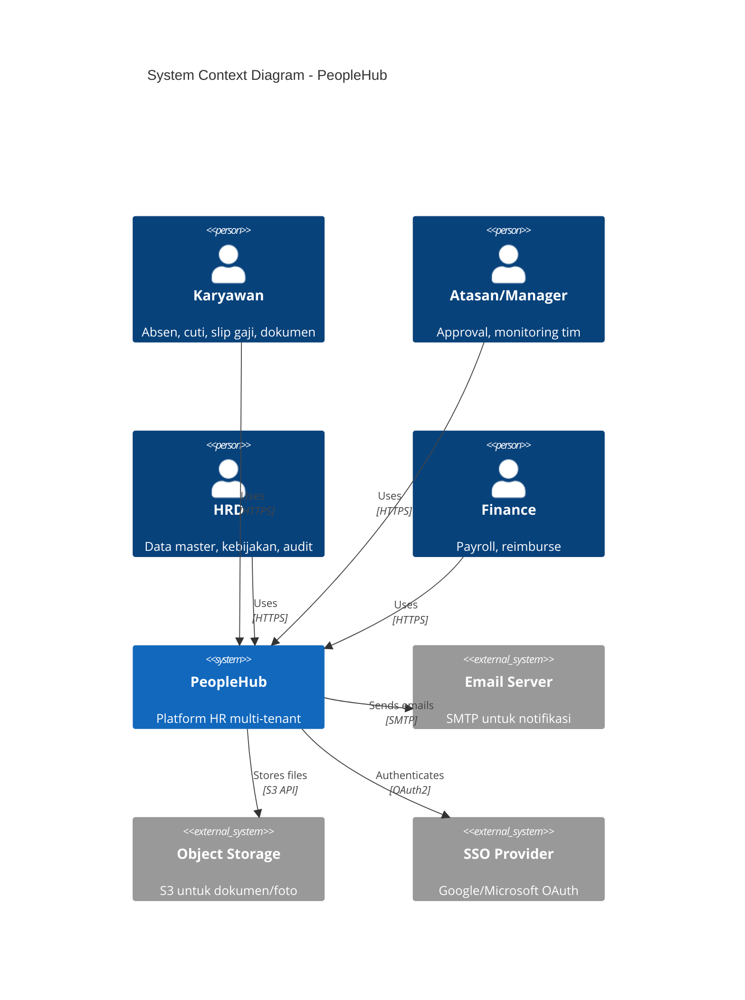
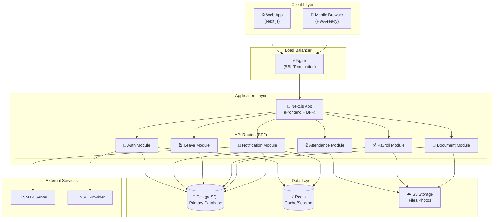
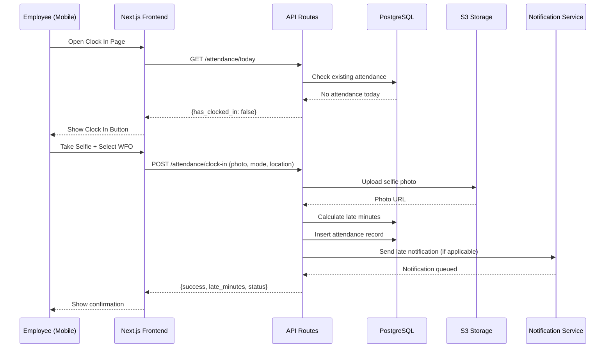
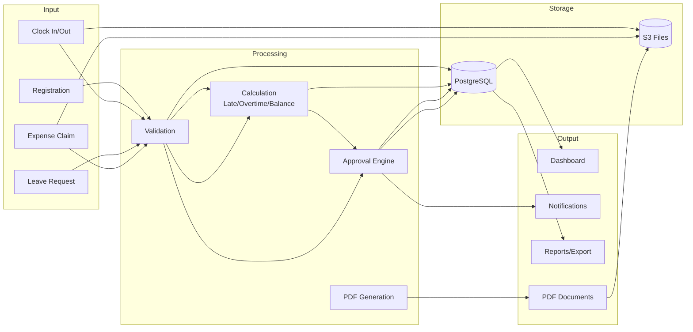
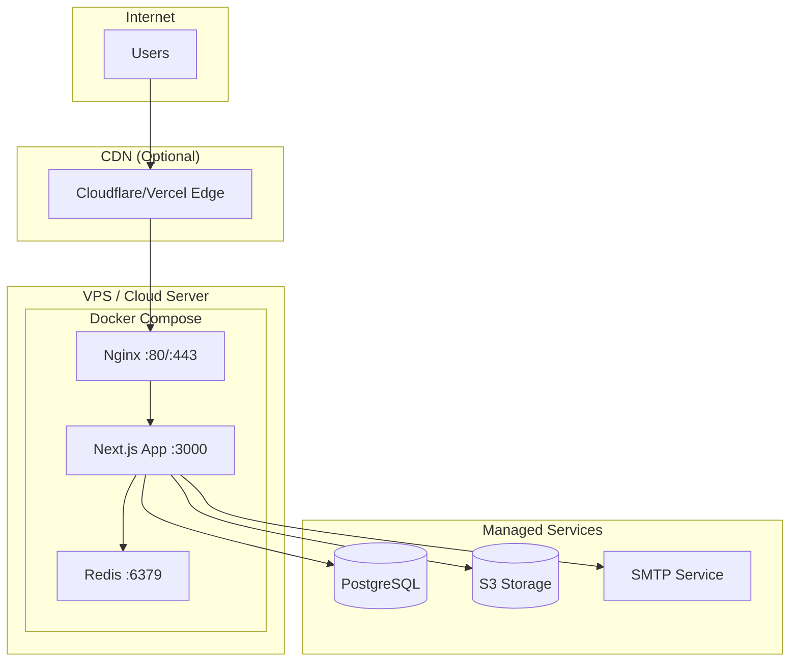

# High-Level Design (HLD) PeopleHub

> **Versi:** 2.0 | **Tanggal Update:** 22 Januari 2026 | **Status:** Final

## Tujuan & Ruang Lingkup
- Platform HR multi-tenant untuk empat perusahaan: absensi, cuti, perjalanan dinas/reimburse, slip gaji, KPI, surat, pengumuman, audit.
- Channel utama: web (desktop/mobile-friendly). Notifikasi email/in-app; SMS/SSO di roadmap.

---

## Diagram Arsitektur

### System Context Diagram

### Container Diagram

### Component Diagram - Attendance Flow

### Data Flow Diagram

---

## Arsitektur Umum

### Client Layer
- **Web Application**: Next.js dengan App Router, TypeScript, Tailwind CSS
- **Communication**: HTTPS/JSON ke API Routes
- **Authentication**: JWT token dalam HTTP-only cookies
- **Local Storage**: Hanya untuk cache ringan (preferences, tidak ada data sensitif)

### Application Layer
- **Framework**: Next.js sebagai Frontend + Backend-for-Frontend (BFF)
- **API Routes**: REST/JSON endpoints, modular per domain
- **Modules**:
  - `auth` - Login, register, password reset, session
  - `attendance` - Clock in/out, correction, shift swap
  - `leave` - Request, balance, approval
  - `payroll` - Slip generation, components, export
  - `document` - Upload, access control, versioning
  - `notification` - Email, in-app, preferences

### Data Layer
- **Database**: PostgreSQL dengan `tenant_id` di semua tabel utama
- **Cache**: Redis untuk session, rate limiting, job queue
- **File Storage**: S3-compatible untuk foto selfie, dokumen, slip PDF

### External Integrations
- **Email**: SMTP server untuk notifikasi
- **SSO**: Google/Microsoft OAuth (roadmap)
- **Webhook**: Outbound events untuk sistem eksternal

---

## Modul Logis

| Module | Responsibility |
|--------|---------------|
| **Auth & Tenant** | Login/registrasi, approval akun, role/permission, delegasi approver, isolasi tenant |
| **HR Core** | Data karyawan, struktur organisasi, kebijakan cuti/jatah libur/shift/denda/lembur |
| **Attendance** | Clock in/out (WFO/WFH), koreksi absensi, tukar/cover shift, denda keterlambatan |
| **Leave** | Cuti/izin dengan saldo, jatah libur bersama, approval berlapis |
| **Travel & Reimburse** | Perjalanan dinas, kategori/plafon biaya, bukti, approval multi-step |
| **Payroll** | Komponen gaji, slip PDF batch, ekspor payroll, COA biaya |
| **Performance** | KPI numerik, periode, progres, feedback |
| **Documents & Letters** | Manajemen dokumen, versi, akses; surat pengajuan dengan template |
| **Announcement & Violation** | Pengumuman per cabang/role, notifikasi pelanggaran |
| **Support & Assets** | Tiket bantuan HR/IT, aset pinjaman |
| **Audit & Reporting** | Audit log, dashboard HRD, ekspor log |

---

## Deployment Architecture

---

## Data & Integritas

- `tenant_id` wajib pada entity utama; foreign key dan index `(tenant_id, fk...)`.
- Audit trail untuk publish slip, perubahan bank, ekspor data, perubahan role, penerbitan surat.
- Constraints: saldo cuti tidak negatif; satu akun aktif per email/tenant; approval order dijaga.

---

## Keamanan

| Layer | Measure |
|-------|---------|
| **Transport** | TLS 1.3 end-to-end |
| **Authentication** | JWT in HTTP-only cookies, bcrypt/argon2 password hash |
| **Authorization** | RBAC per role + tenant scope |
| **File Access** | Signed URLs dengan expiry |
| **Network** | Firewall/allowlist IP untuk admin/DB |
| **Rate Limiting** | Per endpoint, stricter untuk auth |
| **Audit** | Log semua aksi sensitif |

---

## Ketersediaan & Performa

| Metric | Target |
|--------|--------|
| **SLA** | 99.5% jam kerja |
| **Dashboard Load** | < 3 detik @ 500 active users |
| **Attendance API** | P95 < 1.5 detik |
| **Database** | Connection pool, read replicas (jika perlu) |
| **Caching** | Redis untuk session, lookup kebijakan |
| **Pagination** | Cursor-based untuk daftar besar |

---

## Observabilitas

- **Logging**: Structured JSON logs (pino/winston)
- **Metrics**: Prometheus-compatible (latency, error rate, DB connections)
- **Health Check**: `/api/health` endpoint
- **Alerting**: Error rate spike, latency threshold, disk usage
- **Audit Log**: Terpisah dari access log, retensi sesuai kebijakan
