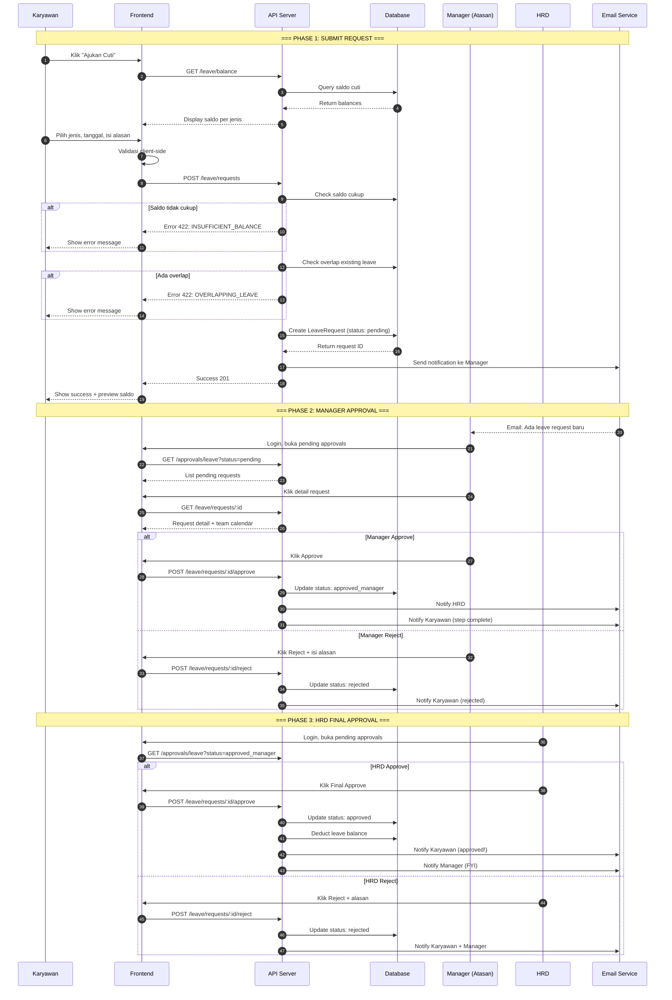
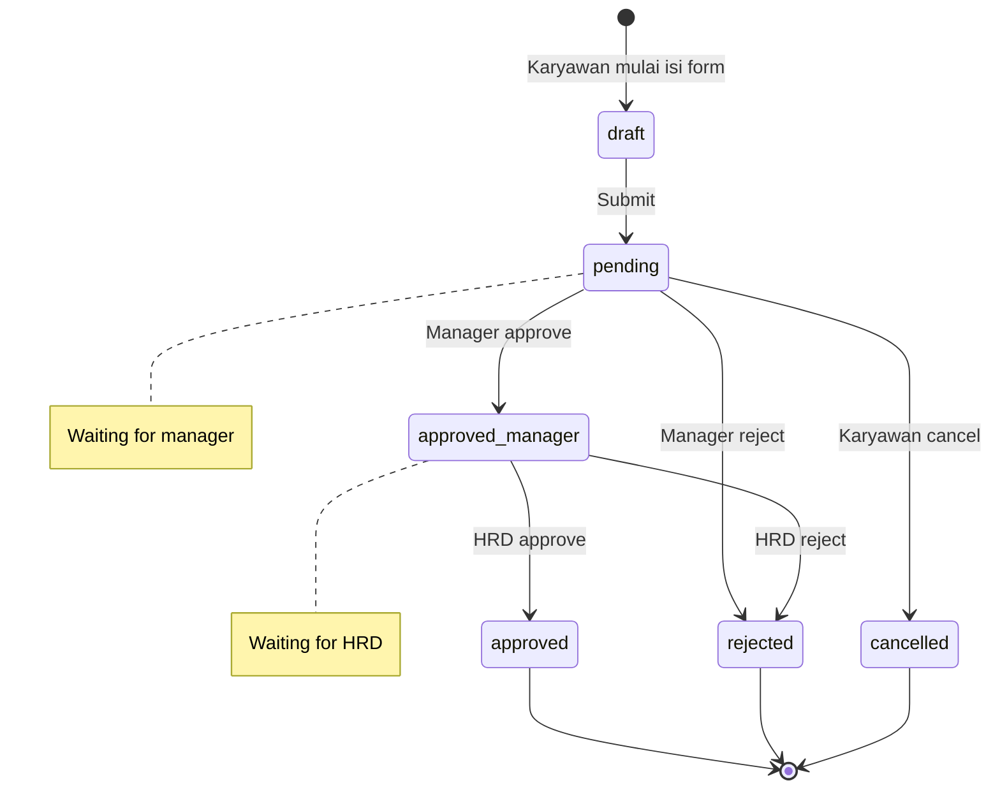

# Flow Leave (Cuti) - PeopleHub

> **Versi:** 1.0 | **Tanggal:** 22 Januari 2026 | **Status:** Final

---

## Ringkasan

Dokumen ini menjelaskan alur lengkap proses pengajuan cuti di PeopleHub, mencakup:
- Alur sistem (sequence diagram)
- Validasi bisnis
- State transitions
- API endpoints yang terlibat
- Edge cases dan error handling

---

## 1. Overview

### Jenis Cuti yang Didukung

| Kode | Nama | Saldo Default | Carry Over | Bukti Wajib |
|------|------|---------------|------------|-------------|
| `ANNUAL` | Cuti Tahunan | 12 hari/tahun | Ya (max 6) | Tidak |
| `SICK` | Sakit | Unlimited | Tidak | Ya (jika > 1 hari) |
| `MARRIAGE` | Menikah | 3 hari | Tidak | Ya (undangan) |
| `MATERNITY` | Melahirkan | 90 hari | Tidak | Ya (surat dokter) |
| `PATERNITY` | Cuti Ayah | 2 hari | Tidak | Ya (surat lahir) |
| `BEREAVEMENT` | Duka Cita | 3 hari | Tidak | Tidak |
| `UNPAID` | Tanpa Gaji | Unlimited | Tidak | Tidak |

---

## 2. Alur Pengajuan Cuti (Happy Path)

### 2.1 Sequence Diagram



---

## 3. State Machine

### 3.1 Leave Request States



### 3.2 State Transitions

| From | To | Action | Actor | Conditions |
|------|-----|--------|-------|------------|
| - | `pending` | Submit request | Karyawan | Saldo cukup, tidak overlap |
| `pending` | `approved_manager` | Approve | Manager | - |
| `pending` | `rejected` | Reject | Manager | Alasan wajib |
| `pending` | `cancelled` | Cancel | Karyawan | - |
| `approved_manager` | `approved` | Final approve | HRD | - |
| `approved_manager` | `rejected` | Reject | HRD | Alasan wajib |

---

## 4. Validasi Bisnis

### 4.1 Pre-Submit Validations

| Rule | Error Code | Message |
|------|------------|---------|
| Saldo harus cukup | `INSUFFICIENT_BALANCE` | "Saldo cuti tidak mencukupi (tersedia: X, dibutuhkan: Y)" |
| Tidak boleh overlap | `OVERLAPPING_LEAVE` | "Sudah ada cuti di tanggal tersebut" |
| Cuti sakit > 1 hari harus ada bukti | `ATTACHMENT_REQUIRED` | "Surat dokter wajib dilampirkan" |
| Tanggal mulai >= hari ini | `INVALID_DATE` | "Tidak dapat mengajukan cuti untuk tanggal lampau" |
| Max advance booking | `TOO_FAR_ADVANCE` | "Maksimal booking 60 hari ke depan" |

### 4.2 Approval Validations

| Rule | Error Code | Message |
|------|------------|---------|
| Hanya pending yang bisa di-approve | `INVALID_STATUS` | "Request sudah tidak dalam status pending" |
| Reject harus ada alasan | `REASON_REQUIRED` | "Alasan penolakan wajib diisi" |
| Approver bukan diri sendiri | `SELF_APPROVAL` | "Tidak dapat menyetujui request sendiri" |

---

## 5. Kalkulasi Hari Cuti

### 5.1 Logic Perhitungan

```typescript
function calculateLeaveDays(
  startDate: Date, 
  endDate: Date, 
  holidays: Date[]
): number {
  let days = 0;
  let current = new Date(startDate);
  
  while (current <= endDate) {
    const dayOfWeek = current.getDay();
    const isWeekend = dayOfWeek === 0 || dayOfWeek === 6;
    const isHoliday = holidays.some(h => isSameDay(h, current));
    
    if (!isWeekend && !isHoliday) {
      days++;
    }
    
    current.setDate(current.getDate() + 1);
  }
  
  return days;
}
```

### 5.2 Contoh Kasus

| Start Date | End Date | Weekend Days | Holidays | Calculated Days |
|------------|----------|--------------|----------|-----------------|
| 2024-02-01 (Thu) | 2024-02-03 (Sat) | 1 | 0 | 2 hari |
| 2024-02-05 (Mon) | 2024-02-09 (Fri) | 0 | 0 | 5 hari |
| 2024-02-05 (Mon) | 2024-02-09 (Fri) | 0 | 1 (Feb 8) | 4 hari |

---

## 6. API Endpoints

### 6.1 GET /leave/balance

**Purpose:** Ambil saldo cuti karyawan

**Response:**
```json
{
  "success": true,
  "data": [
    {
      "leave_type": {
        "code": "ANNUAL",
        "name": "Cuti Tahunan"
      },
      "year": 2024,
      "initial_balance": 12,
      "used_balance": 3,
      "pending_balance": 2,
      "remaining_balance": 7,
      "expiry_date": "2024-12-31"
    }
  ]
}
```

### 6.2 POST /leave/requests

**Purpose:** Submit pengajuan cuti baru

**Request:**
```json
{
  "leave_type_id": "uuid",
  "start_date": "2024-02-01",
  "end_date": "2024-02-03",
  "reason": "Liburan keluarga",
  "delegate_to": "uuid (optional)",
  "attachment": "file (optional)"
}
```

**Response (201):**
```json
{
  "success": true,
  "data": {
    "id": "uuid",
    "leave_type": "Cuti Tahunan",
    "start_date": "2024-02-01",
    "end_date": "2024-02-03",
    "total_days": 2,
    "status": "pending",
    "balance_before": 7,
    "balance_after": 5
  }
}
```

### 6.3 GET /leave/requests

**Purpose:** List pengajuan cuti

**Query Params:**
- `status`: pending | approved_manager | approved | rejected | cancelled
- `year`: 2024
- `page`, `limit`

### 6.4 POST /leave/requests/:id/approve

**Purpose:** Approve pengajuan cuti

**Request:**
```json
{
  "comment": "Approved, selamat berlibur" // optional
}
```

### 6.5 POST /leave/requests/:id/reject

**Purpose:** Reject pengajuan cuti

**Request:**
```json
{
  "comment": "Deadline project Q1, mohon ajukan tanggal lain" // required
}
```

### 6.6 DELETE /leave/requests/:id

**Purpose:** Cancel pengajuan (hanya jika masih pending)

---

## 7. Edge Cases

### 7.1 Cuti Sakit Mendadak

**Skenario:** Karyawan sakit tiba-tiba, tidak sempat ajukan cuti.

**Solusi:**
1. Karyawan bisa submit setelah sakit (retroactive)
2. Max 3 hari retroactive untuk cuti sakit
3. Surat dokter wajib dilampirkan

### 7.2 Atasan Tidak Aktif

**Skenario:** Manager resign/cuti panjang.

**Solusi:**
1. Sistem cek delegasi aktif
2. Jika tidak ada delegasi → eskalasi ke skip-level manager
3. Jika tidak ada → langsung ke HRD

### 7.3 Cuti Overlap dengan Hari Libur

**Skenario:** Karyawan ajukan cuti 1-5 Feb, tapi 5 Feb adalah hari libur.

**Solusi:**
1. Sistem menampilkan warning
2. Hari libur tidak dihitung
3. Total hari: 4 bukan 5

### 7.4 Cancel Setelah Approved Manager

**Skenario:** Karyawan ingin cancel setelah manager approve.

**Solusi:**
1. Tidak bisa cancel otomatis
2. Harus request ke HRD untuk dibatalkan
3. HRD bisa override status

---

## 8. Notifikasi

### 8.1 Email Templates

| Event | Recipient | Subject | Template |
|-------|-----------|---------|----------|
| Submit | Manager | Pengajuan Cuti Baru dari {name} | `leave_request_pending` |
| Manager Approve | HRD, Karyawan | Cuti {name} Disetujui Atasan | `leave_approved_manager` |
| Manager Reject | Karyawan | Pengajuan Cuti Ditolak | `leave_rejected` |
| HRD Approve | Karyawan, Manager | Cuti {name} Disetujui Final | `leave_approved` |
| HRD Reject | Karyawan, Manager | Cuti {name} Ditolak HRD | `leave_rejected_hrd` |
| Reminder | Karyawan | Pengingat: Cuti Anda Besok | `leave_reminder` |

### 8.2 In-App Notifications

Semua event di atas juga generate in-app notification dengan link langsung ke detail.

---

## 9. Database Schema

### 9.1 LeaveRequest Table

```sql
CREATE TABLE leave_requests (
  id UUID PRIMARY KEY DEFAULT gen_random_uuid(),
  employee_id UUID NOT NULL REFERENCES employees(id),
  leave_type_id UUID NOT NULL REFERENCES leave_types(id),
  start_date DATE NOT NULL,
  end_date DATE NOT NULL,
  total_days INT NOT NULL,
  reason TEXT NOT NULL,
  attachment_url TEXT,
  delegate_to UUID REFERENCES employees(id),
  status VARCHAR(20) NOT NULL DEFAULT 'pending',
  
  -- Approval tracking
  manager_id UUID REFERENCES employees(id),
  manager_approved_at TIMESTAMP,
  manager_comment TEXT,
  hrd_id UUID REFERENCES users(id),
  hrd_approved_at TIMESTAMP,
  hrd_comment TEXT,
  rejected_by UUID REFERENCES users(id),
  rejected_at TIMESTAMP,
  rejection_reason TEXT,
  
  -- Audit
  created_at TIMESTAMP DEFAULT NOW(),
  updated_at TIMESTAMP DEFAULT NOW(),
  cancelled_at TIMESTAMP,
  
  -- Tenant isolation
  tenant_id UUID NOT NULL REFERENCES tenants(id),
  
  CONSTRAINT status_check CHECK (
    status IN ('pending', 'approved_manager', 'approved', 'rejected', 'cancelled')
  )
);

CREATE INDEX idx_leave_requests_employee ON leave_requests(employee_id);
CREATE INDEX idx_leave_requests_status ON leave_requests(status);
CREATE INDEX idx_leave_requests_dates ON leave_requests(start_date, end_date);
CREATE INDEX idx_leave_requests_tenant ON leave_requests(tenant_id);
```

---

## 10. Dokumen Terkait

| Dokumen | Link |
|---------|------|
| Approval Matrix | [../02-requirements/approval-matrix.md](../02-requirements/approval-matrix.md) |
| User Stories EP03 | [../02-requirements/user-stories.md](../02-requirements/user-stories.md#ep03---cuti--izin) |
| API Specification | [specification.md](specification.md) |
| Email Templates | [../09-templates/email.md](../09-templates/email.md) |
