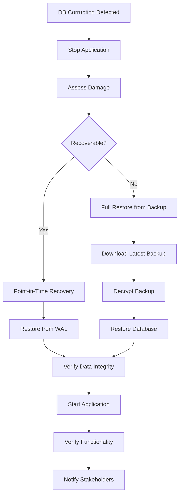

# Backup & Disaster Recovery PeopleHub

## Ringkasan
Dokumen ini mendefinisikan strategi backup, prosedur pemulihan, dan rencana kontinuitas bisnis untuk sistem PeopleHub.

---

## 1. Recovery Objectives

### 1.1 RPO & RTO

| Metric | Target | Deskripsi |
|--------|--------|-----------|
| **RPO (Recovery Point Objective)** | 1 jam | Maksimal data yang boleh hilang |
| **RTO (Recovery Time Objective)** | 4 jam | Maksimal waktu untuk pulih |
| **MTTR (Mean Time to Recovery)** | 2 jam | Target waktu pemulihan rata-rata |

### 1.2 Prioritas Pemulihan

| Prioritas | Komponen | RTO | Justifikasi |
|-----------|----------|-----|-------------|
| P1 | Database PostgreSQL | 2 jam | Core data |
| P1 | Authentication Service | 2 jam | User access |
| P2 | Application Server | 3 jam | Main functionality |
| P2 | File Storage (S3) | 4 jam | Documents/photos |
| P3 | Redis Cache | 4 jam | Can rebuild from DB |
| P3 | Email Service | 6 jam | Non-critical |

---

## 2. Backup Strategy

### 2.1 Database Backup

#### Full Backup
```yaml
Frequency: Daily (02:00 WIB)
Retention: 30 hari
Storage: S3 bucket terpisah (different region)
Encryption: AES-256
Format: PostgreSQL custom format (pg_dump -Fc)
```

#### Incremental Backup (WAL Archiving)
```yaml
Frequency: Continuous (setiap commit)
Retention: 7 hari
Storage: S3 dengan lifecycle policy
Purpose: Point-in-time recovery
```

#### Backup Script
```bash
#!/bin/bash
# /scripts/backup-database.sh

set -e

DATE=$(date +%Y%m%d_%H%M%S)
BACKUP_DIR="/backups/postgres"
S3_BUCKET="s3://peoplehub-backups/database"
DB_NAME="peoplehub"
RETENTION_DAYS=30

# Create backup
echo "Starting backup: ${DATE}"
pg_dump -Fc -v -h $DB_HOST -U $DB_USER -d $DB_NAME \
  -f "${BACKUP_DIR}/peoplehub_${DATE}.dump"

# Encrypt backup
gpg --symmetric --cipher-algo AES256 \
  --passphrase-file /secrets/backup-key \
  "${BACKUP_DIR}/peoplehub_${DATE}.dump"

# Upload to S3
aws s3 cp "${BACKUP_DIR}/peoplehub_${DATE}.dump.gpg" \
  "${S3_BUCKET}/full/peoplehub_${DATE}.dump.gpg" \
  --storage-class STANDARD_IA

# Cleanup local files
rm "${BACKUP_DIR}/peoplehub_${DATE}.dump"
rm "${BACKUP_DIR}/peoplehub_${DATE}.dump.gpg"

# Remove old backups from S3 (retention policy)
aws s3 ls "${S3_BUCKET}/full/" | \
  while read -r line; do
    BACKUP_DATE=$(echo $line | awk '{print $4}' | grep -oP '\d{8}')
    if [[ $(date -d "$BACKUP_DATE" +%s) -lt $(date -d "-${RETENTION_DAYS} days" +%s) ]]; then
      aws s3 rm "${S3_BUCKET}/full/$(echo $line | awk '{print $4}')"
    fi
  done

echo "Backup completed: ${DATE}"
```

### 2.2 File Storage Backup

```yaml
Source: S3 bucket (peoplehub-files)
Destination: S3 bucket (peoplehub-backups/files) - different region
Frequency: Daily (04:00 WIB)
Method: S3 Cross-Region Replication atau sync script
Retention: 90 hari

Files included:
  - /selfies/*       # Foto absensi
  - /documents/*     # Dokumen karyawan
  - /payslips/*      # Slip gaji PDF
  - /receipts/*      # Bukti reimburse
  - /letters/*       # Surat resmi
```

### 2.3 Configuration Backup

```yaml
Items:
  - .env files (encrypted)
  - Nginx configuration
  - Docker Compose files
  - SSL certificates
  - Cron jobs

Storage: Git repository (private) + encrypted S3
Frequency: On every change (GitOps)
```

### 2.4 Backup Schedule Summary

| Component | Type | Frequency | Retention | Location |
|-----------|------|-----------|-----------|----------|
| PostgreSQL | Full | Daily 02:00 | 30 hari | S3 ap-southeast-2 |
| PostgreSQL | WAL | Continuous | 7 hari | S3 ap-southeast-1 |
| Files (S3) | Sync | Daily 04:00 | 90 hari | S3 ap-southeast-2 |
| Config | Git push | On change | Forever | GitHub + S3 |
| Redis | RDB snapshot | Hourly | 24 jam | Local + S3 |

---

## 3. Disaster Recovery Procedures

### 3.1 Scenario 1: Database Corruption



#### Restore Commands
```bash
# 1. Stop application
pm2 stop peoplehub

# 2. Download backup from S3
aws s3 cp s3://peoplehub-backups/database/full/peoplehub_YYYYMMDD.dump.gpg /restore/

# 3. Decrypt backup
gpg --decrypt --passphrase-file /secrets/backup-key \
  /restore/peoplehub_YYYYMMDD.dump.gpg > /restore/peoplehub.dump

# 4. Drop and recreate database
psql -h $DB_HOST -U postgres -c "DROP DATABASE peoplehub;"
psql -h $DB_HOST -U postgres -c "CREATE DATABASE peoplehub OWNER peoplehub_user;"

# 5. Restore database
pg_restore -h $DB_HOST -U $DB_USER -d peoplehub -v /restore/peoplehub.dump

# 6. Point-in-time recovery (if needed)
# Restore WAL files up to specific timestamp
pg_restore --target-time="2024-01-19 10:00:00" ...

# 7. Verify data
psql -h $DB_HOST -U $DB_USER -d peoplehub -c "SELECT COUNT(*) FROM employee;"

# 8. Restart application
pm2 start peoplehub

# 9. Cleanup
rm /restore/peoplehub*
```

### 3.2 Scenario 2: Server Failure

```markdown
## Immediate Actions (0-15 menit)
1. Confirm server is down (monitoring alert)
2. Check if auto-recovery/restart works
3. If not, proceed to manual recovery

## Manual Recovery (15-60 menit)
1. Provision new server dari template/image
2. Pull latest code dari Git
3. Copy .env dari secure storage
4. Restore database (jika perlu)
5. Configure nginx dan SSL
6. Start services
7. Update DNS (jika IP berubah)
8. Verify functionality

## Verification (15-30 menit)
1. Health check endpoint
2. Login test
3. Core functionality test (absen, cuti)
4. Notify users jika ada downtime
```

### 3.3 Scenario 3: Data Center Outage

```markdown
## Preparation (Pre-disaster)
- Standby server di region berbeda (cold standby)
- Database replica di region berbeda
- DNS dengan failover capability

## Failover Procedure
1. Detect outage (monitoring)
2. Verify primary is unreachable
3. Promote database replica to primary
4. Start standby application server
5. Update DNS to point to standby
6. Wait for DNS propagation (TTL: 5 menit)
7. Verify all services

## Failback Procedure (setelah primary pulih)
1. Sync data dari standby ke primary
2. Verify data consistency
3. Update DNS kembali ke primary
4. Monitor for issues
5. Demote standby back to replica
```

### 3.4 Scenario 4: Ransomware/Security Breach

```markdown
## Immediate Actions
1. ISOLATE: Disconnect affected systems from network
2. PRESERVE: Don't delete anything (evidence)
3. NOTIFY: Security team, management, legal

## Assessment
1. Determine scope of breach
2. Identify affected data
3. Check backup integrity (BEFORE restoring)
4. Forensic analysis

## Recovery
1. Rebuild from known clean backup (OFFLINE)
2. Change ALL credentials (DB, API keys, passwords)
3. Patch vulnerabilities
4. Scan for persistence mechanisms
5. Gradual reconnection with monitoring

## Post-Incident
1. Report to authorities (jika data breach)
2. Notify affected users (jika data breach)
3. Root cause analysis
4. Update security controls
```

---

## 4. Backup Verification

### 4.1 Automated Verification

```bash
#!/bin/bash
# /scripts/verify-backup.sh
# Run weekly

set -e

# Download latest backup
LATEST_BACKUP=$(aws s3 ls s3://peoplehub-backups/database/full/ | sort | tail -n 1 | awk '{print $4}')
aws s3 cp "s3://peoplehub-backups/database/full/${LATEST_BACKUP}" /verify/

# Decrypt
gpg --decrypt --passphrase-file /secrets/backup-key \
  "/verify/${LATEST_BACKUP}" > /verify/backup.dump

# Restore to test database
psql -h localhost -U postgres -c "DROP DATABASE IF EXISTS peoplehub_verify;"
psql -h localhost -U postgres -c "CREATE DATABASE peoplehub_verify;"
pg_restore -h localhost -U postgres -d peoplehub_verify /verify/backup.dump

# Run verification queries
EMPLOYEE_COUNT=$(psql -h localhost -U postgres -d peoplehub_verify -t -c "SELECT COUNT(*) FROM employee;")
TENANT_COUNT=$(psql -h localhost -U postgres -d peoplehub_verify -t -c "SELECT COUNT(*) FROM tenant;")

# Check minimum data exists
if [[ $EMPLOYEE_COUNT -lt 10 ]]; then
  echo "ALERT: Employee count too low: $EMPLOYEE_COUNT"
  exit 1
fi

# Cleanup
psql -h localhost -U postgres -c "DROP DATABASE peoplehub_verify;"
rm /verify/*

echo "Backup verification successful"
echo "Employee count: $EMPLOYEE_COUNT"
echo "Tenant count: $TENANT_COUNT"

# Send notification
curl -X POST $SLACK_WEBHOOK -d "{\"text\": \"Backup verification passed. Employees: $EMPLOYEE_COUNT\"}"
```

### 4.2 Manual Verification Schedule

| Test | Frequency | Performed By | Checklist |
|------|-----------|--------------|-----------|
| Backup restore test | Monthly | DevOps | Full restore ke staging |
| Data integrity check | Weekly | Automated | Row counts, checksums |
| File restore test | Monthly | DevOps | Random file sampling |
| Full DR drill | Quarterly | Team | Complete failover simulation |

### 4.3 Verification Checklist

```markdown
## Monthly Backup Restore Test

### Database
- [ ] Download backup berhasil
- [ ] Decrypt berhasil
- [ ] Restore ke test environment berhasil
- [ ] Data integrity check passed
- [ ] Foreign key constraints valid
- [ ] Row counts match expected

### Files
- [ ] S3 sync verification
- [ ] Random sample download test (10 files)
- [ ] File integrity (checksum match)
- [ ] Signed URL generation works

### Application
- [ ] App starts with restored data
- [ ] Login works
- [ ] Core functions work (absen, cuti, slip)

### Documentation
- [ ] Recovery time recorded
- [ ] Issues documented
- [ ] Runbook updated if needed
```

---

## 5. Monitoring & Alerting

### 5.1 Backup Monitoring

```yaml
Alerts:
  - Backup job failed: Immediate (PagerDuty)
  - Backup older than 25 hours: Warning (Slack)
  - Backup size anomaly (±30%): Warning (Slack)
  - S3 bucket near capacity (>80%): Warning (Email)
  - Verification failed: Critical (PagerDuty)

Metrics:
  - backup_last_success_timestamp
  - backup_duration_seconds
  - backup_size_bytes
  - backup_verification_status
```

### 5.2 Monitoring Dashboard

```yaml
Panels:
  - Last successful backup (all types)
  - Backup duration trend
  - Storage usage
  - Verification status
  - Recovery time from last drill
```

---

## 6. Runbook: Quick Reference

### 6.1 Emergency Contacts

| Role | Name | Phone | Escalation |
|------|------|-------|------------|
| Primary On-Call | [DevOps] | +62xxx | 5 menit |
| Secondary On-Call | [Backend Lead] | +62xxx | 15 menit |
| Infrastructure Lead | [Name] | +62xxx | 30 menit |
| CTO | [Name] | +62xxx | 1 jam (P1 only) |

### 6.2 Quick Commands

```bash
# Check backup status
aws s3 ls s3://peoplehub-backups/database/full/ | tail -5

# Check last backup time
stat /var/log/backup-last-run.log

# Manual backup trigger
/scripts/backup-database.sh

# Check database size
psql -c "SELECT pg_size_pretty(pg_database_size('peoplehub'));"

# Check replication lag (if using replica)
psql -c "SELECT now() - pg_last_xact_replay_timestamp() AS replication_lag;"

# Application health
curl -s https://peoplehub.kreatifindo.com/api/health | jq

# Quick restore (DANGER - production)
# See full procedure in Section 3.1
```

### 6.3 Decision Tree

```
Is the system down?
├── Yes
│   ├── Is it database?
│   │   ├── Yes → Section 3.1 (DB Recovery)
│   │   └── No → Section 3.2 (Server Recovery)
│   └── Is it regional outage?
│       └── Yes → Section 3.3 (DC Failover)
└── No, but data is corrupted
    ├── Is it security breach?
    │   └── Yes → Section 3.4 (Security Incident)
    └── No → Section 3.1 (Point-in-time recovery)
```

---

## 7. Compliance & Audit

### 7.1 Backup Audit Log

```sql
CREATE TABLE backup_audit_log (
  id UUID PRIMARY KEY DEFAULT gen_random_uuid(),
  backup_type VARCHAR(50) NOT NULL,  -- 'full', 'incremental', 'files'
  started_at TIMESTAMPTZ NOT NULL,
  completed_at TIMESTAMPTZ,
  status VARCHAR(20) NOT NULL,  -- 'success', 'failed', 'in_progress'
  size_bytes BIGINT,
  storage_location TEXT,
  checksum VARCHAR(64),
  verified_at TIMESTAMPTZ,
  verification_status VARCHAR(20),
  notes TEXT,
  created_at TIMESTAMPTZ DEFAULT NOW()
);
```

### 7.2 Annual DR Report

```markdown
## DR Report Template

### Executive Summary
- Total backup jobs: XXX
- Success rate: XX.X%
- Average backup size: XX GB
- DR drills performed: X
- Average recovery time: X hours

### Incidents
- [Date]: [Description] - [Resolution] - [Lessons Learned]

### Improvements Made
- [Item 1]
- [Item 2]

### Recommendations
- [Recommendation 1]
- [Recommendation 2]

### Compliance Status
- RPO met: Yes/No
- RTO met: Yes/No
- Backup encryption: Compliant
- Retention policy: Compliant
```

---

## 8. Cost Optimization

### 8.1 Storage Classes

| Data Age | Storage Class | Cost/GB/Month |
|----------|---------------|---------------|
| 0-7 days | S3 Standard | $0.023 |
| 7-30 days | S3 Standard-IA | $0.0125 |
| 30-90 days | S3 Glacier Instant | $0.004 |
| 90+ days | S3 Glacier Deep Archive | $0.00099 |

### 8.2 Lifecycle Policy

```json
{
  "Rules": [
    {
      "ID": "BackupLifecycle",
      "Status": "Enabled",
      "Transitions": [
        { "Days": 7, "StorageClass": "STANDARD_IA" },
        { "Days": 30, "StorageClass": "GLACIER_IR" },
        { "Days": 90, "StorageClass": "DEEP_ARCHIVE" }
      ],
      "Expiration": { "Days": 365 }
    }
  ]
}
```

---

## Dokumen Terkait
- [23-security-policy.md](23-security-policy.md) - Security controls
- [18-pengaturan-github-vps.md](18-pengaturan-github-vps.md) - Infrastructure setup
- [21-env-configuration.md](21-env-configuration.md) - Environment config
