# Database Migration Plan - PeopleHub

> **Versi:** 1.0 | **Tanggal:** 23 Januari 2026 | **Status:** Active

---

## Ringkasan

Dokumen ini mendefinisikan strategi migrasi database untuk PeopleHub HRIS, mencakup:
- Migration order berdasarkan dependency graph
- Pre-migration dan post-migration procedures
- Data validation requirements
- Tenant isolation verification

---

## 1. Migration Philosophy

### Prinsip Utama

1. **Safety First** - Backup wajib sebelum migrasi
2. **Backward Compatible** - Migrasi tidak boleh break existing functionality
3. **Tenant Isolation** - Data tenant tidak boleh tercampur
4. **Reversible** - Setiap migrasi harus bisa di-rollback
5. **Tested** - Migrasi wajib test di staging dulu

### Migration Tools

| Tool | Fungsi |
|------|--------|
| Prisma Migrate | Schema migration management |
| pg_dump/pg_restore | Database backup/restore |
| Custom scripts | Data validation & transformation |

---

## 2. Migration Order

### Dependency Graph

```mermaid
flowchart TD
    subgraph "Layer 1 - Foundation"
        T[tenants]
    end
    
    subgraph "Layer 2 - Organization"
        U[users] --> T
        B[branches] --> T
        D[departments] --> T
        P[positions] --> T
        SH[shifts] --> T
    end
    
    subgraph "Layer 3 - Employee"
        E[employees] --> U
        E --> B
        E --> D
        E --> P
        D -.-> B
    end
    
    subgraph "Layer 4 - Time & Attendance"
        SC[schedules] --> E
        SC --> SH
        AT[attendances] --> E
        AT --> SC
        AC[attendance_corrections] --> E
        SS[shift_swaps] --> E
    end
    
    subgraph "Layer 5 - Leave Management"
        LT[leave_types] --> T
        LB[leave_balances] --> E
        LB --> LT
        LR[leave_requests] --> E
        LR --> LT
    end
    
    subgraph "Layer 6 - Finance"
        PS[payslips] --> E
        TR[travel_requests] --> E
        RR[reimburse_requests] --> E
        RI[reimburse_items] --> RR
        CA[cash_advances] --> E
    end
    
    subgraph "Layer 7 - Performance"
        KP[kpi_periods] --> T
        KI[kpi_indicators] --> T
        KT[kpi_targets] --> E
        KT --> KP
        KT --> KI
    end
    
    subgraph "Layer 8 - Documents & Letters"
        DOC[documents] --> E
        LC[letter_categories] --> T
        LRQ[letter_requests] --> E
        LRQ --> LC
    end
    
    subgraph "Layer 9 - Communication"
        AN[announcements] --> T
        AR[announcement_reads] --> AN
        NF[notifications] --> U
        NP[notification_preferences] --> U
        TK[tickets] --> T
        TC[ticket_comments] --> TK
    end
    
    subgraph "Layer 10 - Security & Audit"
        TKN[tokens] --> U
        SES[sessions] --> U
        RT[refresh_tokens] --> U
        LA[login_attempts] --> T
        AL[audit_logs] --> T
    end
    
    subgraph "Layer 11 - Operations"
        HL[holidays] --> T
        HL --> B
        LDR[late_deduction_rules] --> T
        OR[overtime_requests] --> E
        VN[violation_notices] --> E
        ASL[asset_loans] --> E
        BCR[bank_change_requests] --> E
        DEL[delegations] --> E
    end
    
    subgraph "Layer 12 - Configuration"
        AS[attendance_settings] --> T
        AF[approval_flows] --> T
        AFS[approval_steps] --> AF
        WH[webhooks] --> T
        WL[webhook_logs] --> WH
    end
```



### Migration Order Table

| Priority | Layer | Tables | Reason |
|----------|-------|--------|--------|
| P0 | 1 | `tenants` | Root entity, no dependencies |
| P0 | 2 | `users`, `branches`, `departments`, `positions`, `shifts` | Core org structure |
| P0 | 3 | `employees` | Central entity for all HR operations |
| P0 | 4 | `schedules`, `attendances`, `attendance_corrections`, `shift_swaps` | Core attendance |
| P0 | 5 | `leave_types`, `leave_balances`, `leave_requests` | Core leave management |
| P1 | 6 | `payslips`, `travel_requests`, `reimburse_requests`, `reimburse_items`, `cash_advances` | Finance operations |
| P1 | 7 | `kpi_periods`, `kpi_indicators`, `kpi_targets` | Performance management |
| P1 | 8 | `documents`, `letter_categories`, `letter_requests` | Document management |
| P1 | 9 | `announcements`, `announcement_reads`, `notifications`, `notification_preferences`, `tickets`, `ticket_comments` | Communication |
| P1 | 10 | `tokens`, `sessions`, `refresh_tokens`, `login_attempts`, `audit_logs` | Security & audit |
| P2 | 11 | `holidays`, `late_deduction_rules`, `overtime_requests`, `violation_notices`, `asset_loans`, `bank_change_requests`, `delegations` | Extended operations |
| P2 | 12 | `attendance_settings`, `approval_flows`, `approval_steps`, `webhooks`, `webhook_logs` | Configuration |

---

## 3. Pre-Migration Checklist

### 3.1 Environment Preparation

```markdown
## Pre-Migration Checklist

### Backup & Recovery
- [ ] Full database backup completed (pg_dump -Fc)
- [ ] Backup verified - test restore on staging
- [ ] Backup uploaded to S3 offsite
- [ ] Backup filename documented: `backup_YYYYMMDD_HHMMSS_pre_migration.dump`

### Schema Verification
- [ ] `npx prisma validate` passes
- [ ] `npx prisma migrate status` shows no pending migrations
- [ ] Staging migration successful (same migration executed)

### Application Preparation
- [ ] Application code deployed (compatible with new schema)
- [ ] Feature flags enabled (if applicable)
- [ ] Rollback code branch identified

### Stakeholder Notification
- [ ] Maintenance window scheduled
- [ ] Email notification sent to users
- [ ] Support team briefed

### Monitoring Setup
- [ ] Database metrics baseline captured
- [ ] Alert thresholds configured
- [ ] Log aggregation active
```

### 3.2 Pre-Migration Validation Script

```typescript
// scripts/migrations/pre-migrate.ts

import { PrismaClient } from '@prisma/client';

const prisma = new PrismaClient();

interface ValidationResult {
  check: string;
  passed: boolean;
  message: string;
  critical: boolean;
}

async function runPreMigrationChecks(): Promise<ValidationResult[]> {
  const results: ValidationResult[] = [];

  // 1. Database connectivity
  try {
    await prisma.$queryRaw`SELECT 1`;
    results.push({
      check: 'Database Connectivity',
      passed: true,
      message: 'Database connection successful',
      critical: true
    });
  } catch (error) {
    results.push({
      check: 'Database Connectivity',
      passed: false,
      message: `Connection failed: ${error}`,
      critical: true
    });
  }

  // 2. Check for active transactions
  const activeTransactions = await prisma.$queryRaw<Array<{count: bigint}>>`
    SELECT COUNT(*) as count FROM pg_stat_activity 
    WHERE state = 'active' AND query NOT LIKE '%pg_stat_activity%'
  `;
  const txCount = Number(activeTransactions[0]?.count || 0);
  results.push({
    check: 'Active Transactions',
    passed: txCount < 5,
    message: `${txCount} active transactions`,
    critical: false
  });

  // 3. Check database size
  const dbSize = await prisma.$queryRaw<Array<{size: string}>>`
    SELECT pg_size_pretty(pg_database_size(current_database())) as size
  `;
  results.push({
    check: 'Database Size',
    passed: true,
    message: `Current size: ${dbSize[0]?.size}`,
    critical: false
  });

  // 4. Verify tenant count
  const tenantCount = await prisma.tenant.count();
  results.push({
    check: 'Tenant Count',
    passed: tenantCount > 0,
    message: `${tenantCount} tenants found`,
    critical: true
  });

  // 5. Check for orphaned records (employees without users)
  const orphanedEmployees = await prisma.$queryRaw<Array<{count: bigint}>>`
    SELECT COUNT(*) as count FROM employees e
    LEFT JOIN users u ON e.user_id = u.id
    WHERE u.id IS NULL
  `;
  const orphanCount = Number(orphanedEmployees[0]?.count || 0);
  results.push({
    check: 'Orphaned Employees',
    passed: orphanCount === 0,
    message: orphanCount === 0 ? 'No orphaned records' : `${orphanCount} orphaned employees found`,
    critical: true
  });

  // 6. Check for null tenant_id in critical tables
  const tables = ['users', 'employees', 'attendances', 'leave_requests'];
  for (const table of tables) {
    try {
      const nullTenants = await prisma.$queryRawUnsafe<Array<{count: bigint}>>(
        `SELECT COUNT(*) as count FROM ${table} WHERE tenant_id IS NULL`
      );
      const count = Number(nullTenants[0]?.count || 0);
      results.push({
        check: `Tenant ID Check (${table})`,
        passed: count === 0,
        message: count === 0 ? 'All records have tenant_id' : `${count} records missing tenant_id`,
        critical: true
      });
    } catch {
      // Table might not have tenant_id column
      results.push({
        check: `Tenant ID Check (${table})`,
        passed: true,
        message: 'Column check skipped',
        critical: false
      });
    }
  }

  return results;
}

async function main() {
  console.log('🔍 Running Pre-Migration Checks...\n');
  
  const results = await runPreMigrationChecks();
  
  let criticalFailed = false;
  
  for (const result of results) {
    const status = result.passed ? '✅' : '❌';
    const severity = result.critical ? '(CRITICAL)' : '';
    console.log(`${status} ${result.check} ${severity}`);
    console.log(`   ${result.message}\n`);
    
    if (!result.passed && result.critical) {
      criticalFailed = true;
    }
  }
  
  console.log('─'.repeat(50));
  
  if (criticalFailed) {
    console.log('❌ PRE-MIGRATION CHECKS FAILED');
    console.log('Please resolve critical issues before proceeding.');
    process.exit(1);
  } else {
    console.log('✅ PRE-MIGRATION CHECKS PASSED');
    console.log('Safe to proceed with migration.');
    process.exit(0);
  }
}

main()
  .catch(console.error)
  .finally(() => prisma.$disconnect());
```

---

## 4. Migration Execution

### 4.1 Standard Migration Flow

```bash
#!/bin/bash
# scripts/migrate-production.sh

set -e

echo "🚀 Starting Production Migration"
echo "================================"

# 1. Verify we're on correct branch
BRANCH=$(git rev-parse --abbrev-ref HEAD)
if [ "$BRANCH" != "main" ]; then
  echo "❌ Error: Must be on 'main' branch"
  exit 1
fi

# 2. Run pre-migration checks
echo "📋 Running pre-migration checks..."
npx ts-node scripts/migrations/pre-migrate.ts
if [ $? -ne 0 ]; then
  echo "❌ Pre-migration checks failed"
  exit 1
fi

# 3. Create backup
echo "💾 Creating backup..."
TIMESTAMP=$(date +%Y%m%d_%H%M%S)
BACKUP_FILE="backup_${TIMESTAMP}_pre_migration.dump"
pg_dump -Fc $DATABASE_URL > "/backups/${BACKUP_FILE}"
echo "   Backup created: ${BACKUP_FILE}"

# 4. Set maintenance mode
echo "🔧 Enabling maintenance mode..."
# Implement your maintenance mode here
# e.g., touch /var/www/maintenance.flag

# 5. Run migration
echo "🔄 Running Prisma migration..."
npx prisma migrate deploy

# 6. Run post-migration validation
echo "✅ Running post-migration validation..."
npx ts-node scripts/migrations/post-migrate.ts
if [ $? -ne 0 ]; then
  echo "❌ Post-migration validation failed!"
  echo "🔙 Consider rollback: pg_restore -d $DATABASE_URL /backups/${BACKUP_FILE}"
  exit 1
fi

# 7. Disable maintenance mode
echo "🔧 Disabling maintenance mode..."
# rm /var/www/maintenance.flag

# 8. Restart application
echo "🔄 Restarting application..."
pm2 reload peoplehub

echo ""
echo "✅ Migration completed successfully!"
echo "   Backup file: ${BACKUP_FILE}"
```

### 4.2 Migration Commands Reference

| Command | Purpose | When to Use |
|---------|---------|-------------|
| `npx prisma migrate dev` | Create new migration | Development only |
| `npx prisma migrate deploy` | Apply pending migrations | Staging/Production |
| `npx prisma migrate reset` | Reset database | Development only |
| `npx prisma migrate status` | Check migration status | Any environment |
| `npx prisma generate` | Regenerate Prisma Client | After schema changes |
| `npx prisma db push` | Push schema without migration | Prototyping only |

---

## 5. Post-Migration Validation

### 5.1 Post-Migration Checklist

```markdown
## Post-Migration Checklist

### Schema Verification
- [ ] `npx prisma migrate status` shows all migrations applied
- [ ] No pending migrations
- [ ] Prisma Client regenerated

### Data Integrity
- [ ] Row counts match pre-migration (± acceptable variance)
- [ ] No orphaned records
- [ ] All foreign keys valid
- [ ] Tenant isolation maintained

### Application Health
- [ ] Health endpoint returns 200
- [ ] Login functionality works
- [ ] Core features operational (attendance, leave)
- [ ] No error spikes in logs

### Performance
- [ ] Response times within baseline (±10%)
- [ ] No slow query alerts
- [ ] Database connections stable
```

### 5.2 Post-Migration Validation Script

```typescript
// scripts/migrations/post-migrate.ts

import { PrismaClient } from '@prisma/client';

const prisma = new PrismaClient();

interface ValidationResult {
  check: string;
  passed: boolean;
  details: string;
}

async function runPostMigrationValidation(): Promise<ValidationResult[]> {
  const results: ValidationResult[] = [];

  // 1. Verify all tables exist
  const tableCheck = await prisma.$queryRaw<Array<{table_name: string}>>`
    SELECT table_name FROM information_schema.tables 
    WHERE table_schema = 'public' 
    AND table_type = 'BASE TABLE'
    ORDER BY table_name
  `;
  const tables = tableCheck.map(t => t.table_name);
  const expectedTables = [
    'tenants', 'users', 'employees', 'attendances', 
    'leave_requests', 'payslips', 'notifications'
  ];
  const missingTables = expectedTables.filter(t => !tables.includes(t));
  results.push({
    check: 'Required Tables Exist',
    passed: missingTables.length === 0,
    details: missingTables.length === 0 
      ? `All ${expectedTables.length} required tables present`
      : `Missing tables: ${missingTables.join(', ')}`
  });

  // 2. Verify indexes exist
  const indexCheck = await prisma.$queryRaw<Array<{indexname: string}>>`
    SELECT indexname FROM pg_indexes 
    WHERE schemaname = 'public'
  `;
  const indexCount = indexCheck.length;
  results.push({
    check: 'Index Count',
    passed: indexCount > 20, // Minimum expected indexes
    details: `${indexCount} indexes found`
  });

  // 3. Tenant isolation check - no cross-tenant data
  const tenantIsolation = await prisma.$queryRaw<Array<{issue: string}>>`
    SELECT 'employees' as issue FROM employees e
    JOIN users u ON e.user_id = u.id
    WHERE e.tenant_id != u.tenant_id
    LIMIT 1
  `;
  results.push({
    check: 'Tenant Isolation',
    passed: tenantIsolation.length === 0,
    details: tenantIsolation.length === 0 
      ? 'No cross-tenant data found'
      : 'WARNING: Cross-tenant data detected!'
  });

  // 4. Foreign key constraints valid
  const fkCheck = await prisma.$queryRaw<Array<{violation_count: bigint}>>`
    WITH fk_violations AS (
      SELECT COUNT(*) as cnt FROM employees WHERE user_id NOT IN (SELECT id FROM users)
      UNION ALL
      SELECT COUNT(*) FROM employees WHERE branch_id IS NOT NULL AND branch_id NOT IN (SELECT id FROM branches)
      UNION ALL
      SELECT COUNT(*) FROM attendances WHERE employee_id NOT IN (SELECT id FROM employees)
    )
    SELECT SUM(cnt) as violation_count FROM fk_violations
  `;
  const violations = Number(fkCheck[0]?.violation_count || 0);
  results.push({
    check: 'Foreign Key Integrity',
    passed: violations === 0,
    details: violations === 0 
      ? 'All foreign keys valid'
      : `${violations} FK violations found`
  });

  // 5. Check row counts for major tables
  const counts = await prisma.$queryRaw<Array<{table_name: string, count: bigint}>>`
    SELECT 'tenants' as table_name, COUNT(*)::bigint as count FROM tenants
    UNION ALL SELECT 'users', COUNT(*) FROM users
    UNION ALL SELECT 'employees', COUNT(*) FROM employees
    UNION ALL SELECT 'attendances', COUNT(*) FROM attendances
    UNION ALL SELECT 'leave_requests', COUNT(*) FROM leave_requests
    ORDER BY table_name
  `;
  const countDetails = counts.map(c => `${c.table_name}: ${c.count}`).join(', ');
  results.push({
    check: 'Row Counts',
    passed: true,
    details: countDetails
  });

  // 6. Enum values check
  const userStatuses = await prisma.$queryRaw<Array<{status: string, count: bigint}>>`
    SELECT status::text, COUNT(*) as count FROM users GROUP BY status
  `;
  const validStatuses = ['PENDING', 'ACTIVE', 'APPROVED', 'REJECTED', 'SUSPENDED'];
  const invalidStatuses = userStatuses.filter(s => !validStatuses.includes(s.status));
  results.push({
    check: 'Enum Values Valid',
    passed: invalidStatuses.length === 0,
    details: invalidStatuses.length === 0
      ? 'All enum values valid'
      : `Invalid status values: ${invalidStatuses.map(s => s.status).join(', ')}`
  });

  return results;
}

async function main() {
  console.log('🔍 Running Post-Migration Validation...\n');
  
  const results = await runPostMigrationValidation();
  
  let hasFailures = false;
  
  for (const result of results) {
    const status = result.passed ? '✅' : '❌';
    console.log(`${status} ${result.check}`);
    console.log(`   ${result.details}\n`);
    
    if (!result.passed) {
      hasFailures = true;
    }
  }
  
  console.log('─'.repeat(50));
  
  if (hasFailures) {
    console.log('⚠️  POST-MIGRATION VALIDATION HAS ISSUES');
    console.log('Review the failures above before proceeding.');
    process.exit(1);
  } else {
    console.log('✅ POST-MIGRATION VALIDATION PASSED');
    console.log('Migration completed successfully.');
    process.exit(0);
  }
}

main()
  .catch(console.error)
  .finally(() => prisma.$disconnect());
```

---

## 6. Special Migration Scenarios

### 6.1 Adding New Column (Non-Breaking)

```prisma
// Adding optional column - SAFE
model Employee {
  // existing fields...
  newOptionalField String?  // Nullable, no default needed
}
```

```bash
npx prisma migrate dev --name add_optional_field
npx prisma migrate deploy  # on production
```

### 6.2 Adding Required Column

```prisma
// Adding required column - REQUIRES data migration
model Employee {
  // existing fields...
  newRequiredField String @default("default_value")  // Provide default
}
```

**Data Migration Steps:**
1. Add column with default value
2. Run data migration to populate real values
3. Optionally remove default after data populated

### 6.3 Renaming Column (Breaking)

> [!CAUTION]
> Column rename is a breaking change. Use view or shadow column instead.

**Safe Approach:**
```sql
-- 1. Add new column
ALTER TABLE employees ADD COLUMN new_name VARCHAR(255);

-- 2. Copy data
UPDATE employees SET new_name = old_name;

-- 3. Add NOT NULL after data copied (if needed)
ALTER TABLE employees ALTER COLUMN new_name SET NOT NULL;

-- 4. Application uses new column
-- 5. Later: drop old column after all code migrated
```

### 6.4 Adding New Enum Value

```prisma
enum UserStatus {
  PENDING
  ACTIVE
  APPROVED
  REJECTED
  SUSPENDED
  ARCHIVED   // New value added at end
}
```

> [!TIP]
> Always add new enum values at the **end** to maintain compatibility.

### 6.5 Creating New Table with References

```prisma
// New table with foreign key
model NewFeature {
  id         String   @id @default(cuid())
  tenantId   String
  employeeId String
  // fields...
  
  tenant   Tenant   @relation(fields: [tenantId], references: [id])
  employee Employee @relation(fields: [employeeId], references: [id])
  
  @@index([tenantId])
  @@index([employeeId])
}
```

**Migration Order:**
1. Parent tables must exist (tenant, employee)
2. New table created with FK constraints
3. Indexes created

---

## 7. Tenant-Specific Migrations

### When Needed

- Adding company-specific configuration
- Data cleanup for specific tenant
- Schema customization per tenant (avoid if possible)

### Safe Tenant Migration

```sql
-- Always include tenant_id filter
BEGIN;

-- Verify we're targeting correct tenant
SELECT name FROM tenants WHERE id = 'tenant_xyz';

-- Perform tenant-specific update
UPDATE employees 
SET some_field = 'new_value'
WHERE tenant_id = 'tenant_xyz'
  AND some_condition = true;

-- Verify changes
SELECT COUNT(*) FROM employees 
WHERE tenant_id = 'tenant_xyz' 
  AND some_field = 'new_value';

COMMIT;
```

---

## 8. Emergency Procedures

### Migration Fails Mid-Execution

```bash
# 1. Check current state
npx prisma migrate status

# 2. If migration partially applied, attempt to complete
npx prisma migrate deploy

# 3. If cannot complete, restore from backup
pm2 stop peoplehub
pg_restore -c -d $DATABASE_URL /backups/pre_migration.dump
pm2 start peoplehub
```

### Data Corruption Detected

```bash
# 1. Immediately stop application
pm2 stop peoplehub

# 2. Prevent new connections
# (via PostgreSQL or firewall)

# 3. Assess damage
psql $DATABASE_URL -c "SELECT COUNT(*) FROM employees WHERE tenant_id IS NULL"

# 4. Restore from backup if needed
pg_restore -c -d $DATABASE_URL /backups/known_good.dump

# 5. Restart application
pm2 start peoplehub

# 6. Notify stakeholders
```

---

## 9. Related Documents

| Document | Link |
|----------|------|
| Versioning Notes | [versioning-notes.md](versioning-notes.md) |
| Rollback Procedures | [rollback-procedures.md](rollback-procedures.md) |
| Backup & DR | [backup-dr.md](backup-dr.md) |
| Deployment Guide | [deployment.md](deployment.md) |
| ERD | [../03-architecture/erd.md](../03-architecture/erd.md) |
| Database Guidelines | [../06-database/guidelines.md](../06-database/guidelines.md) |

---

## 10. Version History

| Version | Date | Author | Changes |
|---------|------|--------|---------|
| 1.0 | 2026-01-23 | Migration & Release Engineer | Initial document |
