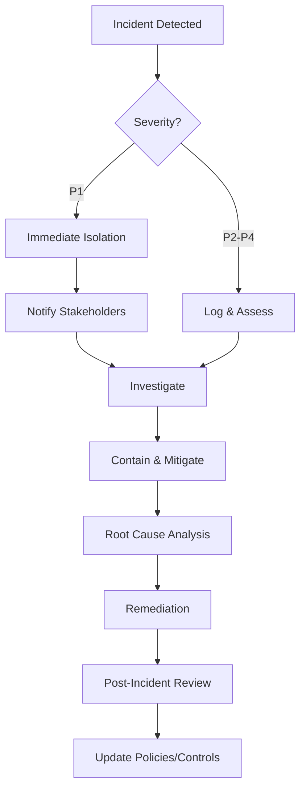

# Security Policy PeopleHub

> **Versi:** 2.0 | **Tanggal Update:** 22 Januari 2026 | **Status:** Final

## Ringkasan
Dokumen ini mendefinisikan kebijakan keamanan, standar, dan prosedur untuk sistem PeopleHub guna melindungi data karyawan dan memastikan kepatuhan.

---

## 1. Klasifikasi Data

### 1.1 Kategori Data

| Kategori | Contoh Data | Tingkat Sensitivitas | Perlindungan |
|----------|-------------|---------------------|--------------|
| **Public** | Nama perusahaan, pengumuman umum | Rendah | Tidak ada enkripsi khusus |
| **Internal** | Struktur organisasi, jadwal shift | Sedang | Akses hanya untuk user terautentikasi |
| **Confidential** | Data karyawan, absensi, KPI | Tinggi | RBAC ketat, audit log |
| **Restricted** | Slip gaji, data bank, password | Sangat Tinggi | Enkripsi, akses sangat terbatas, audit wajib |

### 1.2 Data Pribadi (PII - Personally Identifiable Information)

| Data | Klasifikasi | Handling |
|------|-------------|----------|
| NIK/KTP | Restricted | Enkripsi at-rest, masking saat display |
| NPWP | Restricted | Enkripsi at-rest |
| Nomor rekening | Restricted | Enkripsi at-rest, masking saat display |
| Nomor telepon | Confidential | Masking partial (0812****5678) |
| Alamat | Confidential | Akses sesuai RBAC |
| Foto selfie | Confidential | Signed URL, retention policy |
| Slip gaji | Restricted | Enkripsi, signed URL, audit download |

---

## 2. Authentication & Authorization

### 2.1 Password Policy

```yaml
Minimum Length: 8 karakter
Requirements:
  - Minimal 1 huruf kapital (A-Z)
  - Minimal 1 huruf kecil (a-z)
  - Minimal 1 angka (0-9)
  - Minimal 1 karakter khusus (!@#$%^&*)

Password History: 5 password terakhir tidak boleh digunakan
Max Age: 90 hari (opsional, configurable)
Lockout: 5 percobaan gagal → lock 15 menit
```

### 2.2 Password Storage

```
Algorithm: bcrypt atau Argon2id
Salt Rounds: minimum 12 (bcrypt) atau default Argon2id
Storage: Hanya hash yang disimpan, TIDAK ADA plaintext
```

### 2.3 Session Management

| Parameter | Value | Keterangan |
|-----------|-------|------------|
| Token Type | JWT | Disimpan di HTTP-only cookie |
| Access Token Expiry | 1 jam | Refresh dengan refresh token |
| Refresh Token Expiry | 7 hari | Rotate saat refresh |
| Session Idle Timeout | 30 menit | Logout otomatis jika idle |
| Concurrent Sessions | 3 maksimum | Per user |
| Cookie Flags | HttpOnly, Secure, SameSite=Strict | Wajib di production |

### 2.4 Two-Factor Authentication (2FA) - Roadmap

```yaml
Methods:
  - TOTP (Google Authenticator, Authy)
  - Email OTP (fallback)

Wajib untuk:
  - Super Admin
  - Tenant Admin
  - HRD (akses data sensitif)
  - Finance (akses payroll)

Optional untuk:
  - Manager
  - Employee
```

### 2.5 SSO Integration (Roadmap)

| Provider | Protocol | Keterangan |
|----------|----------|------------|
| Google Workspace | OAuth 2.0 / OIDC | Domain restriction supported |
| Microsoft Azure AD | OAuth 2.0 / OIDC | Tenant-specific |

---

## 3. Authorization (RBAC)

### 3.1 Role Hierarchy

```
super_admin
    └── tenant_admin
            └── hrd
            └── finance
            └── it_ops
                    └── manager
                            └── employee
```

### 3.2 Permission Structure

```typescript
interface Permission {
  resource: string;    // 'employee', 'attendance', 'payslip', etc.
  action: string;      // 'create', 'read', 'update', 'delete', 'approve', 'export'
  scope: string;       // 'own', 'team', 'branch', 'tenant', 'all'
}

// Contoh
{ resource: 'attendance', action: 'read', scope: 'own' }      // Employee lihat absensi sendiri
{ resource: 'attendance', action: 'read', scope: 'team' }     // Manager lihat absensi tim
{ resource: 'attendance', action: 'read', scope: 'tenant' }   // HRD lihat semua absensi
{ resource: 'payslip', action: 'export', scope: 'tenant' }    // Finance ekspor payroll
```

### 3.3 Tenant Isolation

```sql
-- WAJIB: Semua query harus filter tenant_id
SELECT * FROM employee WHERE tenant_id = $1 AND id = $2;

-- DILARANG: Query tanpa tenant_id
SELECT * FROM employee WHERE id = $1;  -- TIDAK BOLEH

-- Middleware check
function checkTenantAccess(req, res, next) {
  const userTenantId = req.user.tenant_id;
  const requestTenantId = req.params.tenant_id || req.body.tenant_id;

  if (userTenantId !== requestTenantId && !req.user.isSuperAdmin) {
    return res.status(403).json({ error: 'TENANT_ACCESS_DENIED' });
  }
  next();
}
```

---

## 4. Data Protection

### 4.1 Encryption

| Layer | Method | Keterangan |
|-------|--------|------------|
| In Transit | TLS 1.3 | Wajib HTTPS, HSTS enabled |
| At Rest (DB) | AES-256 (column-level) | Untuk data Restricted |
| At Rest (Files) | S3 SSE atau equivalent | Server-side encryption |
| Backup | AES-256 | Encrypted backup files |

### 4.2 Data Masking

```typescript
// Masking untuk display
function maskPhoneNumber(phone: string): string {
  return phone.replace(/(\d{4})(\d+)(\d{4})/, '$1****$3');
  // 08123456789 → 0812****6789
}

function maskAccountNumber(account: string): string {
  return account.replace(/(\d{4})(\d+)(\d{4})/, '$1********$3');
  // 1234567890123456 → 1234********3456
}

function maskNIK(nik: string): string {
  return nik.replace(/(\d{6})(\d+)(\d{4})/, '$1******$3');
  // 3201234567890001 → 320123******0001
}
```

### 4.3 Data Retention

| Data Type | Retention Period | Action After Expiry |
|-----------|------------------|---------------------|
| Active employee data | Indefinite | - |
| Terminated employee | 5 tahun | Archive → Delete |
| Attendance records | 5 tahun | Archive → Delete |
| Payslip | 10 tahun | Archive (compliance) |
| Audit logs | 7 tahun | Archive → Delete |
| Session logs | 90 hari | Delete |
| Selfie photos | 2 tahun | Delete |
| Failed login attempts | 30 hari | Delete |

---

## 5. Network Security

### 5.1 Firewall Rules

```yaml
Inbound:
  - Port 443 (HTTPS): Allow from anywhere
  - Port 80 (HTTP): Redirect to 443
  - Port 22 (SSH): Allow from admin IP whitelist only

Outbound:
  - SMTP (587/465): Allow to mail server
  - PostgreSQL (5432): Allow to DB server only
  - S3 (443): Allow to storage endpoint
  - All other: Deny
```

### 5.2 Rate Limiting

| Endpoint | Limit | Window | Action on Exceed |
|----------|-------|--------|------------------|
| POST /auth/login | 5 requests | 1 menit | Block IP 15 menit |
| POST /auth/register | 3 requests | 1 menit | Block IP 30 menit |
| POST /auth/forgot-password | 3 requests | 10 menit | Block IP 1 jam |
| POST /attendance/* | 10 requests | 1 menit | 429 response |
| GET /* (authenticated) | 100 requests | 1 menit | 429 response |
| POST /* (authenticated) | 30 requests | 1 menit | 429 response |

### 5.3 DDoS Mitigation

```yaml
CDN: Cloudflare atau AWS CloudFront
  - Challenge suspicious traffic
  - Block known bad IPs
  - Geographic restrictions (Indonesia only untuk production)

Application Level:
  - Request size limit: 10MB
  - Request timeout: 30 detik
  - Connection limit per IP: 100
```

---

## 6. Application Security

### 6.1 Input Validation

```typescript
// Schema validation dengan Zod
const registerSchema = z.object({
  email: z.string().email().max(255),
  phone: z.string().regex(/^(\+62|62|0)8[1-9][0-9]{6,10}$/),
  password: z.string()
    .min(8)
    .regex(/[A-Z]/, 'Harus ada huruf kapital')
    .regex(/[a-z]/, 'Harus ada huruf kecil')
    .regex(/[0-9]/, 'Harus ada angka')
    .regex(/[!@#$%^&*]/, 'Harus ada karakter khusus'),
  full_name: z.string().min(3).max(255),
});

// Sanitization
import DOMPurify from 'dompurify';
const sanitizedInput = DOMPurify.sanitize(userInput);
```

### 6.2 SQL Injection Prevention

```typescript
// BENAR: Parameterized query
const result = await db.query(
  'SELECT * FROM employee WHERE tenant_id = $1 AND email = $2',
  [tenantId, email]
);

// SALAH: String concatenation
const result = await db.query(
  `SELECT * FROM employee WHERE email = '${email}'`  // VULNERABLE!
);

// ORM (Prisma) - aman by default
const employee = await prisma.employee.findFirst({
  where: { tenant_id: tenantId, email: email }
});
```

### 6.3 XSS Prevention

```typescript
// React sudah escape by default
<div>{userInput}</div>  // Aman

// BERBAHAYA: dangerouslySetInnerHTML
<div dangerouslySetInnerHTML={{ __html: userInput }} />  // JANGAN!

// Jika perlu render HTML, gunakan sanitizer
<div dangerouslySetInnerHTML={{ __html: DOMPurify.sanitize(content) }} />

// CSP Header
Content-Security-Policy:
  default-src 'self';
  script-src 'self' 'unsafe-inline' 'unsafe-eval';
  style-src 'self' 'unsafe-inline';
  img-src 'self' data: https:;
  connect-src 'self' https://api.peoplehub.kreatifindo.com;
```

### 6.4 CSRF Protection

```typescript
// Next.js CSRF token
import { csrf } from '@/lib/csrf';

// Generate token
const token = csrf.generateToken(req, res);

// Validate token
const isValid = csrf.validateToken(req);

// Frontend: include token in forms
<input type="hidden" name="_csrf" value={csrfToken} />

// API calls: include in header
headers: {
  'X-CSRF-Token': csrfToken
}
```

### 6.5 File Upload Security

```typescript
const ALLOWED_MIME_TYPES = {
  image: ['image/jpeg', 'image/png', 'image/webp'],
  document: ['application/pdf'],
};

const MAX_FILE_SIZES = {
  selfie: 5 * 1024 * 1024,      // 5MB
  document: 10 * 1024 * 1024,   // 10MB
  receipt: 5 * 1024 * 1024,     // 5MB
};

async function validateUpload(file: File, type: 'selfie' | 'document' | 'receipt') {
  // Check MIME type
  if (!ALLOWED_MIME_TYPES[type].includes(file.type)) {
    throw new Error('Invalid file type');
  }

  // Check file size
  if (file.size > MAX_FILE_SIZES[type]) {
    throw new Error('File too large');
  }

  // Check magic bytes (file signature)
  const buffer = await file.arrayBuffer();
  const signature = new Uint8Array(buffer.slice(0, 4));

  // JPEG: FF D8 FF
  // PNG: 89 50 4E 47
  // PDF: 25 50 44 46
  if (!isValidSignature(signature, type)) {
    throw new Error('Invalid file signature');
  }

  // Scan for malware (optional, via ClamAV or similar)
  await scanForMalware(buffer);

  return true;
}
```

---

## 7. Audit & Logging

### 7.1 Audit Events (Wajib di-log)

| Event | Data yang Di-log |
|-------|------------------|
| Login success | user_id, IP, user_agent, timestamp |
| Login failed | email attempted, IP, user_agent, reason |
| Password change | user_id, IP, timestamp |
| User status change | user_id, old_status, new_status, changed_by |
| Employee data update | employee_id, fields_changed, old_values, new_values, changed_by |
| Bank info change | employee_id, masked_old, masked_new, changed_by |
| Payslip publish | payslip_ids, published_by, timestamp |
| Payslip download | payslip_id, downloaded_by, IP |
| Data export | export_type, filters, exported_by, IP |
| Role change | user_id, old_role, new_role, changed_by |
| Approval action | request_type, request_id, action, actor_id |
| Document access | document_id, accessed_by, IP |

### 7.2 Log Format

```json
{
  "timestamp": "2024-01-19T08:00:00.000Z",
  "level": "info",
  "event": "PAYSLIP_DOWNLOAD",
  "actor": {
    "id": "uuid-user-123",
    "role": "employee",
    "tenant_id": "uuid-tenant-456"
  },
  "resource": {
    "type": "payslip",
    "id": "uuid-payslip-789"
  },
  "context": {
    "ip": "192.168.1.100",
    "user_agent": "Mozilla/5.0...",
    "request_id": "req-abc-123"
  },
  "result": "success"
}
```

### 7.3 Log Retention & Protection

```yaml
Storage: Terpisah dari database utama
Encryption: At-rest dengan key terpisah
Access: Read-only untuk auditor, no delete access
Retention: 7 tahun (compliance)
Backup: Daily ke cold storage
Integrity: Hash chain untuk tamper detection
```

---

## 8. Incident Response

### 8.1 Severity Levels

| Level | Deskripsi | Response Time | Contoh |
|-------|-----------|---------------|--------|
| P1 - Critical | Data breach, system down | 15 menit | Unauthorized access ke payslip |
| P2 - High | Security vulnerability | 1 jam | SQL injection ditemukan |
| P3 - Medium | Suspicious activity | 4 jam | Brute force attempt |
| P4 - Low | Policy violation | 24 jam | Password tidak diganti 90 hari |

### 8.2 Response Procedure



### 8.3 Contact List

| Role | Contact | Escalation Time |
|------|---------|-----------------|
| IT Security Lead | security@kreatifindo.com | Immediate (P1-P2) |
| IT Operations | ops@kreatifindo.com | 15 menit (P1) |
| CTO | cto@kreatifindo.com | 30 menit (P1) |
| Legal/Compliance | legal@kreatifindo.com | 1 jam (data breach) |

---

## 9. Compliance Checklist

### 9.1 OWASP Top 10 (2021)

| # | Vulnerability | Status | Mitigation |
|---|---------------|--------|------------|
| A01 | Broken Access Control | ✅ Covered | RBAC + tenant isolation |
| A02 | Cryptographic Failures | ✅ Covered | TLS + bcrypt + AES |
| A03 | Injection | ✅ Covered | Parameterized queries + Zod |
| A04 | Insecure Design | ✅ Covered | Threat modeling |
| A05 | Security Misconfiguration | ✅ Covered | Hardened config + env separation |
| A06 | Vulnerable Components | ⏳ Ongoing | Dependabot + npm audit |
| A07 | Auth Failures | ✅ Covered | JWT + rate limiting + 2FA |
| A08 | Software/Data Integrity | ✅ Covered | Signed URLs + hash verification |
| A09 | Logging Failures | ✅ Covered | Comprehensive audit logging |
| A10 | SSRF | ✅ Covered | URL validation + allowlist |

### 9.2 Security Testing Schedule

| Test Type | Frequency | Performed By |
|-----------|-----------|--------------|
| Automated vulnerability scan | Weekly | CI/CD (npm audit, Snyk) |
| SAST (Static Analysis) | Every commit | CI/CD (SonarQube) |
| DAST (Dynamic Analysis) | Bi-weekly | Security team (OWASP ZAP) |
| Penetration test | Quarterly | External vendor |
| Security code review | Every PR | Peer review |

---

## 10. Security Headers

```nginx
# Nginx configuration
add_header X-Frame-Options "DENY" always;
add_header X-Content-Type-Options "nosniff" always;
add_header X-XSS-Protection "1; mode=block" always;
add_header Referrer-Policy "strict-origin-when-cross-origin" always;
add_header Permissions-Policy "camera=(self), microphone=(), geolocation=(self)" always;
add_header Strict-Transport-Security "max-age=31536000; includeSubDomains; preload" always;
add_header Content-Security-Policy "default-src 'self'; script-src 'self'; style-src 'self' 'unsafe-inline'; img-src 'self' data: https:; connect-src 'self' https://api.peoplehub.kreatifindo.com;" always;
```

---

## 11. Secure Development Guidelines

### 11.1 Code Review Checklist

```markdown
## Security Review Checklist

### Authentication & Authorization
- [ ] All endpoints require authentication (except public routes)
- [ ] RBAC checks implemented for protected resources
- [ ] Tenant isolation enforced in queries

### Input Validation
- [ ] All user input validated with schema (Zod)
- [ ] File uploads validated (type, size, signature)
- [ ] SQL injection prevented (parameterized queries)

### Data Protection
- [ ] Sensitive data encrypted/masked
- [ ] No secrets in code or logs
- [ ] Signed URLs for private files

### Error Handling
- [ ] No stack traces in production responses
- [ ] Generic error messages to users
- [ ] Detailed errors only in logs

### Logging
- [ ] Audit events logged for sensitive actions
- [ ] No PII in logs (masked)
- [ ] Request ID for traceability
```

### 11.2 Dependency Management

```bash
# Check for vulnerabilities
npm audit

# Auto-fix where possible
npm audit fix

# Check outdated packages
npm outdated

# Use lockfile
npm ci  # NOT npm install in CI/CD
```

---

## Dokumen Terkait
- [env-config.md](../06-database/env-config.md) - Environment variables
- [github-vps.md](github-vps.md) - Deployment setup
- [guidelines.md](../06-database/guidelines.md) - Database guidelines
- [backup-dr.md](backup-dr.md) - Backup & DR
