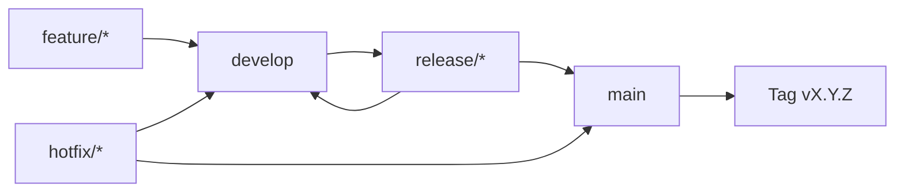

# Versioning Notes - PeopleHub

> **Versi:** 1.0 | **Tanggal:** 23 Januari 2026 | **Status:** Active

---

## Ringkasan

Dokumen ini mendefinisikan strategi versioning untuk:
- Schema database (Prisma migrations)
- API endpoints
- Application releases
- Migration changelog

---

## 1. Semantic Versioning

PeopleHub menggunakan **Semantic Versioning 2.0.0** untuk semua komponen.

### Format

```
MAJOR.MINOR.PATCH[-PRERELEASE][+BUILD]

Contoh:
  1.0.0          - Production release
  1.1.0          - Feature release
  1.1.1          - Patch release
  2.0.0-alpha    - Major prerelease
  1.2.0-beta.1   - Beta release
```

### Version Increment Rules

| Change Type | Version Part | Examples |
|-------------|--------------|----------|
| **Breaking changes** | MAJOR | Remove column, change data type, drop table |
| **New features** | MINOR | Add table, add column, add API endpoint |
| **Bug fixes** | PATCH | Fix query, update index, constraint fix |

---

## 2. Schema Versioning

### Version Tracking

Schema version disimpan dalam tabel `_prisma_migrations` dan di dokumentasi.

```
Schema Version Format: MAJOR.MINOR.PATCH-description

Contoh:
  1.0.0-initial_schema
  1.1.0-add_attendance_settings
  1.2.0-add_liveness_detection
  2.0.0-restructure_approval_flow
```

### Current Schema History

| Version | Date | Migration Name | Changes | Status |
|---------|------|----------------|---------|--------|
| 1.0.0 | 2026-01 | `initial_schema` | Core tables: Tenant, User, Employee, Branch, Department, Position | ✅ Applied |
| 1.1.0 | 2026-01 | `add_attendance` | Attendance, Schedule, Shift tables | ✅ Applied |
| 1.2.0 | 2026-01 | `add_leave_management` | LeaveType, LeaveBalance, LeaveRequest | ✅ Applied |
| 1.3.0 | 2026-01 | `add_payslip` | Payslip, payroll components | ✅ Applied |
| 1.4.0 | 2026-01 | `add_notifications` | Notification, NotificationPreference | ✅ Applied |
| 1.5.0 | 2026-01 | `add_attendance_settings` | AttendanceSettings, liveness fields | ✅ Applied |
| 1.6.0 | 2026-01 | `add_kpi_module` | KpiPeriod, KpiIndicator, KpiTarget | ✅ Applied |
| 1.7.0 | 2026-01 | `add_travel_expense` | TravelRequest, ReimburseRequest | ✅ Applied |
| 1.8.0 | 2026-01 | `add_security_tables` | Session, RefreshToken, LoginAttempt | ✅ Applied |
| 1.9.0 | 2026-01 | `add_approval_flow` | ApprovalFlow, ApprovalStep | ✅ Applied |
| 1.10.0 | 2026-01 | `add_extended_features` | Document, Letter, Ticket, Asset, etc. | ✅ Applied |

### Migration Naming Convention

```
Format: YYYYMMDDHHMMSS_description_snake_case

Contoh:
  20260123100000_add_employee_photo_url
  20260124150000_create_document_table
  20260125090000_add_index_attendance_date
```

### Schema Version Commands

```bash
# Check current schema version
npx prisma migrate status

# List all migrations
ls -la prisma/migrations/

# View migration history in database
psql $DATABASE_URL -c "SELECT * FROM _prisma_migrations ORDER BY finished_at"
```

---

## 3. API Versioning

### Strategy: URL Path Versioning

```
Format: /api/v{MAJOR}/{resource}

Contoh:
  /api/v1/employees
  /api/v1/attendances
  /api/v2/employees  (jika ada breaking change)
```

### Current API Versions

| Version | Status | Support Until | Notes |
|---------|--------|---------------|-------|
| v1 | Active | - | Current production version |

### API Version Guidelines

**Breaking Changes (requires new major version):**
- Removing endpoint
- Removing required field from response
- Changing response structure
- Changing authentication method

**Non-Breaking Changes (no version bump needed):**
- Adding optional query parameter
- Adding optional field to response
- Adding new endpoint
- Adding new error code

### Backward Compatibility Period

| Old Version | New Version | Overlap Period |
|-------------|-------------|----------------|
| v1 | v2 | 6 months |
| v2 | v3 | 6 months |

> [!NOTE]
> Versi lama akan tetap supported selama minimum 6 bulan setelah versi baru dirilis.

---

## 4. Application Versioning

### Release Naming

```
Format: vMAJOR.MINOR.PATCH[-PRERELEASE]

Contoh:
  v1.0.0         - MVP Release
  v1.1.0         - Feature: Document Management
  v1.1.1         - Bugfix: Attendance calculation
  v2.0.0-alpha   - Major: New approval system
  v2.0.0-beta.1  - Beta testing
  v2.0.0-rc.1    - Release candidate
  v2.0.0         - Production release
```

### Git Tagging

```bash
# Create release tag
git tag -a v1.2.0 -m "Release v1.2.0 - Add document management"

# Push tag
git push origin v1.2.0

# List tags
git tag -l "v*"
```

### Branch Strategy

```
main          - Production releases only
develop       - Integration branch
feature/*     - Feature development
hotfix/*      - Production hotfixes
release/*     - Release preparation
```

### Release Process



---

## 5. Package Dependencies

### Lock File Strategy

- Gunakan `package-lock.json` untuk memastikan reproducible builds
- Update dependencies secara berkala (monthly)
- Security patches diterapkan segera

### Dependency Update Process

```bash
# Check outdated packages
npm outdated

# Security audit
npm audit

# Update patch versions only (safe)
npm update

# Update to latest (review breaking changes)
npm update <package>@latest
```

---

## 6. Database Compatibility Matrix

| App Version | Min Schema Version | Max Schema Version |
|-------------|-------------------|-------------------|
| v1.0.x | 1.0.0 | 1.5.0 |
| v1.1.x | 1.3.0 | 1.10.0 |
| v1.2.x | 1.5.0 | 2.0.0 |
| v2.0.x | 2.0.0 | 2.x.x |

### Compatibility Check

```typescript
// lib/version-check.ts

interface VersionCheck {
  appVersion: string;
  schemaVersion: string;
  compatible: boolean;
}

async function checkCompatibility(): Promise<VersionCheck> {
  const appVersion = process.env.npm_package_version || '0.0.0';
  
  // Get schema version from migrations
  const lastMigration = await prisma.$queryRaw<Array<{migration_name: string}>>`
    SELECT migration_name FROM _prisma_migrations 
    WHERE finished_at IS NOT NULL 
    ORDER BY finished_at DESC LIMIT 1
  `;
  
  const schemaVersion = parseVersionFromMigration(lastMigration[0]?.migration_name);
  
  // Check compatibility matrix
  const compatible = isCompatible(appVersion, schemaVersion);
  
  return { appVersion, schemaVersion, compatible };
}
```

---

## 7. Migration Changelog Format

### Changelog Template

```markdown
# Changelog

## [Unreleased]

### Schema Changes
- Added: `column_name` to `table_name`
- Changed: `column_name` type in `table_name`
- Removed: `deprecated_column` from `table_name`

### API Changes
- Added: `POST /api/v1/new-endpoint`
- Deprecated: `GET /api/v1/old-endpoint`

### Breaking Changes
- None

---

## [1.2.0] - 2026-01-23

### Schema Changes
- Added: `liveness_score_in` to `attendances`
- Added: `face_confidence_in` to `attendances`

### API Changes
- Added: `GET /api/v1/attendance/settings`
- Added: `PUT /api/v1/attendance/settings`

### Breaking Changes
- None
```

### Changelog Categories

| Category | Description |
|----------|-------------|
| Added | New features, columns, tables, endpoints |
| Changed | Changes in existing functionality |
| Deprecated | Features to be removed in future |
| Removed | Features removed in this release |
| Fixed | Bug fixes |
| Security | Security patches |

---

## 8. Version Deprecation Policy

### Deprecation Timeline

```
Announce → 3 months → Deprecation Warning → 3 months → Removal

Example:
  Jan: Announce v1 deprecation
  Apr: v1 shows deprecation warning
  Jul: v1 removed from production
```

### Deprecation Notice Format

```typescript
// API Response with deprecation warning
{
  "data": { ... },
  "meta": {
    "deprecated": true,
    "deprecation_date": "2026-07-01",
    "message": "This endpoint is deprecated. Use /api/v2/employees instead.",
    "documentation": "https://docs.peoplehub.com/migration/v1-to-v2"
  }
}
```

### Deprecation Log

| Item | Type | Deprecated | Removal Date | Replacement |
|------|------|------------|--------------|-------------|
| (none currently) | - | - | - | - |

---

## 9. Environment Version Tracking

### Version Endpoints

```typescript
// app/api/version/route.ts

export async function GET() {
  return Response.json({
    app: {
      name: 'PeopleHub',
      version: process.env.npm_package_version,
      environment: process.env.NODE_ENV
    },
    schema: {
      version: await getSchemaVersion(),
      lastMigration: await getLastMigrationName()
    },
    api: {
      version: 'v1',
      deprecated: false
    },
    build: {
      timestamp: process.env.BUILD_TIMESTAMP,
      commit: process.env.GIT_COMMIT
    }
  });
}
```

### Environment Variables

```bash
# Version-related environment variables
APP_VERSION=1.2.0
GIT_COMMIT=abc123def
BUILD_TIMESTAMP=2026-01-23T10:00:00Z
```

---

## 10. Version Communication

### Internal Communication

- Release notes di Slack #releases
- Sprint review presentation
- CHANGELOG.md updates

### External Communication

- User notification untuk breaking changes
- Email untuk mandatory updates
- In-app banner untuk new features

### Release Notes Template

```markdown
# PeopleHub v1.2.0 Release Notes

**Release Date:** 23 Januari 2026

## Highlights

- 🎉 New: Document management system
- ⚡ Improved: Dashboard loading performance
- 🐛 Fixed: Attendance calculation on DST change

## New Features

### Document Management
- Upload and manage employee documents
- Access control per document type
- Version history tracking

## Improvements

- Dashboard loads 40% faster
- Better error messages for form validation

## Bug Fixes

- Fixed attendance late calculation during DST
- Fixed leave balance not updating after cancel

## Breaking Changes

None in this release.

## Upgrade Notes

No special steps required. Standard deployment process applies.

## Known Issues

- File preview not working in Safari 16.0 (workaround: use Chrome)
```

---

## 11. Related Documents

| Document | Link |
|----------|------|
| Migration Plan | [migration-plan.md](migration-plan.md) |
| Rollback Procedures | [rollback-procedures.md](rollback-procedures.md) |
| CHANGELOG | [../CHANGELOG.md](../CHANGELOG.md) |
| API Specification | [../04-api/specification.md](../04-api/specification.md) |

---

## 12. Version History

| Version | Date | Author | Changes |
|---------|------|--------|---------|
| 1.0 | 2026-01-23 | Migration & Release Engineer | Initial document |
