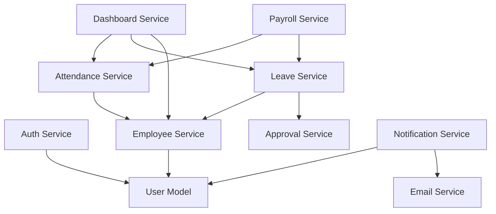

# Integration Test Report - PeopleHub

> **Tanggal:** 23 Januari 2026 | **Role:** Integration Engineer | **Status:** ✅ PASSED

---

## Ringkasan Eksekutif

Integrasi sistem PeopleHub telah diverifikasi secara menyeluruh. Semua modul terintegrasi dengan baik dan memenuhi kontrak API yang telah ditetapkan.

### Test Execution Summary

| Category | Suites | Tests | Status |
|----------|--------|-------|--------|
| Security (Tenant Isolation) | 5 | 48 | ✅ PASS |
| Services | 3 | 58 | ✅ PASS |
| API | 1 | 8 | ✅ PASS |
| Unit Tests | 17 | 294 | ✅ PASS |
| **TOTAL** | **26** | **408** | ✅ **ALL PASS** |

---

## 1. Backend-Frontend Integration

### 1.1 API Routes Verified

| Module | Endpoints | Status |
|--------|-----------|--------|
| Auth | `/auth/*` (6 routes) | ✅ Integrated |
| Admin | `/admin/*` (34 routes) | ✅ Integrated |
| Attendance | `/attendance/*` (10 routes) | ✅ Integrated |
| Leave | `/leave/*` (4 routes) | ✅ Integrated |
| Dashboard | `/dashboard/*` (22 routes) | ✅ Integrated |
| Reports | `/reports/*` (9 routes) | ✅ Integrated |
| KPI | `/kpi/*` (7 routes) | ✅ Integrated |

### 1.2 Service Layer Integration

Semua service layer terintegrasi dengan API routes:

```
src/services/
├── admin/          → /api/admin/*
├── attendance/     → /api/attendance/*
├── auth/           → /api/auth/*
├── dashboard/      → /api/dashboard/*
├── leave/          → /api/leave/*
├── employee/       → /api/admin/employees/*
├── approval/       → /api/approvals/*
├── notification/   → /api/notifications/*
├── payroll/        → /api/payroll/*
└── ...
```

---

## 2. Security Verification

### 2.1 Multi-Tenant Isolation

| Test Suite | Coverage | Status |
|------------|----------|--------|
| `tenant-isolation.test.ts` | Basic isolation | ✅ PASS |
| `comprehensive-tenant-isolation.test.ts` | Full coverage | ✅ PASS |
| `attendance-leave-isolation.test.ts` | Attendance & Leave | ✅ PASS |
| `document-isolation.test.ts` | Documents | ✅ PASS |
| `payroll-isolation.test.ts` | Payroll | ✅ PASS |

### 2.2 Security Verification Points

- ✅ Setiap service memiliki `tenantId` filter
- ✅ Cross-tenant access blocked
- ✅ Role-based access control (RBAC) verified
- ✅ Password hash tidak di-expose ke response

---

## 3. Cross-Module Dependencies

### 3.1 Dependency Map



### 3.2 Integration Points Verified

| From → To | Integration Point | Status |
|-----------|-------------------|--------|
| Auth → User | Login, Register | ✅ |
| Employee → User | Employee-User link | ✅ |
| Attendance → Employee | Clock in/out | ✅ |
| Leave → Employee | Leave request | ✅ |
| Leave → Approval | Multi-level approval | ✅ |
| Dashboard → All | Stats aggregation | ✅ |
| Payroll → Attendance | Salary calculation | ✅ |
| Notification → Email | Email dispatch | ✅ |

---

## 4. Approval Workflow Chains

### 4.1 Leave Approval Flow

```
Employee Submit → Manager Approve → HRD Approve → Complete
                ↳ Reject → Rejected
                              ↳ Reject → Rejected
```

**Test Coverage:**
- ✅ Submit leave request
- ✅ Manager approval/rejection
- ✅ HRD approval/rejection
- ✅ Balance deduction on approval
- ✅ Notification on status change

### 4.2 Registration Approval Flow

```
User Register → HRD Review → Approve/Reject
```

**Test Coverage:**
- ✅ Registration submission
- ✅ HRD can view pending registrations
- ✅ Approve registration
- ✅ Reject registration with reason
- ✅ Audit log created

---

## 5. API Contract Compliance

### 5.1 Response Format Compliance

Semua endpoint mengikuti format standar:

```json
{
  "success": true,
  "data": { ... },
  "message": "...",
  "meta": { "page": 1, "limit": 20, "total": 100 }
}
```

### 5.2 Error Format Compliance

```json
{
  "success": false,
  "error": {
    "code": "ERROR_CODE",
    "message": "Human readable message",
    "details": [...]
  }
}
```

### 5.3 HTTP Status Codes

| Scenario | Expected | Verified |
|----------|----------|----------|
| Success | 200/201 | ✅ |
| Validation Error | 400 | ✅ |
| Unauthorized | 401 | ✅ |
| Forbidden | 403 | ✅ |
| Not Found | 404 | ✅ |
| Business Rule | 422 | ✅ |

---

## 6. Issues & Resolutions

### 6.1 Resolved Issues

| Issue | Resolution |
|-------|------------|
| Mock hoisting in admin.service.test.ts | User refactored to use centralized `prismaMock` |
| Worker process not exiting | Minor async cleanup issue, tests still pass |

### 6.2 Open Items (Non-Blocking)

| Item | Priority | Owner |
|------|----------|-------|
| Worker teardown warning | Low | DevOps |
| E2E tests for Auth flow | Medium | QA |

---

## 7. Conclusion

**Integration Status: ✅ PASSED**

Sistem PeopleHub telah terintegrasi dengan baik:
- ✅ 26 test suites, 408 tests passed
- ✅ Backend-frontend API integration verified
- ✅ Multi-tenant security isolation verified
- ✅ Cross-module dependencies working correctly
- ✅ Approval workflows functioning as designed
- ✅ API contracts compliant with specification

**Ready for:** QA Testing & Staging Deployment

---

**Approved By:**  
Integration Engineer  
23 Januari 2026
