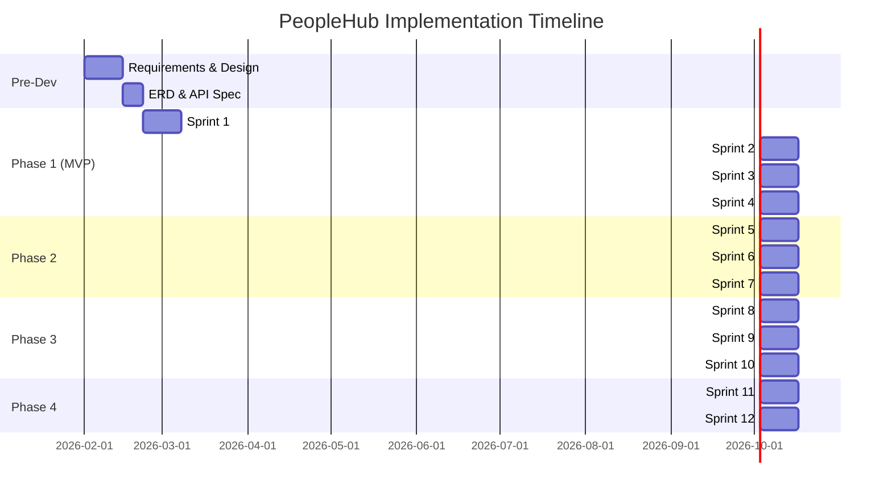

# Implementation Roadmap - PeopleHub

> **Versi:** 1.1 | **Tanggal:** 22 Januari 2026 | **Status:** Active

---

## Executive Summary

Dokumen ini berisi **roadmap implementasi detail** untuk PeopleHub HRIS, termasuk:
- Sprint breakdown dengan task granular
- Estimasi effort per fitur
- Dependencies antar modul
- Acceptance criteria per deliverable
- Verification checklist

**Total Timeline:** ~27 minggu (~7 bulan)
**Total Sprints:** 14 sprints @ 2 minggu

---

## Prerequisites (Pre-Flight Check)

Sebelum memulai implementasi atau deployment, pastikan semua item berikut sudah tersedia:

### Infrastructure Requirements

| Komponen | Spesifikasi Minimum | Rekomendasi |
|----------|---------------------|-------------|
| **Server/VPS** | 2 vCPU, 4GB RAM, 50GB SSD | 4 vCPU, 8GB RAM, 100GB SSD |
| **Database** | PostgreSQL 14+ | PostgreSQL 15+ dengan replication |
| **Storage** | 20GB untuk uploads | S3-compatible object storage |
| **OS** | Ubuntu 22.04 LTS | Ubuntu 24.04 LTS |
| **Docker** | Docker 24+ | Docker 24+ dengan Compose v2 |
| **SSL** | Valid SSL Certificate | Let's Encrypt atau Custom CA |

### Environment Variables

Semua environment variables didokumentasikan di:
- 📄 [env-config.md](../06-database/env-config.md)

**Checklist ENV wajib sebelum deploy:**
- [ ] `DATABASE_URL` - PostgreSQL connection string
- [ ] `NEXTAUTH_SECRET` - JWT signing secret (min 32 chars)
- [ ] `NEXTAUTH_URL` - Production URL
- [ ] `SMTP_*` - Email configuration untuk notifications
- [ ] `S3_*` atau `UPLOAD_PATH` - Storage configuration

### Access Requirements

| Akses | Diperlukan Untuk |
|-------|------------------|
| SSH root/sudo | Server setup, deployment |
| Domain management | DNS configuration, SSL |
| Database admin | Schema migration, backup/restore |
| SMTP credentials | Email notifications |

### Backup Strategy

> [!IMPORTANT]
> Backup WAJIB dikonfigurasi sebelum deployment production.

| Komponen | Metode | Frekuensi | Retensi |
|----------|--------|-----------|--------|
| Database | pg_dump + cron | Daily + before deploy | 30 hari |
| Uploads | rsync ke backup server | Daily | 90 hari |
| Config files | Git repository | On change | Permanent |
| Full server | VPS Snapshot | Weekly | 4 snapshots |

**Pre-Deploy Backup Checklist:**
- [ ] Database snapshot taken
- [ ] Previous release version tagged di Git
- [ ] Upload folder backed up
- [ ] Environment variables documented

---

## Phase Overview



---

### Current Progress Status

> **Last Updated:** 22 Januari 2026

| Phase | Sprint(s) | Status | Progress | Completion Date |
|-------|-----------|--------|----------|-----------------|
| **Pre-Dev** | - | ✅ Complete | 100% | Feb 2026 |
| **Phase 1 (MVP)** | 1-4 | 🟡 95% | Sprint 4 Testing | - |
| Phase 2 | 5-7 | ⬜ Not Started | 0% | - |
| Phase 3 | 8-10 | ⬜ Not Started | 0% | - |
| Phase 4 | 11-12 | ⬜ Not Started | 0% | - |

**Sprint Status:**
| Sprint | Name | Status | Notes |
|--------|------|--------|-------|
| Sprint 1 | Foundation & Auth | ✅ Complete | All 18 tasks done |
| Sprint 2 | Employee & Org | ✅ Complete | All 16 tasks done |
| Sprint 3 | Attendance | ✅ Complete | All 14 tasks done |
| Sprint 4 | Leave & Dashboard | 🟡 95% | QA testing in progress |
| Sprint 5+ | Phase 2-4 | ⬜ Pending | Waiting for MVP completion |

> For detailed sprint progress, see [sprint-progress.md](sprint-progress.md)

---

## Phase 1: MVP (8 Minggu)

### Sprint 1: Foundation & Authentication (Minggu 4-5)

#### Backend Tasks

| ID | Task | Priority | Effort | Dependencies | Assignee |
|----|------|----------|--------|--------------|----------|
| BE-001 | Setup project structure (Next.js App Router) | P0 | 4h | - | Backend |
| BE-002 | Setup Prisma dengan PostgreSQL | P0 | 4h | BE-001 | Backend |
| BE-003 | Schema: User, Company, Role, Permission | P0 | 8h | BE-002 | Backend |
| BE-004 | API: Register dengan approval workflow | P0 | 8h | BE-003 | Backend |
| BE-005 | API: Login (email + password, JWT) | P0 | 4h | BE-003 | Backend |
| BE-006 | API: Password reset flow | P1 | 4h | BE-005 | Backend |
| BE-007 | API: Tenant configuration CRUD | P0 | 6h | BE-003 | Backend |
| BE-008 | Middleware: Auth, Tenant Isolation, RBAC | P0 | 8h | BE-005 | Backend |
| BE-009 | Seed data: 2 tenants, roles, test users | P0 | 4h | BE-003 | Backend |

#### Frontend Tasks

| ID | Task | Priority | Effort | Dependencies | Assignee |
|----|------|----------|--------|--------------|----------|
| FE-001 | Setup design system (Tailwind tokens) | P0 | 8h | - | Frontend |
| FE-002 | Component: Button, Input, Card, Badge | P0 | 8h | FE-001 | Frontend |
| FE-003 | Component: Table with sort, filter, pagination | P0 | 8h | FE-002 | Frontend |
| FE-004 | Component: Modal, Toast, Dialog | P0 | 6h | FE-002 | Frontend |
| FE-005 | Page: Login | P0 | 4h | FE-002 | Frontend |
| FE-006 | Page: Register dengan form validation | P0 | 6h | FE-002 | Frontend |
| FE-007 | Page: Forgot Password | P1 | 4h | FE-002 | Frontend |
| FE-008 | Layout: Sidebar, Header, MainContent | P0 | 8h | FE-002 | Frontend |
| FE-009 | Setup TanStack Query untuk data fetching | P0 | 4h | - | Frontend |

#### QA Tasks

| ID | Task | Priority | Effort | Dependencies | Assignee |
|----|------|----------|--------|--------------|----------|
| QA-001 | Test: Tenant isolation (User A tidak bisa lihat data tenant B) | P0 | 4h | BE-008 | QA |
| QA-002 | Test: Auth flow (register, login, reset) | P0 | 4h | BE-005 | QA |
| QA-003 | Test: RBAC enforcement | P0 | 4h | BE-008 | QA |

**Sprint 1 Deliverables:**
- [x] Project dapat berjalan di local development
- [x] User dapat register (pending approval)
- [x] User dapat login dan logout
- [x] Multi-tenant isolation berfungsi
- [x] Basic UI components ready

---

### Sprint 2: Employee & Organization (Minggu 6-7)

#### Backend Tasks

| ID | Task | Priority | Effort | Dependencies | Assignee |
|----|------|----------|--------|--------------|----------|
| BE-010 | Schema: Employee, Branch, Department, Position | P0 | 8h | BE-003 | Backend |
| BE-011 | API: Branch CRUD | P0 | 4h | BE-010 | Backend |
| BE-012 | API: Department CRUD | P0 | 4h | BE-010 | Backend |
| BE-013 | API: Position CRUD | P0 | 4h | BE-010 | Backend |
| BE-014 | API: Employee CRUD dengan validasi | P0 | 8h | BE-010 | Backend |
| BE-015 | API: Employee profile (self-service) | P0 | 4h | BE-014 | Backend |
| BE-016 | API: Approval registration (HRD) | P0 | 6h | BE-004 | Backend |
| BE-017 | API: Org structure tree view | P1 | 4h | BE-010 | Backend |

#### Frontend Tasks

| ID | Task | Priority | Effort | Dependencies | Assignee |
|----|------|----------|--------|--------------|----------|
| FE-010 | Page: Branch management (table + CRUD modal) | P0 | 6h | FE-003 | Frontend |
| FE-011 | Page: Department management | P0 | 6h | FE-003 | Frontend |
| FE-012 | Page: Position management | P0 | 6h | FE-003 | Frontend |
| FE-013 | Page: Employee list dengan filter | P0 | 8h | FE-003 | Frontend |
| FE-014 | Page: Employee detail/profile | P0 | 8h | FE-002 | Frontend |
| FE-015 | Page: Pending registration approval | P0 | 6h | FE-003 | Frontend |
| FE-016 | Component: Org structure tree | P1 | 8h | FE-002 | Frontend |

**Sprint 2 Deliverables:**
- [x] HRD dapat mengelola struktur organisasi
- [x] HRD dapat approve/reject registrasi
- [x] Employee dapat melihat profil sendiri
- [x] Data master org structure tersedia

---

### Sprint 3: Attendance System (Minggu 8-9)

#### Backend Tasks

| ID | Task | Priority | Effort | Dependencies | Assignee |
|----|------|----------|--------|--------------|----------|
| BE-020 | Schema: Schedule, Attendance, AttendanceLog | P0 | 8h | BE-010 | Backend |
| BE-021 | API: Schedule CRUD (normal, shift, flexible) | P0 | 8h | BE-020 | Backend |
| BE-022 | API: Clock In dengan selfie upload | P0 | 12h | BE-020 | Backend |
| BE-023 | API: Clock Out dengan validasi | P0 | 6h | BE-022 | Backend |
| BE-024 | API: Attendance history (employee) | P0 | 4h | BE-020 | Backend |
| BE-025 | API: Attendance report (HRD) | P0 | 6h | BE-020 | Backend |
| BE-026 | Logic: Late calculation berdasarkan schedule | P0 | 8h | BE-021 | Backend |
| BE-027 | API: WFO/WFH mode toggle | P1 | 4h | BE-022 | Backend |
| BE-028 | Storage: Selfie image upload (S3/local) | P0 | 6h | - | Backend |

#### Frontend Tasks

| ID | Task | Priority | Effort | Dependencies | Assignee |
|----|------|----------|--------|--------------|----------|
| FE-020 | Component: Camera capture untuk selfie | P0 | 8h | - | Frontend |
| FE-021 | Page: Clock In/Out (mobile-first) | P0 | 12h | FE-020 | Frontend |
| FE-022 | Page: My Attendance history | P0 | 6h | FE-003 | Frontend |
| FE-023 | Page: Schedule management (HRD) | P0 | 8h | FE-003 | Frontend |
| FE-024 | Page: Attendance monitoring (HRD) | P0 | 8h | FE-003 | Frontend |
| FE-025 | Component: Attendance status badge | P0 | 2h | FE-002 | Frontend |
| FE-026 | Page: Attendance report dengan filter | P1 | 6h | FE-003 | Frontend |

**Sprint 3 Deliverables:**
- [x] Karyawan dapat clock in/out dengan selfie
- [x] Sistem menghitung keterlambatan otomatis
- [x] HRD dapat memonitor kehadiran real-time
- [x] Support WFO dan WFH mode

---

### Sprint 4: Leave Management & Dashboard (Minggu 10-11)

#### Backend Tasks

| ID | Task | Priority | Effort | Dependencies | Assignee |
|----|------|----------|--------|--------------|----------|
| BE-030 | Schema: LeaveType, LeaveBalance, LeaveRequest | P0 | 8h | BE-010 | Backend |
| BE-031 | Schema: ApprovalFlow, ApprovalHistory | P0 | 6h | BE-010 | Backend |
| BE-032 | API: LeaveType CRUD (annual, sick, special) | P0 | 4h | BE-030 | Backend |
| BE-033 | API: LeaveRequest create dengan validasi saldo | P0 | 8h | BE-030 | Backend |
| BE-034 | API: LeaveRequest approval (multi-level) | P0 | 10h | BE-031 | Backend |
| BE-035 | API: Leave balance calculation | P0 | 6h | BE-030 | Backend |
| BE-036 | API: Dashboard stats (HRD) | P0 | 8h | BE-020, BE-030 | Backend |
| BE-037 | API: Dashboard stats (Employee) | P0 | 6h | BE-020, BE-030 | Backend |
| BE-038 | API: Export CSV absensi | P0 | 4h | BE-020 | Backend |
| BE-039 | Notification: Email approval request | P0 | 6h | BE-034 | Backend |

#### Frontend Tasks

| ID | Task | Priority | Effort | Dependencies | Assignee |
|----|------|----------|--------|--------------|----------|
| FE-030 | Page: Leave request form | P0 | 8h | FE-002 | Frontend |
| FE-031 | Page: My leave history | P0 | 6h | FE-003 | Frontend |
| FE-032 | Page: Leave balance summary | P0 | 4h | FE-002 | Frontend |
| FE-033 | Page: Pending approval list (Manager) | P0 | 8h | FE-003 | Frontend |
| FE-034 | Page: Leave management (HRD) | P0 | 8h | FE-003 | Frontend |
| FE-035 | Page: Dashboard HRD | P0 | 12h | FE-002 | Frontend |
| FE-036 | Page: Dashboard Employee | P0 | 10h | FE-002 | Frontend |
| FE-037 | Component: Stat card dengan trend | P0 | 4h | FE-002 | Frontend |
| FE-038 | Component: Chart (attendance, leave) | P0 | 6h | - | Frontend |
| FE-039 | Feature: Export CSV button | P0 | 2h | FE-002 | Frontend |

**Sprint 4 Deliverables:**
- [x] Karyawan dapat request cuti dengan validasi saldo
- [x] Manager dapat approve/reject cuti
- [x] Dashboard HRD dengan statistik real-time
- [x] Dashboard Employee dengan ringkasan pribadi
- [x] Export CSV untuk payroll

---

## Phase 2: Extended Features (6 Minggu)

### Sprint 5: Document Management (Minggu 12-13)

| ID | Task | Priority | Effort | Dependencies |
|----|------|----------|--------|--------------|
| BE-040 | Schema: Document, DocumentType, DocumentVersion | P0 | 6h | BE-010 |
| BE-041 | API: Document upload dengan version control | P0 | 10h | BE-040 |
| BE-042 | API: Document access control (per role) | P0 | 6h | BE-040 |
| FE-040 | Page: Document upload form | P0 | 6h | FE-002 |
| FE-041 | Page: My documents list | P0 | 6h | FE-003 |
| FE-042 | Page: Document management (HRD) | P0 | 8h | FE-003 |
| FE-043 | Component: Document preview (PDF/image) | P1 | 8h | - |

### Sprint 6: Travel & Expense (Minggu 14-15)

| ID | Task | Priority | Effort | Dependencies |
|----|------|----------|--------|--------------|
| BE-050 | Schema: TravelRequest, Expense, ExpenseItem | P0 | 8h | BE-010 |
| BE-051 | API: Travel request dengan approval | P0 | 10h | BE-050 |
| BE-052 | API: Expense claim dengan upload bukti | P0 | 10h | BE-050 |
| FE-050 | Page: Travel request form | P0 | 8h | FE-002 |
| FE-051 | Page: Expense claim form | P0 | 8h | FE-002 |
| FE-052 | Page: Travel/Expense approval (Finance) | P0 | 8h | FE-003 |

### Sprint 7: Overtime & Correction (Minggu 16-17)

| ID | Task | Priority | Effort | Dependencies |
|----|------|----------|--------|--------------|
| BE-060 | Schema: OvertimeRequest, AttendanceCorrection | P0 | 6h | BE-020 |
| BE-061 | API: Overtime request dengan approval | P0 | 8h | BE-060 |
| BE-062 | API: Attendance correction dengan bukti | P0 | 8h | BE-060 |
| BE-063 | Logic: Late penalty calculation | P1 | 6h | BE-026 |
| FE-060 | Page: Overtime request form | P0 | 6h | FE-002 |
| FE-061 | Page: Correction request form | P0 | 6h | FE-002 |
| FE-062 | Page: Overtime report | P1 | 6h | FE-003 |

---

## Phase 3: Performance & Payroll (6 Minggu)

### Sprint 8: KPI Module (Minggu 18-19)

| ID | Task | Priority | Effort | Dependencies |
|----|------|----------|--------|--------------|
| BE-070 | Schema: KPICycle, KPIIndicator, KPIScore | P0 | 8h | BE-010 |
| BE-071 | API: KPI cycle management | P0 | 6h | BE-070 |
| BE-072 | API: KPI score entry | P0 | 8h | BE-070 |
| FE-070 | Page: KPI setup (HRD) | P0 | 8h | FE-003 |
| FE-071 | Page: My KPI dashboard | P0 | 8h | FE-002 |
| FE-072 | Page: Team KPI overview (Manager) | P0 | 8h | FE-003 |

### Sprint 9: Payslip Module (Minggu 20-21)

| ID | Task | Priority | Effort | Dependencies |
|----|------|----------|--------|--------------|
| BE-080 | Schema: PayrollPeriod, Payslip, PayslipComponent | P0 | 8h | BE-010 |
| BE-081 | API: Payslip upload (batch) | P0 | 8h | BE-080 |
| BE-082 | API: Payslip PDF generation | P0 | 12h | BE-080 |
| BE-083 | API: Payslip notification | P0 | 4h | BE-082 |
| FE-080 | Page: Payroll management (Finance) | P0 | 10h | FE-003 |
| FE-081 | Page: My payslip history | P0 | 6h | FE-003 |
| FE-082 | Component: Payslip PDF viewer | P0 | 6h | - |

### Sprint 10: Bulk Actions & Delegation (Minggu 22-23)

| ID | Task | Priority | Effort | Dependencies |
|----|------|----------|--------|--------------|
| BE-090 | API: Bulk import employees (CSV) | P0 | 8h | BE-014 |
| BE-091 | API: Bulk approval | P0 | 6h | BE-034 |
| BE-092 | API: Approver delegation | P0 | 8h | BE-031 |
| FE-090 | Page: Bulk import wizard | P0 | 10h | FE-003 |
| FE-091 | Feature: Bulk select & approve | P0 | 6h | FE-003 |
| FE-092 | Page: Delegation management | P0 | 6h | FE-002 |

---

## Phase 4: Integration & Analytics (4 Minggu)

### Sprint 11: Analytics Dashboard (Minggu 24-25)

| ID | Task | Priority | Effort | Dependencies |
|----|------|----------|--------|--------------|
| BE-100 | API: Attendance heatmap data | P1 | 6h | BE-020 |
| BE-101 | API: Turnover analytics | P1 | 6h | BE-010 |
| BE-102 | API: Leave trend analytics | P1 | 4h | BE-030 |
| FE-100 | Page: Analytics dashboard | P1 | 12h | FE-038 |
| FE-101 | Component: Heatmap chart | P1 | 6h | - |
| FE-102 | Component: Advanced filters | P1 | 4h | FE-002 |

### Sprint 12: SSO & Webhook (Minggu 26-27)

| ID | Task | Priority | Effort | Dependencies |
|----|------|----------|--------|--------------|
| BE-110 | Integration: Google SSO | P2 | 12h | BE-005 |
| BE-111 | Integration: Microsoft SSO | P2 | 12h | BE-005 |
| BE-112 | API: Webhook configuration | P2 | 8h | - |
| BE-113 | API: Webhook event dispatch | P2 | 8h | BE-112 |
| BE-114 | API: Audit log export | P1 | 4h | - |
| FE-110 | Page: SSO configuration | P2 | 6h | FE-002 |
| FE-111 | Page: Webhook management | P2 | 6h | FE-003 |

---

## Verification Checklist

### Per-Sprint Verification

- [ ] **Unit Tests:** Coverage ≥ 80% untuk business logic
- [ ] **API Tests:** Semua endpoint tested dengan Supertest
- [ ] **E2E Tests:** Happy path + 2 negative scenarios
- [ ] **Tenant Isolation:** Test cross-tenant access blocked
- [ ] **Performance:** Dashboard < 3s, Absen < 1.5s
- [ ] **Manual QA:** Tested di staging environment

### Pre-Release Verification (Per Phase)

- [ ] Full E2E test suite passing
- [ ] Security testing (OWASP ZAP scan)
- [ ] Load testing (K6) dengan 500 concurrent users
- [ ] UAT dengan sample users
- [ ] Documentation updated
- [ ] Rollback plan ready

---

## Rollback Strategy (Contingency Plan)

Rencana cadangan jika deployment gagal atau ditemukan critical bug.

### Rollback Timeline Target

| Severity | Max Downtime | Rollback Trigger |
|----------|--------------|------------------|
| P0 Critical | < 15 menit | Data corruption, security breach, system down |
| P1 High | < 30 menit | Core feature broken (absensi, cuti) |
| P2 Medium | < 2 jam | Non-core feature issues |

### Rollback Procedures

#### Scenario A: Code Rollback (Most Common)

```bash
# 1. Stop current deployment
docker compose -f docker-compose.prod.yml down

# 2. Checkout previous stable version
git checkout tags/v{PREVIOUS_VERSION}

# 3. Rebuild and deploy
docker compose -f docker-compose.prod.yml up -d --build

# 4. Verify application health
curl -f http://localhost:3000/api/health || echo "Health check failed!"
```

#### Scenario B: Database Rollback

```bash
# 1. Stop application
docker compose -f docker-compose.prod.yml down

# 2. Restore database from backup
pg_restore -h localhost -U peoplehub -d peoplehub_db \
  --clean --if-exists backup_YYYYMMDD_HHMM.dump

# 3. Restart with matching code version
git checkout tags/v{MATCHING_VERSION}
docker compose -f docker-compose.prod.yml up -d --build
```

#### Scenario C: Full Server Rollback

```bash
# 1. Notify stakeholders
# 2. Restore VPS snapshot dari control panel provider
# 3. Verify all services running
# 4. Test critical paths (login, absensi, cuti)
```

### Rollback Checklist

- [ ] Identify the issue and severity
- [ ] Notify stakeholders (HRD, IT, Management)
- [ ] Execute appropriate rollback procedure
- [ ] Verify system functionality
- [ ] Document incident in issues-log.md
- [ ] Post-mortem analysis within 24 hours

### Communication Template

```
SUBJECT: [PeopleHub] Rollback Notification - {DATE}

Tim Yth,

Kami melakukan rollback sistem PeopleHub karena:
- Issue: {DESKRIPSI MASALAH}
- Severity: {P0/P1/P2}
- Downtime: {DURASI}

Sistem telah kembali ke versi {VERSION} dan berfungsi normal.
Kami akan melakukan investigasi lebih lanjut.

Terima kasih atas pengertiannya.
```

---

## Definition of Done

Sebuah task dianggap **DONE** jika:

1. **Code Complete**
   - Kode sudah di-merge ke branch `develop`
   - Code review telah passed
   - No lint errors atau warnings

2. **Testing Complete**
   - Unit test passing
   - Integration test passing
   - E2E test untuk happy path

3. **Documentation**
   - API endpoints documented
   - README updated jika ada perubahan setup

4. **Deployment Ready**
   - Deployed ke staging
   - QA sign-off

---

## Dokumen Terkait

| Dokumen | Link |
|---------|------|
| Kerangka Acuan Kerja | [kak.md](../01-overview/kak.md) |
| Konsep Produk | [concept.md](../01-overview/concept.md) |
| User Stories | [user-stories.md](../02-requirements/user-stories.md) |
| ERD | [erd.md](../03-architecture/erd.md) |
| API Specification | [specification.md](../04-api/specification.md) |
| QA Rules | [.agent/rules/qa.md](../../.agent/rules/qa.md) |
