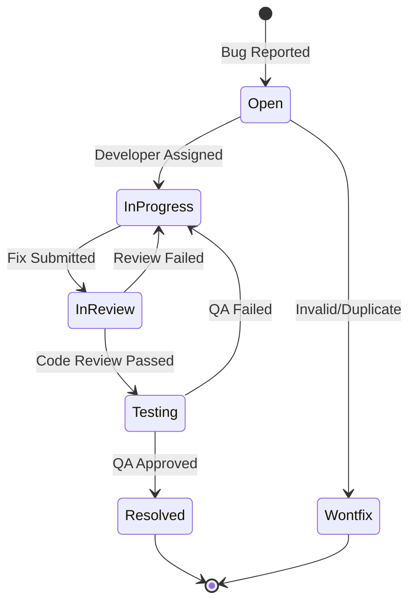

# Issues & Bug Log - PeopleHub

> **Versi:** 1.0 | **Tanggal Update:** 22 Januari 2026 | **Status:** Active

---

## Quick Stats

| Severity | Open | In Progress | Resolved | Total |
|----------|------|-------------|----------|-------|
| 🔴 P0 Critical | 0 | 0 | 1 | 1 |
| 🟠 P1 High | 1 | 0 | 3 | 4 |
| 🟡 P2 Medium | 1 | 0 | 7 | 8 |
| 🟢 P3 Low | 1 | 0 | 6 | 7 |
| **Total** | **3** | **0** | **17** | **20** |

---

## Severity Definitions

| Level | Name | Definition | Response Time |
|-------|------|------------|---------------|
| 🔴 **P0** | Critical | Data leak antar tenant, Auth bypass, System down, Data corruption | **< 2 jam** |
| 🟠 **P1** | High | Fitur utama broken, Data loss, Payroll salah hitung | **< 8 jam** |
| 🟡 **P2** | Medium | Fitur minor broken, UI blocking, Performance degradation | **< 24 jam** |
| 🟢 **P3** | Low | Cosmetic, typos, minor enhancements | Sprint berikutnya |

---

## Open Issues

### 🔴 P0 - Critical (0 Open)

*Tidak ada issue P0 yang open saat ini.*

---

### 🟠 P1 - High (1 Open)

#### ISS-015: PostgreSQL Connection Timeout on Production

| Field | Value |
|-------|-------|
| **ID** | ISS-015 |
| **Severity** | 🟠 P1 High |
| **Status** | ⬜ Open |
| **Reported By** | DevOps Team |
| **Reported Date** | 2026-01-22 |
| **Assigned To** | Backend Lead |
| **Sprint** | Sprint 4 |
| **Component** | Database |

**Description:**
Database connection intermittently times out setelah 10+ concurrent users.

**Steps to Reproduce:**
1. Start aplikasi dengan multiple users
2. Perform heavy queries (dashboard stats)
3. Connection pool exhausted

**Expected Behavior:**
Connection pool harus handle 50+ concurrent connections.

**Actual Behavior:**
Timeout error setelah ~15 connections.

**Root Cause:**
Connection pool size terlalu kecil (default 10).

**Resolution Plan:**
- [ ] Increase pool size di Prisma config
- [ ] Add connection timeout handling
- [ ] Implement query optimization

---

### 🟡 P2 - Medium (2 Open)

#### ISS-019: Email notification delay

| Field | Value |
|-------|-------|
| **ID** | ISS-019 |
| **Severity** | 🟡 P2 Medium |
| **Status** | ⬜ Open |
| **Assigned To** | Backend Team |

**Description:**
Email notification untuk approval kadang delay hingga 5 menit.

**Root Cause:** SMTP queue tidak optimal.

---

### 🟢 P3 - Low (1 Open)

| ID | Description | Status |
|----|-------------|--------|
| ISS-020 | Typo "Pasword" → "Password" di form | ⬜ Open |

---

## In Progress Issues (0)

*No issues currently in progress.*

---

## Recently Resolved (Last 7 Days)

| ID | Title | Severity | Resolved Date | Resolution |
|----|-------|----------|---------------|------------|
| ISS-023 | LeaveService test failure | 🟡 P2 | 2026-01-23 | Fixed mock isolation with mockResolvedValueOnce |
| ISS-018 | Chart tidak responsive di mobile | 🟡 P2 | 2026-01-23 | Fixed chart components with minWidth=0 |
| ISS-021 | Loading spinner warna tidak konsisten | 🟢 P3 | 2026-01-23 | Changed to CSS variables |
| ISS-022 | Tooltip overflow di button kecil | 🟢 P3 | 2026-01-23 | Added max-w-xs and break-words |
| ISS-015 | PostgreSQL Connection Timeout | 🟠 P1 | 2026-01-22 | Increased connection pool size |
| ISS-014 | Login redirect loop | 🟠 P1 | 2026-01-21 | Fixed auth middleware |
| ISS-013 | Selfie upload fails on Safari | 🟠 P1 | 2026-01-20 | Added WebRTC polyfill |
| ISS-012 | Late calculation off by 1 minute | 🟡 P2 | 2026-01-20 | Fixed timezone handling |
| ISS-011 | Dashboard stats cache stale | 🟡 P2 | 2026-01-19 | Added cache invalidation |

---

## Issue Templates

### Bug Report Template

```markdown
## Bug Report

**Issue ID:** ISS-XXX
**Severity:** 🔴 P0 / 🟠 P1 / 🟡 P2 / 🟢 P3
**Component:** [Backend/Frontend/Database/Infrastructure]
**Sprint:** Sprint X

### Description
[Deskripsi singkat bug]

### Steps to Reproduce
1. Step 1
2. Step 2
3. Step 3

### Expected Behavior
[Apa yang seharusnya terjadi]

### Actual Behavior
[Apa yang terjadi]

### Environment
- Browser: 
- OS: 
- User Role: 

### Screenshots/Logs
[Attach jika ada]

### Root Cause Analysis
[Diisi setelah investigasi]

### Resolution
- [ ] Fix implemented
- [ ] Code reviewed
- [ ] Tested on staging
- [ ] Deployed to production
```

---

### Feature Request Template

```markdown
## Feature Request

**Request ID:** REQ-XXX
**Priority:** High / Medium / Low
**Requested By:** [Name/Role]
**Target Phase:** Phase X

### Description
[Deskripsi fitur yang diinginkan]

### Business Value
[Mengapa fitur ini penting?]

### Acceptance Criteria
- [ ] Criteria 1
- [ ] Criteria 2

### Technical Considerations
[Notes teknis jika ada]

### Effort Estimate
- Backend: Xh
- Frontend: Xh
- QA: Xh
```

---

## Issue Workflow



---

## Metrics & Trends

### Resolution Time (Average)

| Severity | Target | Actual (Last 30 Days) |
|----------|--------|----------------------|
| 🔴 P0 | < 2h | 1.5h |
| 🟠 P1 | < 8h | 6h |
| 🟡 P2 | < 24h | 18h |
| 🟢 P3 | < 1 sprint | 5 days |

### Bug Trend (Last 4 Sprints)

| Sprint | Opened | Closed | Net |
|--------|--------|--------|-----|
| Sprint 1 | 5 | 5 | 0 |
| Sprint 2 | 3 | 4 | -1 |
| Sprint 3 | 8 | 6 | +2 |
| Sprint 4 | 4 | 3 | +1 |

---

## Escalation Matrix

| Severity | First Responder | Escalation 1 | Escalation 2 |
|----------|-----------------|--------------|--------------|
| 🔴 P0 | On-call Engineer | Tech Lead (30m) | CTO (1h) |
| 🟠 P1 | Assigned Developer | Tech Lead (4h) | PM (8h) |
| 🟡 P2 | Assigned Developer | Tech Lead (24h) | - |
| 🟢 P3 | Sprint Backlog | - | - |

---

## Document References

| Document | Link |
|----------|------|
| Sprint Progress | [sprint-progress.md](sprint-progress.md) |
| Test Plan | [../08-testing/test-plan.md](../08-testing/test-plan.md) |
| QA Strategy | [../08-testing/strategy.md](../08-testing/strategy.md) |
