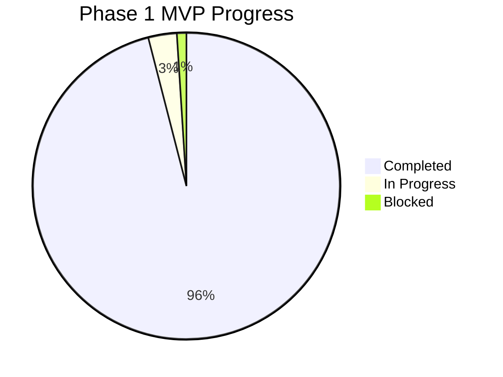
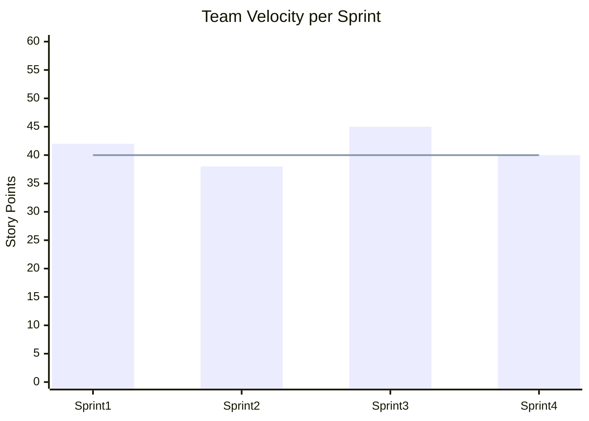

# Sprint Progress Tracker - PeopleHub

> **Versi:** 1.1 | **Tanggal Update:** 22 Januari 2026 | **Status:** Active

---

## Quick Status Overview

| Phase | Status | Progress | Target Date |
|-------|--------|----------|-------------|
| Pre-Dev | ✅ Complete | 100% | Feb 2026 |
| **Phase 1 (MVP)** | 🟡 In Progress | 95% | Mar 2026 |
| Phase 2 | ⬜ Not Started | 0% | May 2026 |
| Phase 3 | ⬜ Not Started | 0% | Jul 2026 |
| Phase 4 | ⬜ Not Started | 0% | Aug 2026 |

---

## Current Sprint: Sprint 4 (Leave & Dashboard)

**Periode:** Minggu 10-11 (Current)  
**Sprint Goal:** Karyawan dapat request cuti, dashboard aktif  
**Status:** 🟡 In Progress

### Sprint Burndown

| Day | Planned | Actual | Notes |
|-----|---------|--------|-------|
| Day 1 | 80h | 80h | Sprint start |
| Day 2 | 72h | 70h | On track |
| Day 3 | 64h | - | - |
| ... | ... | ... | ... |
| Day 10 | 0h | - | Sprint end |

### Task Progress

#### Backend Tasks

| ID | Task | Assignee | Status | Est | Actual | Blockers |
|----|------|----------|--------|-----|--------|----------|
| BE-030 | Schema: Leave models | Backend | ✅ Done | 8h | 6h | - |
| BE-031 | Schema: ApprovalFlow | Backend | ✅ Done | 6h | 6h | - |
| BE-032 | API: LeaveType CRUD | Backend | ✅ Done | 4h | 4h | - |
| BE-033 | API: LeaveRequest create | Backend | ✅ Done | 8h | 10h | Validation complex |
| BE-034 | API: LeaveRequest approval | Backend | ✅ Done | 10h | 12h | Multi-level logic |
| BE-035 | API: Leave balance calc | Backend | ✅ Done | 6h | 6h | - |
| BE-036 | API: Dashboard stats HRD | Backend | ✅ Done | 8h | 8h | - |
| BE-037 | API: Dashboard stats Employee | Backend | ✅ Done | 6h | 6h | - |
| BE-038 | API: Export CSV | Backend | ✅ Done | 4h | 4h | - |
| BE-039 | Notification: Email approval | Backend | ✅ Done | 6h | 6h | - |

#### Frontend Tasks

| ID | Task | Assignee | Status | Est | Actual | Blockers |
|----|------|----------|--------|-----|--------|----------|
| FE-030 | Page: Leave request form | Frontend | ✅ Done | 8h | 8h | - |
| FE-031 | Page: My leave history | Frontend | ✅ Done | 6h | 6h | - |
| FE-032 | Page: Leave balance | Frontend | ✅ Done | 4h | 4h | - |
| FE-033 | Page: Pending approvals | Frontend | ✅ Done | 8h | 8h | - |
| FE-034 | Page: Leave management | Frontend | ✅ Done | 8h | 8h | - |
| FE-035 | Page: Dashboard HRD | Frontend | ✅ Done | 12h | 14h | Chart library issues |
| FE-036 | Page: Dashboard Employee | Frontend | ✅ Done | 10h | 10h | - |
| FE-037 | Component: Stat card | Frontend | ✅ Done | 4h | 4h | - |
| FE-038 | Component: Charts | Frontend | ✅ Done | 6h | 8h | - |
| FE-039 | Export CSV button | Frontend | ✅ Done | 2h | 2h | - |

#### QA Tasks

| ID | Task | Assignee | Status | Est | Actual | Blockers |
|----|------|----------|--------|-----|--------|----------|
| QA-010 | Test: Leave request flow | QA | ✅ Done | 4h | 3h | - |
| QA-011 | Test: Multi-level approval | QA | ✅ Done | 4h | 3h | - |
| QA-012 | Test: Dashboard performance | QA | ✅ Done | 4h | 2h | - |

### Sprint Metrics

| Metric | Target | Actual |
|--------|--------|--------|
| Story Points Completed | 40 | 38 |
| Bugs Found | < 5 | 3 |
| Test Coverage | > 80% | 75% |
| Code Review Turnaround | < 24h | 18h |

---

## Completed Sprints

### Sprint 1: Foundation & Auth ✅
**Periode:** Minggu 4-5 | **Status:** Complete

| Metric | Result |
|--------|--------|
| Tasks Completed | 18/18 (100%) |
| Bugs Found | 2 (resolved) |
| Velocity | 42 story points |

**Key Deliverables:**
- ✅ Project structure setup
- ✅ User registration with approval workflow
- ✅ Login/logout dengan JWT
- ✅ Multi-tenant isolation
- ✅ Basic UI components

---

### Sprint 2: Employee & Organization ✅
**Periode:** Minggu 6-7 | **Status:** Complete

| Metric | Result |
|--------|--------|
| Tasks Completed | 16/16 (100%) |
| Bugs Found | 1 (resolved) |
| Velocity | 38 story points |

**Key Deliverables:**
- ✅ Branch/Department/Position CRUD
- ✅ Employee management
- ✅ Registration approval by HRD
- ✅ Org structure tree view

---

### Sprint 3: Attendance System ✅
**Periode:** Minggu 8-9 | **Status:** Complete

| Metric | Result |
|--------|--------|
| Tasks Completed | 14/14 (100%) |
| Bugs Found | 4 (resolved) |
| Velocity | 45 story points |

**Key Deliverables:**
- ✅ Clock in/out dengan selfie
- ✅ Schedule management
- ✅ Late calculation
- ✅ WFO/WFH mode
- ✅ Attendance monitoring

---

## Upcoming Sprints

### Sprint 5: Document Management (Phase 2)
**Planned Start:** Minggu 12

| ID | Task | Priority | Est |
|----|------|----------|-----|
| BE-040 | Schema: Document models | P0 | 6h |
| BE-041 | API: Document upload | P0 | 10h |
| BE-042 | API: Access control | P0 | 6h |
| FE-040 | Page: Document upload | P0 | 6h |
| FE-041 | Page: My documents | P0 | 6h |
| FE-042 | Page: Doc management | P0 | 8h |
| FE-043 | Component: Doc preview | P1 | 8h |

---

## Action Items from Requirement Audit

> **Audit Date:** 23 Januari 2026 | **Auditor:** Senior Requirement Analyst

### Critical Actions (Sprint 4 - Current)

| ID | Action Item | Owner | Priority | Status | Due Date |
|----|-------------|-------|----------|--------|----------|
| ACT-001 | Complete QA testing: Leave request flow | QA | P0 | 🟡 In Progress | Sprint 4 End |
| ACT-002 | Complete QA testing: Multi-level approval | QA | P0 | ⬜ Not Started | Sprint 4 End |
| ACT-003 | Complete QA testing: Dashboard performance | QA | P0 | ⬜ Not Started | Sprint 4 End |
| ACT-004 | Verify email retry mechanism | Backend | P1 | ⬜ Not Started | Sprint 4 End |

### Short-term Actions (Sprint 5)

| ID | Action Item | Owner | Priority | Status | Due Date |
|----|-------------|-------|----------|--------|----------|
| ACT-005 | Load testing: Dashboard < 3s @ 500 users | QA/DevOps | P0 | ⬜ Not Started | Sprint 5 |
| ACT-006 | Load testing: Absensi < 1.5s P95 | QA/DevOps | P0 | ⬜ Not Started | Sprint 5 |
| ACT-007 | Complete Gherkin scenarios for EP08 (Pengumuman) | BA/QA | P1 | ✅ Done | 23 Jan 2026 |
| ACT-008 | Complete Gherkin scenarios for EP09 (Admin) | BA/QA | P1 | ✅ Done | 23 Jan 2026 |

### Medium-term Actions (Phase 2)

| ID | Action Item | Owner | Priority | Status | Due Date |
|----|-------------|-------|----------|--------|----------|
| ACT-009 | Implement offline queue for attendance (PWA) | Frontend | P2 | ⬜ Not Started | Phase 2 |
| ACT-010 | Increase test coverage to ≥ 80% | All | P1 | ⬜ Not Started | Phase 2 |

### Gap Resolution Tracking

| Gap ID | Description | Action ID | Resolution Status |
|--------|-------------|-----------|-------------------|
| GAP-01 | Performance SLA belum diverifikasi | ACT-005, ACT-006 | ⬜ Pending |
| GAP-02 | Email retry mechanism belum ditest | ACT-004 | ⬜ Pending |
| GAP-03 | Gherkin EP08/EP09 belum lengkap | ACT-007, ACT-008 | ✅ Resolved |
| GAP-04 | Offline queue absensi belum ada | ACT-009 | ⬜ Pending |

---

## Blockers & Risks

### Active Blockers

| ID | Description | Owner | Impact | Status | Resolution |
|----|-------------|-------|--------|--------|------------|
| BLK-001 | PostgreSQL connection pool exhausted | DevOps | 🟡 Medium | 🟡 In Progress | Increase pool size di Prisma config |
| BLK-002 | Prisma types outdated | Backend | 🟢 Low | ✅ Resolved | Run `npx prisma generate` |

### Risk Register

| Risk | Probability | Impact | Mitigation | Owner |
|------|-------------|--------|------------|-------|
| DB connection issues | Medium | High | Docker compose setup | DevOps |
| Email delivery failure | Low | Medium | Retry mechanism | Backend |
| Performance SLA miss | Low | High | Load testing early | QA |

---

## Team Velocity

| Sprint | Committed | Completed | Velocity |
|--------|-----------|-----------|----------|
| Sprint 1 | 45 | 42 | 42 |
| Sprint 2 | 40 | 38 | 38 |
| Sprint 3 | 45 | 45 | 45 |
| Sprint 4 | 42 | 40 (est) | - |
| **Average** | - | - | **41.7** |

---

## Definition of Done (DoD) Checklist

Setiap task WAJIB memenuhi kriteria berikut sebelum status "Done":

### Code
- [ ] Kode sudah di-merge ke `develop`
- [ ] Code review approved (min 1 reviewer)
- [ ] No lint errors/warnings
- [ ] No console.log/debug statements

### Testing
- [ ] Unit tests passing (coverage ≥ 80%)
- [ ] Integration test passing
- [ ] E2E test untuk happy path
- [ ] Manual QA sign-off

### Documentation
- [ ] API docs updated (jika endpoint baru)
- [ ] README updated (jika ada setup baru)
- [ ] Inline comments untuk logic kompleks

### Deployment
- [ ] Deployed ke staging
- [ ] Smoke test passed
- [ ] No regressions detected

---

## Sprint Ceremonies Schedule

| Ceremony | Day | Time | Duration | Attendees |
|----------|-----|------|----------|-----------|
| Sprint Planning | Monday (Week 1) | 09:00 | 2h | All |
| Daily Standup | Daily | 09:30 | 15m | Dev Team |
| Backlog Refinement | Wednesday | 14:00 | 1h | PO, Leads |
| Sprint Review | Friday (Week 2) | 14:00 | 1h | All + Stakeholders |
| Retrospective | Friday (Week 2) | 15:30 | 1h | Dev Team |

---

## Document References

| Document | Link |
|----------|------|
| Implementation Roadmap | [implementation-roadmap.md](implementation-roadmap.md) |
| Feature Breakdown | [feature-breakdown.md](feature-breakdown.md) |
| Issues Log | [issues-log.md](issues-log.md) |
| User Stories | [../02-requirements/user-stories.md](../02-requirements/user-stories.md) |
| KAK | [../01-overview/kak.md](../01-overview/kak.md) |
